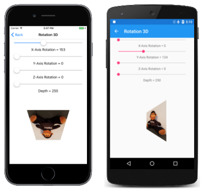

# 3D Rotations in SkiaSharp

_Use non-affine transforms to rotate 2D objects in 3D space._

One common application of non-affine transforms is simulating the rotation of a 2D object in 3D space:


This job involves working with three-dimensional rotations, and then deriving a non-affine `SKMatrix` transform that performs these 3D rotations.

It is hard to develop this `SKMatrix` transform working solely within two dimensions. The job becomes much easier when this 3-by-3 matrix is derived from a 4-by-4 matrix used in 3D graphics. SkiaSharp includes the [`SKMatrix44`](xref:SkiaSharp.SKMatrix44) class for this purpose, but some background in 3D graphics is necessary for understanding 3D rotations and the 4-by-4 transform matrix.

A three-dimensional coordinate system adds a third axis called Z. Conceptually, the Z axis is at right angles to the screen. Coordinate points in 3D space are indicated with three numbers: (x, y, z). In the 3D coordinate system used in this article, increasing values of X are to the right and increasing values of Y go down, just as in two dimensions. Increasing positive Z values come out of the screen. The origin is the upper-left corner, just as in 2D graphics. You can think of the screen as an XY plane with the Z axis at right angles to this plane.

This is called a left-hand coordinate system. If you point the forefinger for your left hand in the direction of positive X coordinates (to the right), and your middle finger in the direction of increasing Y coordinates (down), then your thumb points in the direction of increasing Z coordinates — extending out from the screen.

In 3D graphics, transforms are based on a 4-by-4 matrix. Here is the 4-by-4 identity matrix:

<pre>
|  1  0  0  0  |
|  0  1  0  0  |
|  0  0  1  0  |
|  0  0  0  1  |
</pre>

In working with a 4-by-4 matrix, it is convenient to identify the cells with their row and column numbers:

<pre>
|  M11  M12  M13  M14  |
|  M21  M22  M23  M24  |
|  M31  M32  M33  M34  |
|  M41  M42  M43  M44  |
</pre>

However, the SkiaSharp `Matrix44` class is a little different. The only way to set or get individual cell values in `SKMatrix44` is by using the [`Item`](xref:SkiaSharp.SKMatrix44.Item(System.Int32,System.Int32)) indexer. The row and column indices are zero-based rather than one-based, and the rows and columns are swapped. The cell M14 in the above diagram is accessed using the indexer `[3, 0]` in a `SKMatrix44` object.

In a 3D graphics system, a 3D point (x, y, z) is converted to a 1-by-4 matrix for multiplying by the 4-by-4 transform matrix:

<pre>
                 |  M11  M12  M13  M14  |
| x  y  z  1 | × |  M21  M22  M23  M24  | = | x'  y'  z'  w' |
                 |  M31  M32  M33  M34  |
                 |  M41  M42  M43  M44  |
</pre>

Analogous to 2D transforms that take place in three dimensions, 3D transforms are assumed to take place in four dimensions. The fourth dimension is referred to as W, and the 3D space is assumed to exist within the 4D space where W coordinates are equal to 1. The transform formulas are as follows:

`x' = M11·x + M21·y + M31·z + M41`

`y' = M12·x + M22·y + M32·z + M42`

`z' = M13·x + M23·y + M33·z + M43`

`w' = M14·x + M24·y + M34·z + M44`

It's obvious from the transform formulas that the cells `M11`, `M22`, `M33` are scaling factors in the X, Y, and Z directions, and `M41`, `M42`, and `M43` are translation factors in the X, Y, and Z directions.

To convert these coordinates back to the 3D space where W equals 1, the x', y', and z' coordinates are all divided by w':

`x" = x' / w'`

`y" = y' / w'`

`z" = z' / w'`

`w" = w' / w' = 1`

That division by w' provides perspective in 3D space. If w' equals 1, then no perspective occurs.

Rotations in 3D space can be quite complex, but the simplest rotations are those around the X, Y, and Z axes. A rotation of angle α around the X axis is this matrix:

<pre>
|  1     0       0     0  |
|  0   cos(α)  sin(α)  0  |
|  0  –sin(α)  cos(α)  0  |
|  0     0       0     1  |
</pre>

Values of X remain the same when subjected to this transform. Rotation around the Y axis leaves values of Y unchanged:

<pre>
|  cos(α)  0  –sin(α)  0  |
|    0     1     0     0  |
|  sin(α)  0   cos(α)  0  |
|    0     0     0     1  |
</pre>

Rotation around the Z axis is the same as in 2D graphics:

<pre>
|  cos(α)  sin(α)  0  0  |
| –sin(α)  cos(α)  0  0  |
|    0       0     1  0  |
|    0       0     0  1  |
</pre>

The direction of rotation is implied by the handedness of the coordinate system. This is a left-handed system, so if you point the thumb of your left hand towards increasing values for a particular axis — to the right for rotation around the X axis, down for rotation around the Y axis, and towards you for rotation around the Z axis — then the curve of your other fingers indicates the direction of rotation for positive angles.

`SKMatrix44` has generalized static [`CreateRotation`](xref:SkiaSharp.SKMatrix44.CreateRotation(System.Single,System.Single,System.Single,System.Single)) and [`CreateRotationDegrees`](xref:SkiaSharp.SKMatrix44.CreateRotationDegrees(System.Single,System.Single,System.Single,System.Single)) methods that allow you to specify the axis around which the rotation occurs:

```csharp
public static SKMatrix44 CreateRotationDegrees (Single x, Single y, Single z, Single degrees)
```

For rotation around the X axis, set the first three arguments to 1, 0, 0. For rotation around the Y axis, set them to 0, 1, 0, and for rotation around the Z axis, set them to 0, 0, 1.

The fourth column of the 4-by-4 is for perspective. The `SKMatrix44` has no methods for creating perspective transforms, but you can create one yourself using the following code:

```csharp
SKMatrix44 perspectiveMatrix = SKMatrix44.CreateIdentity();
perspectiveMatrix[2, 3] = -1 / depth;
```

The reason for the argument name `depth` will be evident shortly. That code creates the matrix:

<pre>
|  1  0  0      0     |
|  0  1  0      0     |
|  0  0  1  -1/depth  |
|  0  0  0      1     |
</pre>

The transform formulas result in the following calculation of w':

`w' = –z / depth + 1`

This serves to reduce X and Y coordinates when values of Z are less than zero (conceptually behind the XY plane) and to increase X and Y coordinates for positive values of Z. When the Z coordinate equals `depth`, then w' is zero, and coordinates become infinite. Three-dimensional graphics systems are built around a camera metaphor, and the `depth` value here represents the distance of the camera from the origin of the coordinate system. If a graphical object has a Z coordinate that is `depth` units from the origin, it is conceptually touching the lens of the camera and becomes infinitely large.

Keep in mind that you'll probably be using this `perspectiveMatrix` value in combination with rotation matrices. If a graphics object being rotated has X or Y coordinates greater than `depth`, then the rotation of this object in 3D space is likely to involve Z coordinates greater than `depth`. This must be avoided! When creating `perspectiveMatrix` you want to set `depth` to a value sufficiently large for all coordinates in the graphics object no matter how it is rotated. This ensures that there is never any division by zero.

Combining 3D rotations and perspective requires multiplying 4-by-4 matrices together. For this purpose, `SKMatrix44` defines concatenation methods. If `A` and `B` are `SKMatrix44` objects, then the following code sets A equal to A × B:

```csharp
A.PostConcat(B);
```

When a 4-by-4 transform matrix is used in a 2D graphics system, it is applied to 2D objects. These objects are flat and are assumed to have Z coordinates of zero. The transform multiplication is a little simpler than the transform shown earlier:

<pre>
                 |  M11  M12  M13  M14  |
| x  y  0  1 | × |  M21  M22  M23  M24  | = | x'  y'  z'  w' |
                 |  M31  M32  M33  M34  |
                 |  M41  M42  M43  M44  |
</pre>

That 0 value for z results in transform formulas that do not involve any cells in the third row of the matrix:

x' = M11·x + M21·y + M41

y' = M12·x + M22·y + M42

z' = M13·x + M23·y + M43

w' = M14·x + M24·y + M44

Moreover, the z' coordinate is irrelevant here as well. When a 3D object is displayed in a 2D graphics system, it is collapsed to a two-dimensional object by ignoring the Z coordinate values. The transform formulas are really just these two:

`x" = x' / w'`

`y" = y' / w'`

This means that the third row *and* third column of the 4-by-4 matrix can be ignored.

But if that is so, why is the 4-by-4 matrix even necessary in the first place?

Although the third row and third column of the 4-by-4 are irrelevant for two-dimensional transforms, the third row and column *do* play a role prior to that when various `SKMatrix44` values are multiplied together. For example, suppose that you multiply rotation around the Y axis with the perspective transform:

<pre>
|  cos(α)  0  –sin(α)  0  |   |  1  0  0      0     |   |  cos(α)  0  –sin(α)   sin(α)/depth  |
|    0     1     0     0  | × |  0  1  0      0     | = |    0     1     0           0        |
|  sin(α)  0   cos(α)  0  |   |  0  0  1  -1/depth  |   |  sin(α)  0   cos(α)  -cos(α)/depth  |  
|    0     0     0     1  |   |  0  0  0      1     |   |    0     0     0           1        |
</pre>

In the product, the cell `M14` now contains a perspective value. If you want to apply that matrix to 2D objects, the third row and column are eliminated to convert it into a 3-by-3 matrix:

<pre>
|  cos(α)  0  sin(α)/depth  |
|    0     1       0        |
|    0     0       1        |
</pre>

Now it can be used to transform a 2D point:

<pre>
                |  cos(α)  0  sin(α)/depth  |
|  x  y  1  | × |    0     1       0        | = |  x'  y'  z'  |
                |    0     0       1        |
</pre>

The transform formulas are:

`x' = cos(α)·x`

`y' = y`

`z' = (sin(α)/depth)·x + 1`

Now divide everything by z':

`x" = cos(α)·x / ((sin(α)/depth)·x + 1)`

`y" = y / ((sin(α)/depth)·x + 1)`

When 2D objects are rotated with a positive angle around the Y axis, then positive X values recede to the background while negative X values come to the foreground. The X values seem to move closer to the Y axis (which is governed by the cosine value) as coordinates furthest from the Y axis becomes smaller or larger as they move further from the viewer or closer to the viewer.

When using `SKMatrix44`, perform all the 3D rotation and perspective operations by multiplying various `SKMatrix44` values. Then you can extract a two-dimensional 3-by-3 matrix from the 4-by-4 matrix using the [`Matrix`](xref:SkiaSharp.SKMatrix44.Matrix) property of the `SKMatrix44` class. This property returns a familiar `SKMatrix` value.

The **Rotation 3D** page lets you experiment with 3D rotation. The [**Rotation3DPage.xaml**](https://github.com/mono/SkiaSharp/blob/docs/samples/Demos/Demos/SkiaSharpFormsDemos/Transforms/Rotation3DPage.xaml) file instantiates four sliders to set rotation around the X, Y, and Z axes, and to set a depth value:

```xaml
<ContentPage xmlns="http://schemas.microsoft.com/dotnet/2021/maui"
             xmlns:x="http://schemas.microsoft.com/winfx/2009/xaml"
             xmlns:skia="clr-namespace:SkiaSharp.Views.Maui.Controls;assembly=SkiaSharp.Views.Maui.Controls"
             x:Class="SkiaSharpFormsDemos.Transforms.Rotation3DPage"
             Title="Rotation 3D">
    <Grid>
        <Grid.RowDefinitions>
            <RowDefinition Height="Auto" />
            <RowDefinition Height="Auto" />
            <RowDefinition Height="Auto" />
            <RowDefinition Height="Auto" />
            <RowDefinition Height="Auto" />
            <RowDefinition Height="Auto" />
            <RowDefinition Height="Auto" />
            <RowDefinition Height="Auto" />
            <RowDefinition Height="*" />
        </Grid.RowDefinitions>

        <Grid.Resources>
            <ResourceDictionary>
                <Style TargetType="Label">
                    <Setter Property="HorizontalTextAlignment" Value="Center" />
                </Style>

                <Style TargetType="Slider">
                    <Setter Property="Margin" Value="20, 0" />
                    <Setter Property="Maximum" Value="360" />
                </Style>
            </ResourceDictionary>
        </Grid.Resources>

        <Slider x:Name="xRotateSlider"
                Grid.Row="0"
                ValueChanged="OnSliderValueChanged" />

        <Label Text="{Binding Source={x:Reference xRotateSlider},
                              Path=Value,
                              StringFormat='X-Axis Rotation = {0:F0}'}"
               Grid.Row="1" />

        <Slider x:Name="yRotateSlider"
                Grid.Row="2"
                ValueChanged="OnSliderValueChanged" />

        <Label Text="{Binding Source={x:Reference yRotateSlider},
                              Path=Value,
                              StringFormat='Y-Axis Rotation = {0:F0}'}"
               Grid.Row="3" />

        <Slider x:Name="zRotateSlider"
                Grid.Row="4"
                ValueChanged="OnSliderValueChanged" />

        <Label Text="{Binding Source={x:Reference zRotateSlider},
                              Path=Value,
                              StringFormat='Z-Axis Rotation = {0:F0}'}"
               Grid.Row="5" />

        <Slider x:Name="depthSlider"
                Grid.Row="6"
                Maximum="2500"
                Minimum="250"
                ValueChanged="OnSliderValueChanged" />

        <Label Grid.Row="7"
               Text="{Binding Source={x:Reference depthSlider},
                              Path=Value,
                              StringFormat='Depth = {0:F0}'}" />

        <skia:SKCanvasView x:Name="canvasView"
                           Grid.Row="8"
                           PaintSurface="OnCanvasViewPaintSurface" />
    </Grid>
</ContentPage>
```

Notice that the `depthSlider` is initialized with a `Minimum` value of 250. This implies that the 2D object being rotated here has X and Y coordinates restricted to a circle defined by a 250-pixel radius around the origin. Any rotation of this object in 3D space will always result in coordinate values less than 250.

The [**Rotation3DPage.cs**](https://github.com/mono/SkiaSharp/blob/docs/samples/Demos/Demos/SkiaSharpFormsDemos/Transforms/Rotation3DPage.xaml.cs) code-behind file loads in a bitmap that is 300 pixels square from the Resources/Raw folder:

```csharp
public partial class Rotation3DPage : ContentPage
{
    SKBitmap? bitmap;

    public Rotation3DPage()
    {
        InitializeComponent();

        _ = LoadBitmapAsync();
    }

    async Task LoadBitmapAsync()
    {
        using Stream stream = await FileSystem.OpenAppPackageFileAsync("SeatedMonkey.jpg");
        bitmap = SKBitmap.Decode(stream);
        canvasView.InvalidateSurface();
    }

    void OnSliderValueChanged(object? sender, ValueChangedEventArgs args)
    {
        if (canvasView != null)
        {
            canvasView.InvalidateSurface();
        }
    }
    ...
}
```

If the 3D transform is centered on this bitmap, then X and Y coordinates range between –150 and 150, while the corners are 212 pixels from the center, so everything is within the 250-pixel radius.

The `PaintSurface` handler creates `SKMatrix44` objects based on the sliders and multiplies them together using `PostConcat`. The `SKMatrix` value extracted from the final `SKMatrix44` object is surrounded by translate transforms to center the rotation in the center of the screen:

```csharp
public partial class Rotation3DPage : ContentPage
{
    SKBitmap? bitmap;

    public Rotation3DPage()
    {
        InitializeComponent();

        _ = LoadBitmapAsync();
    }

    async Task LoadBitmapAsync()
    {
        using Stream stream = await FileSystem.OpenAppPackageFileAsync("SeatedMonkey.jpg");
        bitmap = SKBitmap.Decode(stream);
        canvasView.InvalidateSurface();
    }

    void OnSliderValueChanged(object? sender, ValueChangedEventArgs args)
    {
        if (canvasView != null)
        {
            canvasView.InvalidateSurface();
        }
    }

    void OnCanvasViewPaintSurface(object? sender, SKPaintSurfaceEventArgs args)
    {
        SKImageInfo info = args.Info;
        SKSurface surface = args.Surface;
        SKCanvas canvas = surface.Canvas;

        canvas.Clear();

        if (bitmap is null)
            return;

        // Find center of canvas
        float xCenter = info.Width / 2;
        float yCenter = info.Height / 2;

        // Translate center to origin
        SKMatrix matrix = SKMatrix.CreateTranslation(-xCenter, -yCenter);

        // Use 3D matrix for 3D rotations and perspective
        // Note: PostConcat returns a new matrix, use *= operator
        SKMatrix44 matrix44 = SKMatrix44.CreateIdentity();
        matrix44 *= SKMatrix44.CreateRotationDegrees(1, 0, 0, (float)xRotateSlider.Value);
        matrix44 *= SKMatrix44.CreateRotationDegrees(0, 1, 0, (float)yRotateSlider.Value);
        matrix44 *= SKMatrix44.CreateRotationDegrees(0, 0, 1, (float)zRotateSlider.Value);

        SKMatrix44 perspectiveMatrix = SKMatrix44.CreateIdentity();
        perspectiveMatrix[2, 3] = -1 / (float)depthSlider.Value;
        matrix44 *= perspectiveMatrix;

        // Concatenate with 2D matrix
        matrix = matrix.PostConcat(matrix44.Matrix);

        // Translate back to center
        matrix = matrix.PostConcat(SKMatrix.CreateTranslation(xCenter, yCenter));

        // Set the matrix and display the bitmap
        canvas.SetMatrix(matrix);
        float xBitmap = xCenter - bitmap.Width / 2;
        float yBitmap = yCenter - bitmap.Height / 2;
        canvas.DrawBitmap(bitmap, xBitmap, yBitmap);
    }
}
```

When you experiment with the fourth slider, you'll notice that the different depth settings don't move the object further away from the viewer, but instead alter the extent of the perspective effect:

[](3d-rotation-images/rotation3d-large.png#lightbox "Triple screenshot of the Rotation 3D page")

The **Animated Rotation 3D** also uses `SKMatrix44` to animate a text string in 3D space. The `textPaint` object set as a field is used in the constructor to determine the bounds of the text:

```csharp
public class AnimatedRotation3DPage : ContentPage
{
    SKCanvasView canvasView;
    float xRotationDegrees, yRotationDegrees, zRotationDegrees;
    string text = "SkiaSharp";
    SKPaint textPaint = new SKPaint
    {
        Style = SKPaintStyle.Stroke,
        Color = SKColors.Black,
        StrokeWidth = 3,
    };
    SKFont font = new SKFont
    {
        Size = 100
    };
    SKRect textBounds;

    public AnimatedRotation3DPage()
    {
        Title = "Animated Rotation 3D";

        canvasView = new SKCanvasView();
        canvasView.PaintSurface += OnCanvasViewPaintSurface;
        Content = canvasView;

        // Measure the text
        font.MeasureText(text, out textBounds);
    }
    ...
}
```

The `OnAppearing` override defines three .NET MAUI `Animation` objects to animate the `xRotationDegrees`, `yRotationDegrees`, and `zRotationDegrees` fields at different rates. Notice that the periods of these animations are set to prime numbers (5 seconds, 7 seconds, and 11 seconds) so the overall combination only repeats every 385 seconds, or more than 10 minutes:

```csharp
public class AnimatedRotation3DPage : ContentPage
{
    ...
    protected override void OnAppearing()
    {
        base.OnAppearing();

        new Animation((value) => xRotationDegrees = 360 * (float)value).
            Commit(this, "xRotationAnimation", length: 5000, repeat: () => true);

        new Animation((value) => yRotationDegrees = 360 * (float)value).
            Commit(this, "yRotationAnimation", length: 7000, repeat: () => true);

        new Animation((value) =>
        {
            zRotationDegrees = 360 * (float)value;
            canvasView.InvalidateSurface();
        }).Commit(this, "zRotationAnimation", length: 11000, repeat: () => true);
    }

    protected override void OnDisappearing()
    {
        base.OnDisappearing();
        this.AbortAnimation("xRotationAnimation");
        this.AbortAnimation("yRotationAnimation");
        this.AbortAnimation("zRotationAnimation");
    }
    ...
}
```

As in the previous program, the `PaintCanvas` handler creates `SKMatrix44` values for rotation and perspective, and multiplies them together:

```csharp
public class AnimatedRotation3DPage : ContentPage
{
    ...
    void OnCanvasViewPaintSurface(object? sender, SKPaintSurfaceEventArgs args)
    {
        SKImageInfo info = args.Info;
        SKSurface surface = args.Surface;
        SKCanvas canvas = surface.Canvas;

        canvas.Clear();

        // Find center of canvas
        float xCenter = info.Width / 2;
        float yCenter = info.Height / 2;

        // Translate center to origin
        SKMatrix matrix = SKMatrix.CreateTranslation(-xCenter, -yCenter);

        // Scale so text fits
        float scale = Math.Min(info.Width / textBounds.Width,
                               info.Height / textBounds.Height);
        matrix = matrix.PostConcat(SKMatrix.CreateScale(scale, scale));

        // Calculate composite 3D transforms
        float depth = 0.75f * scale * textBounds.Width;

        SKMatrix44 matrix44 = SKMatrix44.CreateIdentity();
        matrix44 *= SKMatrix44.CreateRotationDegrees(1, 0, 0, xRotationDegrees);
        matrix44 *= SKMatrix44.CreateRotationDegrees(0, 1, 0, yRotationDegrees);
        matrix44 *= SKMatrix44.CreateRotationDegrees(0, 0, 1, zRotationDegrees);

        SKMatrix44 perspectiveMatrix = SKMatrix44.CreateIdentity();
        perspectiveMatrix[2, 3] = -1 / depth;
        matrix44 *= perspectiveMatrix;

        // Concatenate with 2D matrix
        matrix = matrix.PostConcat(matrix44.Matrix);

        // Translate back to center
        matrix = matrix.PostConcat(SKMatrix.CreateTranslation(xCenter, yCenter));

        // Set the matrix and display the text
        canvas.SetMatrix(matrix);
        float xText = xCenter - textBounds.MidX;
        float yText = yCenter - textBounds.MidY;
        canvas.DrawText(text, xText, yText, SKTextAlign.Left, font, textPaint);
    }
}
```

This 3D rotation is surrounded with several 2D transforms to move the center of rotation to the center of the screen, and to scale the size of the text string so that it is the same width as the screen:

[](3d-rotation-images/animatedrotation3d-large.png#lightbox "Triple screenshot of the Animated Rotation 3D page")

## Related Links

- [SkiaSharp APIs](/dotnet/api/skiasharp)
