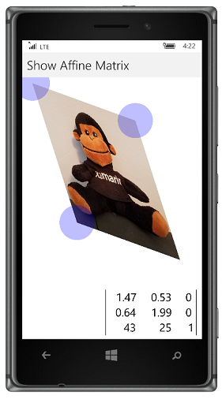
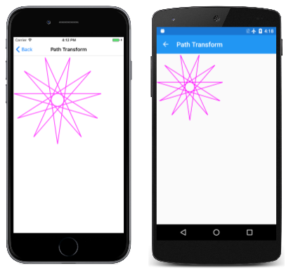

# Matrix Transforms in SkiaSharp

_Dive deeper into SkiaSharp transforms with the versatile transform matrix_

All the transforms applied to the `SKCanvas` object are consolidated in a single instance of the [`SKMatrix`](xref:SkiaSharp.SKMatrix) structure. This is a standard 3-by-3 transform matrix similar to those in all modern 2D graphics systems.

As you've seen, you can use transforms in SkiaSharp without knowing about the transform matrix, but the transform matrix is important from a theoretical perspective, and it is crucial when using transforms to modify paths or for handling complex touch input, both of which are demonstrated in this article and the next.



The current transform matrix applied to the `SKCanvas` is available at any time by accessing the read-only [`TotalMatrix`](xref:SkiaSharp.SKCanvas.TotalMatrix) property. You can set a new transform matrix using the [`SetMatrix`](xref:SkiaSharp.SKCanvas.SetMatrix(SkiaSharp.SKMatrix)) method, and you can restore that transform matrix to default values by calling [`ResetMatrix`](xref:SkiaSharp.SKCanvas.ResetMatrix).

The only other `SKCanvas` member that directly works with the canvas's matrix transform is [`Concat`](xref:SkiaSharp.SKCanvas.Concat(SkiaSharp.SKMatrix@)) which concatenates two matrices by multiplying them together.

The default transform matrix is the identity matrix and consists of 1's in the diagonal cells and 0's everywhere else:

<pre>
| 1  0  0 |
| 0  1  0 |
| 0  0  1 |
</pre>

You can create an identity matrix using the static  [`SKMatrix.MakeIdentity`](xref:SkiaSharp.SKMatrix.MakeIdentity) method:

```csharp
SKMatrix matrix = SKMatrix.MakeIdentity();
```

The `SKMatrix` default constructor does *not* return an identity matrix. It returns a matrix with all of the cells set to zero. Do not use the `SKMatrix` constructor unless you plan to set those cells manually.

When SkiaSharp renders a graphical object, each point (x, y) is effectively converted to a 1-by-3 matrix with a 1 in the third column:

<pre>
| x  y  1 |
</pre>

This 1-by-3 matrix represents a three-dimensional point with the Z coordinate set to 1. There are mathematical reasons (discussed later) why a two-dimensional matrix transform requires working in three dimensions. You can think of this 1-by-3 matrix as representing a point in a 3D coordinate system, but always on the 2D plane where Z equals 1.

This 1-by-3 matrix is then multiplied by the transform matrix, and the result is the point rendered on the canvas:

<pre>
              | 1  0  0 |
| x  y  1 | × | 0  1  0 | = | x'  y'  z' |
              | 0  0  1 |
</pre>

Using standard matrix multiplication, the converted points are as follows:

`x' = x`

`y' = y`

`z' = 1`

That's the default transform.

When the `Translate` method is called on the `SKCanvas` object, the `tx` and `ty` arguments to the `Translate` method become the first two cells in the third row of the transform matrix:

<pre>
|  1   0   0 |
|  0   1   0 |
| tx  ty   1 |
</pre>

The multiplication is now as follows:

<pre>
              |  1   0   0 |
| x  y  1 | × |  0   1   0 | = | x'  y'  z' |
              | tx  ty   1 |
</pre>

Here are the transform formulas:

`x' = x + tx`

`y' = y + ty`

Scaling factors have a default value of 1. When you call the `Scale` method on a new `SKCanvas` object, the resultant transform matrix contains the `sx` and `sy` arguments in the diagonal cells:

<pre>
              | sx   0   0 |
| x  y  1 | × |  0  sy   0 | = | x'  y'  z' |
              |  0   0   1 |
</pre>

The transform formulas are as follows:

`x' = sx · x`

`y' = sy · y`

The transform matrix after calling `Skew` contains the two arguments in the matrix cells adjacent to the scaling factors:

<pre>
              │   1   ySkew   0 │
| x  y  1 | × │ xSkew   1     0 │ = | x'  y'  z' |
              │   0     0     1 │
</pre>

The transform formulas are:

`x' = x + xSkew · y`

`y' = ySkew · x + y`

For a call to `RotateDegrees` or `RotateRadians` for an angle of α, the transform matrix is as follows:

<pre>
              │  cos(α)  sin(α)  0 │
| x  y  1 | × │ –sin(α)  cos(α)  0 │ = | x'  y'  z' |
              │    0       0     1 │
</pre>

Here are the transform formulas:

`x' = cos(α) · x - sin(α) · y`

`y' = sin(α) · x - cos(α) · y`

When α is 0 degrees, it's the identity matrix. When α is 180 degrees, the transform matrix is as follows:

<pre>
| –1   0   0 |
|  0  –1   0 |
|  0   0   1 |
</pre>

A 180-degree rotation is equivalent to flipping an object horizontally and vertically, which is also accomplished by setting scale factors of –1.

All these types of transforms are classified as *affine* transforms. Affine transforms never involve the third column of the matrix, which remains at the default values of 0, 0, and 1. The article [**Non-Affine Transforms**](non-affine.md) discusses non-affine transforms.

## Matrix Multiplication

One significant advantage with using the transform matrix is that composite transforms can be obtained by matrix multiplication, which is often referred to in the SkiaSharp documentation as *concatenation*. Many of the transform-related methods in `SKCanvas` refer to "pre-concatenation" or "pre-concat." This refers to the order of multiplication, which is important because matrix multiplication is not commutative.

For example, the documentation for the [`Translate`](xref:SkiaSharp.SKCanvas.Translate(System.Single,System.Single)) method says that it "Pre-concats the current matrix with the specified translation,"
while the documentation for the [`Scale`](xref:SkiaSharp.SKCanvas.Scale(System.Single,System.Single)) method says that it "Pre-concats the current matrix with the specified scale."

This means that the transform specified by the method call is the multiplier (the left-hand operand) and the current transform matrix is the multiplicand (the right-hand operand).

Suppose that `Translate` is called followed by `Scale`:

```csharp
canvas.Translate(tx, ty);
canvas.Scale(sx, sy);
```

The `Scale` transform is multiplied by the `Translate` transform for the composite transform matrix:

<pre>
| sx   0   0 |   |  1   0   0 |   | sx   0   0 |
|  0  sy   0 | × |  0   1   0 | = |  0  sy   0 |
|  0   0   1 |   | tx  ty   1 |   | tx  ty   1 |
</pre>

`Scale` could be called before `Translate` like this:

```csharp
canvas.Scale(sx, sy);
canvas.Translate(tx, ty);
```

In that case, the order of the multiplication is reversed, and the scaling factors are effectively applied to the translation factors:

<pre>
|  1   0   0 |   | sx   0   0 |   |  sx      0    0 |
|  0   1   0 | × |  0  sy   0 | = |   0     sy    0 |
| tx  ty   1 |   |  0   0   1 |   | tx·sx  ty·sy  1 |
</pre>

Here is the `Scale` method with a pivot point:

```csharp
canvas.Scale(sx, sy, px, py);
```

This is equivalent to the following translate and scale calls:

```csharp
canvas.Translate(px, py);
canvas.Scale(sx, sy);
canvas.Translate(–px, –py);
```

The three transform matrices are multiplied in reverse order from how the methods appear in code:

<pre>
|  1    0   0 |   | sx   0   0 |   |  1   0  0 |   |    sx         0     0 |
|  0    1   0 | × |  0  sy   0 | × |  0   1  0 | = |     0        sy     0 |
| –px  –py  1 |   |  0   0   1 |   | px  py  1 |   | px–px·sx  py–py·sy  1 |
</pre>

## The SKMatrix Structure

The `SKMatrix` structure defines nine read/write properties of type `float` corresponding to the nine cells of the transform matrix:

<pre>
│ ScaleX  SkewY   Persp0 │
│ SkewX   ScaleY  Persp1 │
│ TransX  TransY  Persp2 │
</pre>

`SKMatrix` also defines a property named [`Values`](xref:SkiaSharp.SKMatrix.Values) of type `float[]`. This property can be used to set or obtain the nine values in one shot in the order `ScaleX`, `SkewX`, `TransX`, `SkewY`, `ScaleY`, `TransY`, `Persp0`, `Persp1`, and `Persp2`.

The `Persp0`, `Persp1`, and `Persp2` cells are discussed in the article [**Non-Affine Transforms**](non-affine.md). If these cells have their default values of 0, 0, and 1, then the transform is multiplied by a coordinate point like this:

<pre>
              │ ScaleX  SkewY   0 │
| x  y  1 | × │ SkewX   ScaleY  0 │ = | x'  y'  z' |
              │ TransX  TransY  1 │
</pre>

`x' = ScaleX · x + SkewX · y + TransX`

`y' = SkewX · x + ScaleY · y + TransY`

`z' = 1`

This is the complete two-dimensional affine transform. The affine transform preserves parallel lines, which means that a rectangle is never transformed into anything other than a parallelogram.

The `SKMatrix` structure defines several static methods to create `SKMatrix` values. These all return `SKMatrix` values:

- [`MakeTranslation`](xref:SkiaSharp.SKMatrix.MakeTranslation(System.Single,System.Single))
- [`MakeScale`](xref:SkiaSharp.SKMatrix.MakeScale(System.Single,System.Single))
- [`MakeScale`](xref:SkiaSharp.SKMatrix.MakeScale(System.Single,System.Single,System.Single,System.Single)) with a pivot point
- [`MakeRotation`](xref:SkiaSharp.SKMatrix.MakeRotation(System.Single)) for an angle in radians
- [`MakeRotation`](xref:SkiaSharp.SKMatrix.MakeRotation(System.Single,System.Single,System.Single)) for an angle in radians with a pivot point
- [`MakeRotationDegrees`](xref:SkiaSharp.SKMatrix.MakeRotationDegrees(System.Single))
- [`MakeRotationDegrees`](xref:SkiaSharp.SKMatrix.MakeRotationDegrees(System.Single,System.Single,System.Single)) with a pivot point
- [`MakeSkew`](xref:SkiaSharp.SKMatrix.MakeSkew(System.Single,System.Single))

`SKMatrix` also defines several static methods that concatenate two matrices, which means to multiply them. These methods are named [`Concat`](xref:SkiaSharp.SKMatrix.Concat*), [`PostConcat`](xref:SkiaSharp.SKMatrix.PostConcat*), and [`PreConcat`](xref:SkiaSharp.SKMatrix.PreConcat*), and there are two versions of each. These methods have no return values; instead, they reference existing `SKMatrix` values through `ref` arguments. In the following example, `A`, `B`, and `R` (for "result") are all `SKMatrix` values.

The two `Concat` methods are called like this:

```csharp
SKMatrix.Concat(ref R, A, B);

SKMatrix.Concat(ref R, ref A, ref B);
```

These perform the following multiplication:

`R = B × A`

The other methods have only two parameters. The first parameter is modified, and on return from the method call, contains the product of the two matrices. The two `PostConcat` methods are called like this:

```csharp
SKMatrix.PostConcat(ref A, B);

SKMatrix.PostConcat(ref A, ref B);
```

These calls perform the following operation:

`A = A × B`

The two `PreConcat` methods are similar:

```csharp
SKMatrix.PreConcat(ref A, B);

SKMatrix.PreConcat(ref A, ref B);
```

These calls perform the following operation:

`A = B × A`

The versions of these methods with all `ref` arguments are slightly more efficient in calling the underlying implementations, but it might be confusing to someone reading your code and assuming that anything with a `ref` argument is modified by the method. Moreover, it's often convenient to pass an argument that is a result of one of the `Make` methods, for example:

```csharp
SKMatrix result;
SKMatrix.Concat(result, SKMatrix.MakeTranslation(100, 100),
                        SKMatrix.MakeScale(3, 3));
```

This creates the following matrix:

<pre>
│   3    0  0 │
│   0    3  0 │
│ 100  100  1 │
</pre>

This is the scale transform multiplied by the translate transform. In this particular case, the `SKMatrix` structure provides a shortcut with a method named [`SetScaleTranslate`](xref:SkiaSharp.SKMatrix.SetScaleTranslate(System.Single,System.Single,System.Single,System.Single)):

```csharp
SKMatrix R = new SKMatrix();
R.SetScaleTranslate(3, 3, 100, 100);
```

This is one of the few times when it's safe to use the `SKMatrix` constructor. The `SetScaleTranslate` method sets all nine cells of the matrix. It is also safe to use the `SKMatrix` constructor with the static `Rotate` and `RotateDegrees` methods:

```csharp
SKMatrix R = new SKMatrix();

SKMatrix.Rotate(ref R, radians);

SKMatrix.Rotate(ref R, radians, px, py);

SKMatrix.RotateDegrees(ref R, degrees);

SKMatrix.RotateDegrees(ref R, degrees, px, py);
```

These methods do *not* concatenate a rotate transform to an existing transform. The methods set all the cells of the matrix. They are functionally identical to the `MakeRotation` and `MakeRotationDegrees` methods except that they don't instantiate the `SKMatrix` value.

Suppose you have an `SKPath` object that you want to display, but you would prefer that it have a somewhat different orientation, or a different center point. You can modify all the coordinates of that path by calling the [`Transform`](xref:SkiaSharp.SKPath.Transform(SkiaSharp.SKMatrix)) method of `SKPath` with an `SKMatrix` argument. The **Path Transform** page demonstrates how to do this. The [`PathTransform`](https://github.com/mono/SkiaSharp/blob/docs/samples/Demos/Demos/SkiaSharpFormsDemos/Transforms/PathTransformPage.cs) class references the `HendecagramPath` object in a field but uses its constructor to apply a transform to that path:

```csharp
public class PathTransformPage : ContentPage
{
    SKPath transformedPath = HendecagramArrayPage.HendecagramPath;

    public PathTransformPage()
    {
        Title = "Path Transform";

        SKCanvasView canvasView = new SKCanvasView();
        canvasView.PaintSurface += OnCanvasViewPaintSurface;
        Content = canvasView;

        SKMatrix matrix = SKMatrix.MakeScale(3, 3);
        SKMatrix.PostConcat(ref matrix, SKMatrix.MakeRotationDegrees(360f / 22));
        SKMatrix.PostConcat(ref matrix, SKMatrix.MakeTranslation(300, 300));

        transformedPath.Transform(matrix);
    }
    ...
}
```

The `HendecagramPath` object has a center at (0, 0), and the 11 points of the star extend outward from that center by 100 units in all directions. This means that the path has both positive and negative coordinates. The **Path Transform** page prefers to work with a star three times as large, and with all positive coordinates. Moreover, it doesn't want one point of the star to point straight up. It wants instead for one point of the star to point straight down. (Because the star has 11 points, it can't have both.) This requires rotating the star by 360 degrees divided by 22.

The constructor builds an `SKMatrix` object from three separate transforms using the `PostConcat` method with the following pattern, where A, B, and C are instances of `SKMatrix`:

```csharp
SKMatrix matrix = A;
SKMatrix.PostConcat(ref A, B);
SKMatrix.PostConcat(ref A, C);
```

This is a series of successive multiplications, so the result is as follows:

`A × B × C`

The consecutive multiplications aid in understanding what each transform does. The scale transform increases the size of the path coordinates by a factor of 3, so the coordinates range from –300 to 300. The rotate transform rotates the star around its origin. The translate transform then shifts it by 300 pixels right and down, so all the coordinates become positive.

There are other sequences that produce the same matrix. Here's another one:

```csharp
SKMatrix matrix = SKMatrix.MakeRotationDegrees(360f / 22);
SKMatrix.PostConcat(ref matrix, SKMatrix.MakeTranslation(100, 100));
SKMatrix.PostConcat(ref matrix, SKMatrix.MakeScale(3, 3));
```

This rotates the path around its center first, and then translates it 100 pixels to the right and down so all the coordinates are positive. The star is then increased in size relative to its new upper-left corner, which is the point (0, 0).

The `PaintSurface` handler can simply render this path:

```csharp
public class PathTransformPage : ContentPage
{
    ...
    void OnCanvasViewPaintSurface(object? sender, SKPaintSurfaceEventArgs args)
    {
        SKImageInfo info = args.Info;
        SKSurface surface = args.Surface;
        SKCanvas canvas = surface.Canvas;

        canvas.Clear();

        using (SKPaint paint = new SKPaint())
        {
            paint.Style = SKPaintStyle.Stroke;
            paint.Color = SKColors.Magenta;
            paint.StrokeWidth = 5;

            canvas.DrawPath(transformedPath, paint);
        }
    }
}

```

It appears in the upper-left corner of the canvas:

[](matrix-images/pathtransform-large.png#lightbox "Triple screenshot of the Path Transform page")

The constructor of this program applies the matrix to the path with the following call:

```csharp
transformedPath.Transform(matrix);
```

The path does *not* retain this matrix as a property. Instead, it applies the transform to all of the coordinates of the path. If `Transform` is called again, the transform is applied again, and the only way you can go back is by applying another matrix that undoes the transform. Fortunately, the `SKMatrix` structure defines a [`TryInvert`](xref:SkiaSharp.SKMatrix.TryInvert*) method that obtains the matrix that reverses a given matrix:

```csharp
SKMatrix inverse;
bool success = matrix.TryInverse(out inverse);
```

The method is called `TryInverse` because not all matrices are invertible, but a non-invertible matrix is not likely to be used for a graphics transform.

You can also apply a matrix transform to an `SKPoint` value, an array of points, an `SKRect`, or even just a single number within your program. The `SKMatrix` structure supports these operations with a collection of methods that begin with the word `Map`, such as these:

```csharp
SKPoint transformedPoint = matrix.MapPoint(point);

SKPoint transformedPoint = matrix.MapPoint(x, y);

SKPoint[] transformedPoints = matrix.MapPoints(pointArray);

float transformedValue = matrix.MapRadius(floatValue);

SKRect transformedRect = matrix.MapRect(rect);
```

If you use that last method, keep in mind that the `SKRect` structure is not capable of representing a rotated rectangle. The method only makes sense for an `SKMatrix` value representing translation and scaling.

## Interactive Experimentation

One way to get a feel for the affine transform is by interactively moving three corners of a bitmap around the screen and seeing what transform results. This is the idea behind the **Show Affine Matrix** page. This page requires two other classes that are also used in other demonstrations:

The [`TouchPoint`](https://github.com/mono/SkiaSharp/blob/docs/samples/Demos/Demos/SkiaSharpFormsDemos/TouchPoint.cs) class displays a translucent circle that can be dragged around the screen. `TouchPoint` requires that an `SKCanvasView` have touch events enabled via the `EnableTouchEvents` property set to `True`. In the `Touch` event handler, the program must call the `ProcessTouchEvent` method in `TouchPoint` for each `TouchPoint` instance. The method returns `true` if the touch event resulted in the touch point moving. Also, the `PaintSurface` handler must call the `Paint` method in each `TouchPoint` instance, passing to it the `SKCanvas` object.

`TouchPoint` demonstrates a common way that a SkiaSharp visual can be encapsulated in a separate class. The class can define properties for specifying characteristics of the visual, and a method named `Paint` with an `SKCanvas` argument can render it.

The `Center` property of `TouchPoint` indicates the location of the object. This property can be set to initialize the location; the property changes when the user drags the circle around the canvas.

The **Show Affine Matrix Page** also requires the [`MatrixDisplay`](https://github.com/mono/SkiaSharp/blob/docs/samples/Demos/Demos/SkiaSharpFormsDemos/MatrixDisplay.cs) class. This class displays the cells of an `SKMatrix` object. It has two public methods: `Measure` to obtain the dimensions of the rendered matrix, and `Paint` to display it. The class contains a `MatrixPaint` property of type `SKPaint` that can be replaced for a different font size or color.

The [**ShowAffineMatrixPage.xaml**](https://github.com/mono/SkiaSharp/blob/docs/samples/Demos/Demos/SkiaSharpFormsDemos/Transforms/ShowAffineMatrixPage.xaml) file instantiates the `SKCanvasView` with touch events enabled. The [**ShowAffineMatrixPage.xaml.cs**](https://github.com/mono/SkiaSharp/blob/docs/samples/Demos/Demos/SkiaSharpFormsDemos/Transforms/ShowAffineMatrixPage.xaml.cs) code-behind file creates three `TouchPoint` objects and then sets them to positions corresponding to three corners of a bitmap that it loads from the Resources/Raw folder:

```csharp
public partial class ShowAffineMatrixPage : ContentPage
{
    SKMatrix matrix;
    SKBitmap? bitmap;
    SKSize bitmapSize;

    TouchPoint[] touchPoints = new TouchPoint[3];

    MatrixDisplay matrixDisplay = new MatrixDisplay();

    public ShowAffineMatrixPage()
    {
        InitializeComponent();

        _ = LoadBitmapAsync();
    }

    async Task LoadBitmapAsync()
    {
        using Stream stream = await FileSystem.OpenAppPackageFileAsync("SeatedMonkey.jpg");
        bitmap = SKBitmap.Decode(stream);

        touchPoints[0] = new TouchPoint(100, 100);                        // upper-left corner
        touchPoints[1] = new TouchPoint(bitmap.Width + 100, 100);   // upper-right corner
        touchPoints[2] = new TouchPoint(100, bitmap.Height + 100);  // lower-left corner

        bitmapSize = new SKSize(bitmap.Width, bitmap.Height);
        matrix = ComputeMatrix(bitmapSize, touchPoints[0].Center,
                                           touchPoints[1].Center,
                                           touchPoints[2].Center);

        canvasView.InvalidateSurface();
    }
    ...
}
```

An affine matrix is uniquely defined by three points. The three `TouchPoint` objects correspond to the upper-left, upper-right, and lower-left corners of the bitmap. Because an affine matrix is only capable of transforming a rectangle into a parallelogram, the fourth point is implied by the other three. The constructor concludes with a call to `ComputeMatrix`, which calculates the cells of an `SKMatrix` object from these three points.

The `Touch` handler calls the `ProcessTouchEvent` method of each `TouchPoint`. The touch location is already in pixel coordinates:

```csharp
public partial class ShowAffineMatrixPage : ContentPage
{
    ...
    void OnTouch(object? sender, SKTouchEventArgs e)
    {
        bool touchPointMoved = false;

        foreach (TouchPoint touchPoint in touchPoints)
        {
            touchPointMoved |= touchPoint.ProcessTouchEvent(e.Id, e.ActionType, e.Location);
        }

        if (touchPointMoved)
        {
            matrix = ComputeMatrix(bitmapSize, touchPoints[0].Center,
                                               touchPoints[1].Center,
                                               touchPoints[2].Center);
            canvasView.InvalidateSurface();
        }

        e.Handled = true;
    }
    ...
}
```

If any `TouchPoint` has moved, then the method calls `ComputeMatrix` again and invalidates the surface.

The `ComputeMatrix` method determines the matrix implied by those three points. The matrix called `A` transforms a one-pixel square rectangle into a parallelogram based on the three points, while the scale transform called `S` scales the bitmap to a one-pixel square rectangle. The composite matrix is `S` × `A`:

```csharp
public partial class ShowAffineMatrixPage : ContentPage
{
    ...
    static SKMatrix ComputeMatrix(SKSize size, SKPoint ptUL, SKPoint ptUR, SKPoint ptLL)
    {
        // Scale transform
        SKMatrix S = SKMatrix.MakeScale(1 / size.Width, 1 / size.Height);

        // Affine transform
        SKMatrix A = new SKMatrix
        {
            ScaleX = ptUR.X - ptUL.X,
            SkewY = ptUR.Y - ptUL.Y,
            SkewX = ptLL.X - ptUL.X,
            ScaleY = ptLL.Y - ptUL.Y,
            TransX = ptUL.X,
            TransY = ptUL.Y,
            Persp2 = 1
        };

        SKMatrix result = SKMatrix.MakeIdentity();
        SKMatrix.Concat(ref result, A, S);
        return result;
    }
    ...
}
```

Finally, the `PaintSurface` method renders the bitmap based on that matrix, displays the matrix at the bottom of the screen, and renders the touch points at the three corners of the bitmap:

```csharp
public partial class ShowAffineMatrixPage : ContentPage
{
    ...
    void OnCanvasViewPaintSurface(object? sender, SKPaintSurfaceEventArgs args)
    {
        SKImageInfo info = args.Info;
        SKSurface surface = args.Surface;
        SKCanvas canvas = surface.Canvas;

        canvas.Clear();

        if (bitmap is null)
            return;

        // Display the bitmap using the matrix
        canvas.Save();
        canvas.SetMatrix(matrix);
        canvas.DrawBitmap(bitmap, 0, 0);
        canvas.Restore();

        // Display the matrix in the lower-right corner
        SKSize matrixSize = matrixDisplay.Measure(matrix);

        matrixDisplay.Paint(canvas, matrix,
            new SKPoint(info.Width - matrixSize.Width,
                        info.Height - matrixSize.Height));

        // Display the touchpoints
        foreach (TouchPoint touchPoint in touchPoints)
        {
            touchPoint.Paint(canvas);
        }
    }
  }
```

The iOS screen below shows the bitmap when the page is first loaded, while the two other screens show it after some manipulation:

[](matrix-images/showaffinematrix-large.png#lightbox "Triple screenshot of the Show Affine Matrix page")

Although it seems as if the touch points drag the corners of the bitmap, that's only an illusion. The matrix calculated from the touch points transforms the bitmap so that the corners coincide with the touch points.

It is more natural for users to move, resize, and rotate bitmaps not by dragging the corners, but by using one or two fingers directly on the object to drag, pinch, and rotate. This is covered in the next article [**Touch Manipulation**](touch.md).

## The Reason for the 3-by-3 Matrix

It might be expected that a two-dimensional graphics system would require only a 2-by-2 transform matrix:

<pre>
           │ ScaleX  SkewY  │
| x  y | × │                │ = | x'  y' |
           │ SkewX   ScaleY │
</pre>

This works for scaling, rotation, and even skewing, but it is not capable of the most basic of transforms, which is translation.

The problem is that the 2-by-2 matrix represents a *linear* transform in two dimensions. A linear transform preserves some basic arithmetic operations, but one of the implications is that a linear transform never alters the point (0, 0). A linear transform makes translation impossible.

In three dimensions, a linear transform matrix looks like this:

<pre>
              │ ScaleX  SkewYX  SkewZX │
| x  y  z | × │ SkewXY  ScaleY  SkewZY │ = | x'  y'  z' |
              │ SkewXZ  SkewYZ  ScaleZ │
</pre>

The cell labeled `SkewXY` means that the value skews the X coordinate based on values of Y; the cell `SkewXZ` means that the value skews the X coordinate based on values of Z; and values skew similarly for the other `Skew` cells.

It's possible to restrict this 3D transform matrix to a two-dimensional plane by setting `SkewZX` and `SkewZY` to 0, and `ScaleZ` to 1:

<pre>
              │ ScaleX  SkewYX   0 │
| x  y  z | × │ SkewXY  ScaleY   0 │ = | x'  y'  z' |
              │ SkewXZ  SkewYZ   1 │
</pre>

If the two-dimensional graphics are drawn entirely on the plane in 3D space where Z equals 1, the transform multiplication looks like this:

<pre>
              │ ScaleX  SkewYX   0 │
| x  y  1 | × │ SkewXY  ScaleY   0 │ = | x'  y'  1 |
              │ SkewXZ  SkewYZ   1 │
</pre>

Everything stays on the two-dimensional plane where Z equals 1, but the `SkewXZ` and `SkewYZ` cells effectively become two-dimensional translation factors.

This is how a three-dimensional linear transform serves as a two-dimensional non-linear transform. (By analogy, transforms in 3D graphics are based on a 4-by-4 matrix.)

The `SKMatrix` structure in SkiaSharp defines properties for that third row:

<pre>
              │ ScaleX  SkewY   Persp0 │
| x  y  1 | × │ SkewX   ScaleY  Persp1 │ = | x'  y'  z` |
              │ TransX  TransY  Persp2 │
</pre>

Non-zero values of `Persp0` and `Persp1` result in transforms that move objects off the two-dimensional plane where Z equals 1. What happens when those objects are moved back to that plane is covered in the article on [**Non-Affine Transforms**](non-affine.md).

## Related Links

- [SkiaSharp APIs](/dotnet/api/skiasharp)
