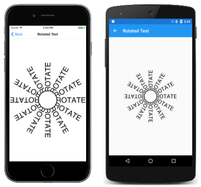

# The Rotate Transform

_Explore the effects and animations possible with the SkiaSharp rotate transform_

With the rotate transform, SkiaSharp graphics objects break free of the constraint of alignment with the horizontal and vertical axes:


For rotating a graphical object around the point (0, 0), SkiaSharp supports both a [`RotateDegrees`](xref:SkiaSharp.SKCanvas.RotateDegrees(System.Single)) method and a [`RotateRadians`](xref:SkiaSharp.SKCanvas.RotateRadians(System.Single)) method:

```csharp
public void RotateDegrees (Single degrees)

public Void RotateRadians (Single radians)
```

A circle of 360 degrees is the same as 2π radians, so it's easy to convert between the two units. Use whichever is convenient. All the trigonometric functions in the .NET [`Math`](xref:System.Math) class use units of radians.

Rotation is clockwise for increasing angles. (Although rotation on the Cartesian coordinate system is counter-clockwise by convention, clockwise rotation is consistent with Y coordinates increasing going down as in SkiaSharp.) Negative angles and angles greater than 360 degrees are allowed.

The transform formulas for rotation are more complex than those for translate and scale. For an angle of α, the transform formulas are:

x' = x•cos(α) – y•sin(α)   

y` = x•sin(α) + y•cos(α)

The **Basic Rotate** page demonstrates the `RotateDegrees` method. The [**BasicRotate.xaml.cs**](https://github.com/xamarin/xamarin-forms-samples/blob/master/SkiaSharpForms/Demos/Demos/SkiaSharpFormsDemos/Transforms/BasicRotatePage.xaml.cs) file displays some text with its baseline centered on the page and rotates it based on a `Slider` with a range of –360 to 360. Here's the relevant part of the `PaintSurface` handler:

```csharp
using (SKPaint textPaint = new SKPaint
{
    Style = SKPaintStyle.Fill,
    Color = SKColors.Blue,
    TextAlign = SKTextAlign.Center,
    TextSize = 100
})
{
    canvas.RotateDegrees((float)rotateSlider.Value);
    canvas.DrawText(Title, info.Width / 2, info.Height / 2, textPaint);
}
```

Because rotation is centered around the upper-left corner of the canvas, for most angles set in this program, the text is rotated off the screen:

[](rotate-images/basicrotate-large.png#lightbox "Triple screenshot of the Basic Rotate page")

Very often you'll want to rotate something centered around a specified pivot point using these versions of the [`RotateDegrees`](xref:SkiaSharp.SKCanvas.RotateDegrees(System.Single,System.Single,System.Single)) and [`RotateRadians`](xref:SkiaSharp.SKCanvas.RotateRadians(System.Single,System.Single,System.Single)) methods:

```csharp
public void RotateDegrees (Single degrees, Single px, Single py)

public void RotateRadians (Single radians, Single px, Single py)
```

The **Centered Rotate** page is just like the **Basic Rotate** except that the expanded version of the `RotateDegrees` is used to set the center of rotation to the same point used to position the text:

```csharp
using (SKPaint textPaint = new SKPaint
{
    Style = SKPaintStyle.Fill,
    Color = SKColors.Blue,
    TextAlign = SKTextAlign.Center,
    TextSize = 100
})
{
    canvas.RotateDegrees((float)rotateSlider.Value, info.Width / 2, info.Height / 2);
    canvas.DrawText(Title, info.Width / 2, info.Height / 2, textPaint);
}
```

Now the text rotates around the point used to position the text, which is the horizontal center of the text's baseline:

[](rotate-images/centeredrotate-large.png#lightbox "Triple screenshot of the Centered Rotate page")

As with the centered version of the `Scale` method, the centered version of the `RotateDegrees` call is a shortcut. Here's the method:

```csharp
RotateDegrees (degrees, px, py);
```

That call is equivalent to the following:

```csharp
canvas.Translate(px, py);
canvas.RotateDegrees(degrees);
canvas.Translate(-px, -py);
```

You'll discover that you can sometimes combine `Translate` calls with `Rotate` calls. For example, here are the `RotateDegrees` and `DrawText` calls in the **Centered Rotate** page;

```csharp
canvas.RotateDegrees((float)rotateSlider.Value, info.Width / 2, info.Height / 2);
canvas.DrawText(Title, info.Width / 2, info.Height / 2, textPaint);
```

The `RotateDegrees` call is equivalent to two `Translate` calls and a non-centered `RotateDegrees`:

```csharp
canvas.Translate(info.Width / 2, info.Height / 2);
canvas.RotateDegrees((float)rotateSlider.Value);
canvas.Translate(-info.Width / 2, -info.Height / 2);
canvas.DrawText(Title, info.Width / 2, info.Height / 2, textPaint);
```

The `DrawText` call to display text at a particular location is equivalent to a `Translate` call for that location followed by `DrawText` at the point (0, 0):

```csharp
canvas.Translate(info.Width / 2, info.Height / 2);
canvas.RotateDegrees((float)rotateSlider.Value);
canvas.Translate(-info.Width / 2, -info.Height / 2);
canvas.Translate(info.Width / 2, info.Height / 2);
canvas.DrawText(Title, 0, 0, textPaint);
```

The two consecutive `Translate` calls cancel each other out:

```csharp
canvas.Translate(info.Width / 2, info.Height / 2);
canvas.RotateDegrees((float)rotateSlider.Value);
canvas.DrawText(Title, 0, 0, textPaint);
```

Conceptually, the two transforms are applied in the order opposite to how they appear in the code. The `DrawText` call displays the text in the upper-left corner of the canvas. The `RotateDegrees` call rotates that text relative to the upper-left corner. Then the `Translate` call moves the text to the center of the canvas.

There are usually several ways to combine rotation and translation. The **Rotated Text** page creates the following display:

[](rotate-images/rotatedtext-large.png#lightbox "Triple screenshot of the Rotated Text page")

Here's the `PaintSurface` handler of the [`RotatedTextPage`](https://github.com/xamarin/xamarin-forms-samples/blob/master/SkiaSharpForms/Demos/Demos/SkiaSharpFormsDemos/Transforms/RotatedTextPage.cs) class:

```csharp
static readonly string text = "    ROTATE";
...
void OnCanvasViewPaintSurface(object sender, SKPaintSurfaceEventArgs args)
{
    SKImageInfo info = args.Info;
    SKSurface surface = args.Surface;
    SKCanvas canvas = surface.Canvas;

    canvas.Clear();

    using (SKPaint textPaint = new SKPaint
    {
        Color = SKColors.Black,
        TextSize = 72
    })
    {
        float xCenter = info.Width / 2;
        float yCenter = info.Height / 2;

        SKRect textBounds = new SKRect();
        textPaint.MeasureText(text, ref textBounds);
        float yText = yCenter - textBounds.Height / 2 - textBounds.Top;

        for (int degrees = 0; degrees < 360; degrees += 30)
        {
            canvas.Save();
            canvas.RotateDegrees(degrees, xCenter, yCenter);
            canvas.DrawText(text, xCenter, yText, textPaint);
            canvas.Restore();
        }
    }
}

```

The `xCenter` and `yCenter` values indicate the center of the canvas. The `yText` value is a little offset from that. This value is the Y coordinate necessary to position the text so that it is truly vertically centered on the page. The `for` loop then sets a rotation based on the center of the canvas. The rotation is in increments of 30 degrees. The text is drawn using the `yText` value. The number of blanks before the word "ROTATE" in the `text` value was determined empirically to make the connection between these 12 text strings appear to be a dodecagon.

One way to simplify this code is to increment the rotation angle by 30 degrees each time through the loop after the `DrawText` call. This eliminates the need for calls to `Save` and `Restore`. Notice that the `degrees` variable is no longer used within the body of the `for` block:

```csharp
for (int degrees = 0; degrees < 360; degrees += 30)
{
    canvas.DrawText(text, xCenter, yText, textPaint);
    canvas.RotateDegrees(30, xCenter, yCenter);
}

```

It's also possible to use the simple form of `RotateDegrees` by prefacing the loop with a call to `Translate` to move everything to the center of the canvas:

```csharp
float yText = -textBounds.Height / 2 - textBounds.Top;

canvas.Translate(xCenter, yCenter);

for (int degrees = 0; degrees < 360; degrees += 30)
{
    canvas.DrawText(text, 0, yText, textPaint);
    canvas.RotateDegrees(30);
}
```

The modified `yText` calculation no longer incorporates `yCenter`. Now the `DrawText` call centers the text vertically at the top of the canvas.

Because the transforms are conceptually applied opposite to how they appear in code, it's often possible to begin with more global transforms, followed by more local transforms. This is often the easiest way to combine rotation and translation.

For example, suppose you want to draw a graphical object that rotates around its center much like a planet rotating on its axis. But you also want this object to revolve around the center of the screen much like a planet revolving around the sun.

You can do this by positioning the object in the upper-left corner of the canvas, and then using an animation to rotate it around that corner. Next, translate the object horizontally like an orbital radius. Now apply a second animated rotation, also around the origin. This makes the object revolve around the corner. Now translate to the center of the canvas.

Here's the `PaintSurface` handler that contains these transform calls in reverse order:

```csharp
float revolveDegrees, rotateDegrees;
...
void OnCanvasViewPaintSurface(object sender, SKPaintSurfaceEventArgs args)
{
    SKImageInfo info = args.Info;
    SKSurface surface = args.Surface;
    SKCanvas canvas = surface.Canvas;

    canvas.Clear();

    using (SKPaint fillPaint = new SKPaint
    {
        Style = SKPaintStyle.Fill,
        Color = SKColors.Red
    })
    {
        // Translate to center of canvas
        canvas.Translate(info.Width / 2, info.Height / 2);

        // Rotate around center of canvas
        canvas.RotateDegrees(revolveDegrees);

        // Translate horizontally
        float radius = Math.Min(info.Width, info.Height) / 3;
        canvas.Translate(radius, 0);

        // Rotate around center of object
        canvas.RotateDegrees(rotateDegrees);

        // Draw a square
        canvas.DrawRect(new SKRect(-50, -50, 50, 50), fillPaint);
    }
}
```

The `revolveDegrees` and `rotateDegrees` fields are animated. This program uses a different animation technique based on the Xamarin.Forms [`Animation`](xref:Xamarin.Forms.Animation) class. (This class is described in Chapter 22 of [Free PDF download of *Creating Mobile Apps with Xamarin.Forms*](https://aka.ms/xamformsebook)) The `OnAppearing` override creates two `Animation` objects with callback methods and then calls `Commit` on them for an animation duration:

```csharp
protected override void OnAppearing()
{
    base.OnAppearing();

    new Animation((value) => revolveDegrees = 360 * (float)value).
        Commit(this, "revolveAnimation", length: 10000, repeat: () => true);

    new Animation((value) =>
    {
        rotateDegrees = 360 * (float)value;
        canvasView.InvalidateSurface();
    }).Commit(this, "rotateAnimation", length: 1000, repeat: () => true);
}
```

The first `Animation` object animates `revolveDegrees` from 0 degrees to 360 degrees over 10 seconds. The second one animates `rotateDegrees` from 0 degrees to 360 degrees every 1 second and also invalidates the surface to generate another call to the `PaintSurface` handler. The `OnDisappearing` override cancels these two animations:

```csharp
protected override void OnDisappearing()
{
    base.OnDisappearing();
    this.AbortAnimation("revolveAnimation");
    this.AbortAnimation("rotateAnimation");
}
```

The **Ugly Analog Clock** program (so called because a more attractive analog clock will be described in a later article) uses rotation to draw the minute and hour marks of the clock and to rotate the hands. The program draws the clock using an arbitrary coordinate system based on a circle that is centered at the point (0, 0) with a radius of 100. It uses translation and scaling to expand and center that circle on the page.

The `Translate` and `Scale` calls apply globally to the clock, so those are the first ones to be called following the initialization of the `SKPaint` objects:

```csharp
void OnCanvasViewPaintSurface(object sender, SKPaintSurfaceEventArgs args)
{
    SKImageInfo info = args.Info;
    SKSurface surface = args.Surface;
    SKCanvas canvas = surface.Canvas;

    canvas.Clear();

    using (SKPaint strokePaint = new SKPaint())
    using (SKPaint fillPaint = new SKPaint())
    {
        strokePaint.Style = SKPaintStyle.Stroke;
        strokePaint.Color = SKColors.Black;
        strokePaint.StrokeCap = SKStrokeCap.Round;

        fillPaint.Style = SKPaintStyle.Fill;
        fillPaint.Color = SKColors.Gray;

        // Transform for 100-radius circle centered at origin
        canvas.Translate(info.Width / 2f, info.Height / 2f);
        canvas.Scale(Math.Min(info.Width / 200f, info.Height / 200f));
        ...
    }
}
```

There are 60 marks of two different sizes that must be drawn in a circle around the clock. The `DrawCircle` call draws that circle at the point (0, –90), which relative to the center of the clock corresponds to 12:00. The `RotateDegrees` call increments the rotation angle by 6 degrees after every tick mark. The `angle` variable is used solely to determine if a large circle or a small circle is drawn:

```csharp
void OnCanvasViewPaintSurface(object sender, SKPaintSurfaceEventArgs args)
{
    ...
        // Hour and minute marks
        for (int angle = 0; angle < 360; angle += 6)
        {
            canvas.DrawCircle(0, -90, angle % 30 == 0 ? 4 : 2, fillPaint);
            canvas.RotateDegrees(6);
        }
    ...
    }
}
```

Finally, the `PaintSurface` handler obtains the current time and calculates rotation degrees for the hour, minute, and second hands. Each hand is drawn in the 12:00 position so that the rotation angle is relative to that:

```csharp
void OnCanvasViewPaintSurface(object sender, SKPaintSurfaceEventArgs args)
{
    ...
        DateTime dateTime = DateTime.Now;

        // Hour hand
        strokePaint.StrokeWidth = 20;
        canvas.Save();
        canvas.RotateDegrees(30 * dateTime.Hour + dateTime.Minute / 2f);
        canvas.DrawLine(0, 0, 0, -50, strokePaint);
        canvas.Restore();

        // Minute hand
        strokePaint.StrokeWidth = 10;
        canvas.Save();
        canvas.RotateDegrees(6 * dateTime.Minute + dateTime.Second / 10f);
        canvas.DrawLine(0, 0, 0, -70, strokePaint);
        canvas.Restore();

        // Second hand
        strokePaint.StrokeWidth = 2;
        canvas.Save();
        canvas.RotateDegrees(6 * dateTime.Second);
        canvas.DrawLine(0, 10, 0, -80, strokePaint);
        canvas.Restore();
    }
}
```

The clock is certainly functional although the hands are rather crude:

[](rotate-images/uglyanalogclock-large.png#lightbox "Triple screenshot of the Ugly Analog page")

For a more attractive clock, see the article [**SVG Path Data in SkiaSharp**](../curves/path-data.md).

## Related Links

- [SkiaSharp APIs](/dotnet/api/skiasharp)
