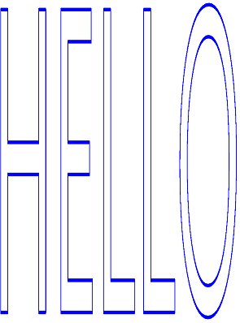
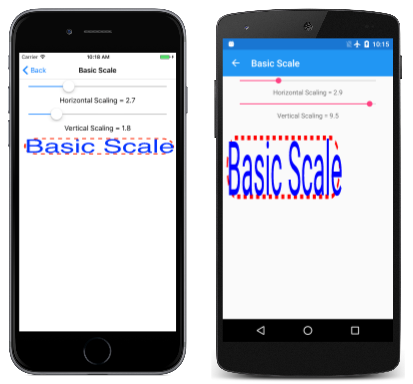
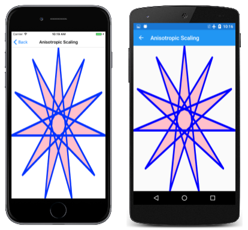

# The Scale Transform

_Discover the SkiaSharp scale transform for scaling objects to various sizes_

As you've seen in [**The Translate Transform**](translate.md) article, the translate transform can move a graphical object from one location to another. In contrast, the scale transform changes the size of the graphical object:



The scale transform also often causes graphics coordinates to move as they are made larger.

Earlier you saw two transform formulas that describe the effects of translation factors of `dx` and `dy`:

x' = x + dx

y' = y + dy

Scale factors of `sx` and `sy` are multiplicative rather than additive:

x' = sx · x

y' = sy · y

The default values of the translate factors are 0; the default values of the scale factors are 1.

The `SKCanvas` class defines four `Scale` methods. The first [`Scale`](xref:SkiaSharp.SKCanvas.Scale(System.Single)) method is for cases when you want the same horizontal and vertical scaling factor:

```csharp
public void Scale (Single s)
```

This is known as *isotropic* scaling &mdash; scaling that is the same in both directions. Isotropic scaling preserves the object's aspect ratio.

The second [`Scale`](xref:SkiaSharp.SKCanvas.Scale(System.Single,System.Single)) method lets you specify different values for horizontal and vertical scaling:

```csharp
public void Scale (Single sx, Single sy)
```

This results in *anisotropic* scaling.
The third [`Scale`](xref:SkiaSharp.SKCanvas.Scale(SkiaSharp.SKPoint)) method combines the two scaling factors in a single `SKPoint` value:

```csharp
public void Scale (SKPoint size)
```

The fourth `Scale` method will be described shortly.

The **Basic Scale** page demonstrates the `Scale` method. The [**BasicScalePage.xaml**](https://github.com/xamarin/xamarin-forms-samples/blob/master/SkiaSharpForms/Demos/Demos/SkiaSharpFormsDemos/Transforms/BasicScalePage.xaml) file contains two `Slider` elements that let you select horizontal and vertical scaling factors between 0 and 10. The [**BasicScalePage.xaml.cs**](https://github.com/xamarin/xamarin-forms-samples/blob/master/SkiaSharpForms/Demos/Demos/SkiaSharpFormsDemos/Transforms/BasicScalePage.xaml.cs) code-behind file uses those values to call `Scale` before displaying a rounded rectangle stroked with a dashed line and sized to fit some text in the upper-left corner of the canvas:

```csharp
void OnCanvasViewPaintSurface(object sender, SKPaintSurfaceEventArgs args)
{
    SKImageInfo info = args.Info;
    SKSurface surface = args.Surface;
    SKCanvas canvas = surface.Canvas;

    canvas.Clear(SKColors.SkyBlue);

    using (SKPaint strokePaint = new SKPaint
    {
        Style = SKPaintStyle.Stroke,
        Color = SKColors.Red,
        StrokeWidth = 3,
        PathEffect = SKPathEffect.CreateDash(new float[] {  7, 7 }, 0)
    })
    using (SKPaint textPaint = new SKPaint
    {
        Style = SKPaintStyle.Fill,
        Color = SKColors.Blue,
        TextSize = 50
    })
    {
        canvas.Scale((float)xScaleSlider.Value,
                     (float)yScaleSlider.Value);

        SKRect textBounds = new SKRect();
        textPaint.MeasureText(Title, ref textBounds);

        float margin = 10;
        SKRect borderRect = SKRect.Create(new SKPoint(margin, margin), textBounds.Size);
        canvas.DrawRoundRect(borderRect, 20, 20, strokePaint);
        canvas.DrawText(Title, margin, -textBounds.Top + margin, textPaint);
    }
}
```

You might wonder: How do the scaling factors affect the value returned from the `MeasureText` method of `SKPaint`? The answer is: Not at all. `Scale` is a method of `SKCanvas`. It does not affect anything you do with an `SKPaint` object until you use that object to render something on the canvas.

As you can see, everything drawn after the `Scale` call increases proportionally:

[](scale-images/basicscale-large.png#lightbox "Triple screenshot of the Basic Scale page")

The text, the width of the dashed line, the length of the dashes in that line, the rounding of the corners, and the 10-pixel margin between the left and top edges of the canvas and the rounded rectangle are all subject to the same scaling factors.

> [!IMPORTANT]
> The Universal Windows Platform does not properly render anisotropicly scaled text.

Anisotropic scaling causes the stroke width to become different for lines aligned with the horizontal and vertical axes. (This is also evident from the first image on this page.) If you don't want the stroke width to be affected by the scaling factors, set it to 0 and it will always be one pixel wide regardless of the `Scale` setting.

Scaling is relative to the upper-left corner of the canvas. This might be exactly what you want, but it might not be. Suppose you want to position the text and rectangle somewhere else on the canvas and you want to scale it relative to its center. In that case you can use the fourth version of the [`Scale`](xref:SkiaSharp.SKCanvas.Scale(System.Single,System.Single,System.Single,System.Single)) method, which includes two additional parameters to specify the center of scaling:

```csharp
public void Scale (Single sx, Single sy, Single px, Single py)
```

The `px` and `py` parameters define a point that is sometimes called the *scaling center* but in the SkiaSharp documentation is referred to as a *pivot point*. This is a point relative to the upper-left corner of the canvas that is not affected by the scaling. All scaling occurs relative to that center.

The [**Centered Scale**](https://github.com/xamarin/xamarin-forms-samples/blob/master/SkiaSharpForms/Demos/Demos/SkiaSharpFormsDemos/Transforms/CenteredScalePage.xaml.cs) page shows how this works. The `PaintSurface` handler is similar to the **Basic Scale** program except that the `margin` value is calculated to center the text horizontally, which implies that the program works best in portrait mode:

```csharp
void OnCanvasViewPaintSurface(object sender, SKPaintSurfaceEventArgs args)
{
    SKImageInfo info = args.Info;
    SKSurface surface = args.Surface;
    SKCanvas canvas = surface.Canvas;

    canvas.Clear(SKColors.SkyBlue);

    using (SKPaint strokePaint = new SKPaint
    {
        Style = SKPaintStyle.Stroke,
        Color = SKColors.Red,
        StrokeWidth = 3,
        PathEffect = SKPathEffect.CreateDash(new float[] { 7, 7 }, 0)
    })
    using (SKPaint textPaint = new SKPaint
    {
        Style = SKPaintStyle.Fill,
        Color = SKColors.Blue,
        TextSize = 50
    })
    {
        SKRect textBounds = new SKRect();
        textPaint.MeasureText(Title, ref textBounds);
        float margin = (info.Width - textBounds.Width) / 2;

        float sx = (float)xScaleSlider.Value;
        float sy = (float)yScaleSlider.Value;
        float px = margin + textBounds.Width / 2;
        float py = margin + textBounds.Height / 2;

        canvas.Scale(sx, sy, px, py);

        SKRect borderRect = SKRect.Create(new SKPoint(margin, margin), textBounds.Size);
        canvas.DrawRoundRect(borderRect, 20, 20, strokePaint);
        canvas.DrawText(Title, margin, -textBounds.Top + margin, textPaint);
    }
}
```

The upper-left corner of the rounded rectangle is positioned `margin` pixels from the left of the canvas and `margin` pixels from the top. The last two arguments to the `Scale` method are set to those values plus the width and height of the text, which is also the width and height of the rounded rectangle. This means that all scaling is relative to the center of that rectangle:

[](scale-images/centeredscale-large.png#lightbox "Triple screenshot of the Centered Scale page")

The `Slider` elements in this program have a range of &ndash;10 to 10. As you can see,
negative values of vertical scaling (such as on the Android screen in the center) cause objects to flip around the horizontal axis that passes through the center of scaling. Negative values of horizontal scaling (such as in the UWP screen on the right) cause objects to flip around the vertical axis that passes through the center of scaling.

The version of the [`Scale`](xref:SkiaSharp.SKCanvas.Scale(System.Single,System.Single,System.Single,System.Single)) method with pivot points is a shortcut for a series of three `Translate` and `Scale` calls. You might want to see how this works by replacing the `Scale` method in the **Centered Scale** page with the following:

```csharp
canvas.Translate(-px, -py);
```

These are the negatives of the pivot point coordinates.

Now run the program again. You'll see that the rectangle and text are shifted so that the center is in the upper-left corner of the canvas. You can barely see it. The sliders don't work of course because now the program doesn't scale at all.

Now add the basic `Scale` call (without a scaling center) *before* that `Translate` call:

```csharp
canvas.Scale(sx, sy);
canvas.Translate(–px, –py);
```

If you're familiar with this exercise in other graphics programming systems, you might think that's wrong, but it's not. Skia handles successive transform calls a little differently from what you might be familiar with.

With the successive `Scale` and `Translate` calls, the center of the rounded rectangle is still in the upper-left corner, but you can now scale it relative to the upper-left corner of the canvas, which is also the center of the rounded rectangle.

Now, before that `Scale` call, add another `Translate` call with the centering values:

```csharp
canvas.Translate(px, py);
canvas.Scale(sx, sy);
canvas.Translate(–px, –py);
```

This moves the scaled result back to the original position. Those three calls are equivalent to:

```csharp
canvas.Scale(sx, sy, px, py);
```

The individual transforms are compounded so that the total transform formula is:

 x' = sx · (x – px) + px

 y' = sy · (y – py) + py

Keep in mind that the default values of `sx` and `sy` are 1. It's easy to convince yourself that the pivot point (px, py) is not transformed by these formulas. It remains in the same location relative to the canvas.

When you combine `Translate` and `Scale` calls, the order matters. If the `Translate` comes after the `Scale`, the translation factors are effectively scaled by the scaling factors. If the `Translate` comes before the `Scale`, the translation factors are not scaled. This process becomes somewhat clearer (albeit more mathematical) when the subject of transform matrices is introduced.

The `SKPath` class defines a read-only [`Bounds`](xref:SkiaSharp.SKPath.Bounds) property that returns an `SKRect` defining the extent of the coordinates in the path. For example, when the `Bounds` property is obtained from the hendecagram path created earlier, the `Left` and `Top` properties of the rectangle are approximately –100, the `Right` and `Bottom` properties are approximately 100, and the `Width` and `Height` properties are approximately 200. (Most of the actual values are a little less because the points of the stars are defined by a circle with a radius of 100 but only the top point is parallel with the horizontal or vertical axes.)

The availability of this information implies that it should be possible to derive scale and translate factors suitable for scaling a path to the size of the canvas. The [**Anisotropic Scaling**](https://github.com/xamarin/xamarin-forms-samples/blob/master/SkiaSharpForms/Demos/Demos/SkiaSharpFormsDemos/Transforms/AnisotropicScalingPage.cs) page demonstrates this with the 11-pointed star. An *anisotropic* scale means that it's unequal in the horizontal and vertical directions, which means that the star won't retain its original aspect ratio. Here's the relevant code in the `PaintSurface` handler:

```csharp
SKPath path = HendecagramPage.HendecagramPath;
SKRect pathBounds = path.Bounds;

using (SKPaint fillPaint = new SKPaint
{
    Style = SKPaintStyle.Fill,
    Color = SKColors.Pink
})
using (SKPaint strokePaint = new SKPaint
{
    Style = SKPaintStyle.Stroke,
    Color = SKColors.Blue,
    StrokeWidth = 3,
    StrokeJoin = SKStrokeJoin.Round
})
{
    canvas.Scale(info.Width / pathBounds.Width,
                 info.Height / pathBounds.Height);
    canvas.Translate(-pathBounds.Left, -pathBounds.Top);

    canvas.DrawPath(path, fillPaint);
    canvas.DrawPath(path, strokePaint);
}
```

The `pathBounds` rectangle is obtained near the top of this code, and then used later with the width and height of the canvas in the `Scale` call. That call by itself will scale the coordinates of the path when it's rendered by the `DrawPath` call but the star will be centered in the upper-right corner of the canvas. It needs to be shifted down and to the left. This is the job of the `Translate` call. Those two properties of `pathBounds` are approximately –100, so the translation factors are about 100. Because the `Translate` call is after the `Scale` call, those values are effectively scaled by the scaling factors, so they move the center of the star to the center of the canvas:

[](scale-images/anisotropicscaling-large.png#lightbox "Triple screenshot of the Anisotropic Scaling page")

Another way you can think about the `Scale` and `Translate` calls is to determine the effect in reverse sequence: The `Translate` call shifts the path so it becomes fully visible but oriented in the upper-left corner of the canvas. The `Scale` method then makes that star larger relative to the upper-left corner.

Actually, it appears that the star is a little larger than the canvas. The problem is the stroke width. The `Bounds` property of `SKPath` indicates the dimensions of the coordinates encoded in the path, and that's what the program uses to scale it. When the path is rendered with a particular stroke width, the rendered path is larger than the canvas.

To fix this problem you need to compensate for that. One easy approach in this program is to add the following statement right before the `Scale` call:

```csharp
pathBounds.Inflate(strokePaint.StrokeWidth / 2,
                   strokePaint.StrokeWidth / 2);
```

This increases the `pathBounds` rectangle by 1.5 units on all four sides. This is a reasonable solution only when the stroke join is rounded. A miter join can be longer and is difficult to calculate.

You can also use a similar technique with text, as the **Anisotropic Text** page demonstrates. Here's the relevant part of the `PaintSurface` handler from the [`AnisotropicTextPage`](https://github.com/xamarin/xamarin-forms-samples/blob/master/SkiaSharpForms/Demos/Demos/SkiaSharpFormsDemos/Transforms/AnisotropicTextPage.cs) class:

```csharp
using (SKPaint textPaint = new SKPaint
{
    Style = SKPaintStyle.Stroke,
    Color = SKColors.Blue,
    StrokeWidth = 0.1f,
    StrokeJoin = SKStrokeJoin.Round
})
{
    SKRect textBounds = new SKRect();
    textPaint.MeasureText("HELLO", ref textBounds);

    // Inflate bounds by the stroke width
    textBounds.Inflate(textPaint.StrokeWidth / 2,
                       textPaint.StrokeWidth / 2);

    canvas.Scale(info.Width / textBounds.Width,
                 info.Height / textBounds.Height);
    canvas.Translate(-textBounds.Left, -textBounds.Top);

    canvas.DrawText("HELLO", 0, 0, textPaint);
}
```

It's similar logic, and the text expands to the size of the page based on the text bounds rectangle returned from `MeasureText` (which is a little larger than the actual text):

[](scale-images/anisotropictext-large.png#lightbox "Triple screenshot of the Anisotropic Test page")

If you need to preserve the aspect ratio of the graphical objects, you'll want to use isotropic scaling. The **Isotropic Scaling** page demonstrates this for the 11-pointed star. Conceptually, the steps for displaying a graphical object in the center of the page with isotropic scaling are:

- Translate the center of the graphical object to the upper-left corner.
- Scale the object based on the minimum of the horizontal and vertical page dimensions divided by the graphical object dimensions.
- Translate the center of the scaled object to the center of the page.

The [`IsotropicScalingPage`](https://github.com/xamarin/xamarin-forms-samples/blob/master/SkiaSharpForms/Demos/Demos/SkiaSharpFormsDemos/Transforms/IsotropicScalingPage.cs) performs these steps in reverse order before displaying the star:

```csharp
void OnCanvasViewPaintSurface(object sender, SKPaintSurfaceEventArgs args)
{
    SKImageInfo info = args.Info;
    SKSurface surface = args.Surface;
    SKCanvas canvas = surface.Canvas;

    canvas.Clear();

    SKPath path = HendecagramArrayPage.HendecagramPath;
    SKRect pathBounds = path.Bounds;

    using (SKPaint fillPaint = new SKPaint())
    {
        fillPaint.Style = SKPaintStyle.Fill;

        float scale = Math.Min(info.Width / pathBounds.Width,
                               info.Height / pathBounds.Height);

        for (int i = 0; i <= 10; i++)
        {
            fillPaint.Color = new SKColor((byte)(255 * (10 - i) / 10),
                                          0,
                                          (byte)(255 * i / 10));
            canvas.Save();
            canvas.Translate(info.Width / 2, info.Height / 2);
            canvas.Scale(scale);
            canvas.Translate(-pathBounds.MidX, -pathBounds.MidY);
            canvas.DrawPath(path, fillPaint);
            canvas.Restore();

            scale *= 0.9f;
        }
    }
}
```

The code also displays the star 10 more times, each time decreasing the scaling factor by 10% and progressively changing the color from red to blue:

[](scale-images/isotropicscaling-large.png#lightbox "Triple screenshot of the Isotropic Scaling page")

## Related Links

- [SkiaSharp APIs](/dotnet/api/skiasharp)
