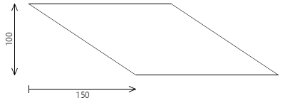
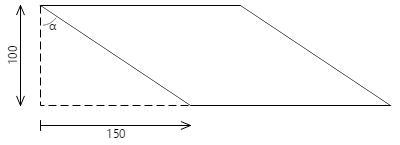
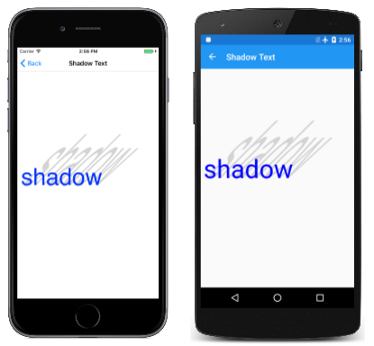

# The Skew Transform

_See how the skew transform can create tilted graphical objects in SkiaSharp_

In SkiaSharp, the skew transform tilts graphical objects, such as the shadow in this image:


The skew turns a rectangle into a parallelogram, but a skewed ellipse is still an ellipse.

Although .NET MAUI defines properties for translation, scaling, and rotations, there is no corresponding property in .NET MAUI for skew.

The [`Skew`](xref:SkiaSharp.SKCanvas.Skew(System.Single,System.Single)) method of `SKCanvas` accepts two arguments for horizontal skew and vertical skew:

```csharp
public void Skew (Single xSkew, Single ySkew)
```

A second [`Skew`](xref:SkiaSharp.SKCanvas.Skew(SkiaSharp.SKPoint)) method combines those arguments in a single `SKPoint` value:

```csharp
public void Skew (SKPoint skew)
```

However, it's unlikely that you'll be using either of these two methods in isolation.

The **Skew Experiment** page lets you experiment with skew values that range between –10 and 10. A text string is positioned in the upper-left corner of the page, with skew values obtained from two `Slider` elements. Here is the `PaintSurface` handler in the [`SkewExperimentPage`](https://github.com/mono/SkiaSharp/blob/docs/samples/Demos/Demos/SkiaSharpFormsDemos/Transforms/SkewExperimentPage.xaml.cs) class:

```csharp
void OnCanvasViewPaintSurface(object? sender, SKPaintSurfaceEventArgs args)
{
    SKImageInfo info = args.Info;
    SKSurface surface = args.Surface;
    SKCanvas canvas = surface.Canvas;

    canvas.Clear();

    using (SKPaint textPaint = new SKPaint
    {
        Style = SKPaintStyle.Fill,
        Color = SKColors.Blue
    })
    using (SKFont font = new SKFont
    {
        Size = 200
    })
    {
        string text = "SKEW";
        SKRect textBounds = new SKRect();
        font.MeasureText(text, out textBounds);

        canvas.Skew((float)xSkewSlider.Value, (float)ySkewSlider.Value);
        canvas.DrawText(text, 0, -textBounds.Top, SKTextAlign.Left, font, textPaint);
    }
}
```

Values of the `xSkew` argument shift the bottom of the text right for positive values or left for negative values. Values of `ySkew` shift the right of the text down for positive values or up for negative values:

[](skew-images/skewexperiment-large.png#lightbox "Triple screenshot of the Skew Experiment page")

If the `xSkew` value is the negative of the `ySkew` value, the result is rotation, but also scaled somewhat.

The transform formulas are as follows:

x' = x + xSkew · y

y' = ySkew · x + y

For example, for a positive `xSkew` value, the transformed `x'` value increases as `y` increases. That's what causes the tilt.

If a triangle 200 pixels wide and 100 pixels high is positioned with its upper-left corner at the point (0, 0) and is rendered with an `xSkew` value of 1.5, the following parallelogram results:



The coordinates of the bottom edge have `y` values of 100, so it is shifted 150 pixels to the right.

For non-zero values of `xSkew` or `ySkew`, only the point (0, 0) remains the same. That point can be considered the center of skewing. If you need the center of skewing to be something else (which is usually the case), there is no `Skew` method that provides that. You'll need to explicitly combine `Translate` calls with the `Skew` call. To center the skewing at `px` and `py`, make the following calls:

```csharp
canvas.Translate(px, py);
canvas.Skew(xSkew, ySkew);
canvas.Translate(-px, -py);
```

The composite transform formulas are:

x' = x + xSkew · (y – py)

y' = ySkew · (x – px) + y

If `ySkew` is zero, then the `px` value is not used. The value is irrelevant, and similarly for `ySkew` and `py`.

You might feel more comfortable specifying skew as an angle of tilt, such as the angle α in this diagram:



The ratio of the 150-pixel shift to the 100-pixel vertical is the tangent of that angle, in this example 56.3 degrees.

The XAML file of the **Skew Angle Experiment** page is similar to the **Skew Angle** page except that the `Slider` elements range from –90 degrees to 90 degrees. The [`SkewAngleExperiment`](https://github.com/mono/SkiaSharp/blob/docs/samples/Demos/Demos/SkiaSharpFormsDemos/Transforms/SkewAngleExperimentPage.xaml.cs) code-behind file centers the text on the page and uses `Translate` to set a center of skewing to the center of the page. A short `SkewDegrees` method at the bottom of the code converts angles to skew values:

```csharp
void OnCanvasViewPaintSurface(object? sender, SKPaintSurfaceEventArgs args)
{
    SKImageInfo info = args.Info;
    SKSurface surface = args.Surface;
    SKCanvas canvas = surface.Canvas;

    canvas.Clear();

    using (SKPaint textPaint = new SKPaint
    {
        Style = SKPaintStyle.Fill,
        Color = SKColors.Blue
    })
    using (SKFont font = new SKFont
    {
        Size = 200
    })
    {
        float xCenter = info.Width / 2;
        float yCenter = info.Height / 2;

        string text = "SKEW";
        SKRect textBounds = new SKRect();
        font.MeasureText(text, out textBounds);
        float xText = xCenter - textBounds.MidX;
        float yText = yCenter - textBounds.MidY;

        canvas.Translate(xCenter, yCenter);
        SkewDegrees(canvas, xSkewSlider.Value, ySkewSlider.Value);
        canvas.Translate(-xCenter, -yCenter);
        canvas.DrawText(text, xText, yText, SKTextAlign.Left, font, textPaint);
    }
}

void SkewDegrees(SKCanvas canvas, double xDegrees, double yDegrees)
{
    canvas.Skew((float)Math.Tan(Math.PI * xDegrees / 180),
                (float)Math.Tan(Math.PI * yDegrees / 180));
}
```

As an angle approaches positive or negative 90 degrees, the tangent approaches infinity, but angles up to about 80 degrees or so are usable:

[](skew-images/skewangleexperiment-large.png#lightbox "Triple screenshot of the Skew Angle Experiment page")

A small negative horizontal skew can mimic oblique or italic text, as the **Oblique Text** page demonstrates. The [`ObliqueTextPage`](https://github.com/mono/SkiaSharp/blob/docs/samples/Demos/Demos/SkiaSharpFormsDemos/Transforms/ObliqueTextPage.cs) class shows how it's done:

```csharp
void OnCanvasViewPaintSurface(object? sender, SKPaintSurfaceEventArgs args)
{
    SKImageInfo info = args.Info;
    SKSurface surface = args.Surface;
    SKCanvas canvas = surface.Canvas;

    canvas.Clear();

    using (SKPaint textPaint = new SKPaint()
    {
        Style = SKPaintStyle.Fill,
        Color = SKColors.Maroon
    })
    using (SKFont font = new SKFont()
    {
        Size = info.Width / 8       // empirically determined
    })
    {
        canvas.Translate(info.Width / 2, info.Height / 2);
        SkewDegrees(canvas, -20, 0);
        canvas.DrawText(Title, 0, 0, SKTextAlign.Center, font, textPaint);
    }
}

void SkewDegrees(SKCanvas canvas, double xDegrees, double yDegrees)
{
    canvas.Skew((float)Math.Tan(Math.PI * xDegrees / 180),
                (float)Math.Tan(Math.PI * yDegrees / 180));
}
```

The `SKTextAlign.Center` parameter passed to `DrawText` positions the text with the horizontal center of the baseline at the specified location. The `SkewDegrees` skews the text horizontally 20 degrees relative to the baseline. The `Translate` call moves the horizontal center of the text's baseline to the center of the canvas:

[](skew-images/obliquetext-large.png#lightbox "Triple screenshot of the Oblique Text page")

The **Skew Shadow Text** page demonstrates how to use a combination of a 45-degree skew and vertical scale to make a text shadow that tilts away from the text. Here's the pertinent part of the `PaintSurface` handler:

```csharp
using (SKPaint textPaint = new SKPaint())
using (SKFont font = new SKFont())
{
    textPaint.Style = SKPaintStyle.Fill;
    font.Size = info.Width / 6;   // empirically determined

    // Common to shadow and text
    string text = "Shadow";
    float xText = 20;
    float yText = info.Height / 2;

    // Shadow
    textPaint.Color = SKColors.LightGray;
    canvas.Save();
    canvas.Translate(xText, yText);
    canvas.Skew((float)Math.Tan(-Math.PI / 4), 0);
    canvas.Scale(1, 3);
    canvas.Translate(-xText, -yText);
    canvas.DrawText(text, xText, yText, SKTextAlign.Left, font, textPaint);
    canvas.Restore();

    // Text
    textPaint.Color = SKColors.Blue;
    canvas.DrawText(text, xText, yText, SKTextAlign.Left, font, textPaint);
}
```

The shadow is displayed first and then the text:

[](skew-images/skewshadowtext1-large.png#lightbox "Triple screenshot of the Skew Shadow Text page")

The vertical coordinate passed to the `DrawText` method indicates the position of the text relative to the baseline. That is the same vertical coordinate used for the center of skewing. This technique will not work if the text string contains descenders. For example, substitute the word "quirky" for "Shadow" and here's the result:

[](skew-images/skewshadowtext2-large.png#lightbox "Triple screenshot of the Skew Shadow Text page with an alternative word with descenders")

The shadow and text are still aligned at the baseline, but the effect just looks wrong. To fix it, you need to obtain the text bounds:

```csharp
SKRect textBounds = new SKRect();
font.MeasureText(text, out textBounds);
```

The `Translate` calls need to be adjusted by the height of the descenders:

```csharp
canvas.Translate(xText, yText + textBounds.Bottom);
canvas.Skew((float)Math.Tan(-Math.PI / 4), 0);
canvas.Scale(1, 3);
canvas.Translate(-xText, -yText - textBounds.Bottom);
```

Now the shadow extends from the bottom of those descenders:

[](skew-images/skewshadowtext3-large.png#lightbox "Triple screenshot of the Skew Shadow Text page with adjustments for descenders")

## Related Links

- [SkiaSharp APIs](/dotnet/api/skiasharp)
