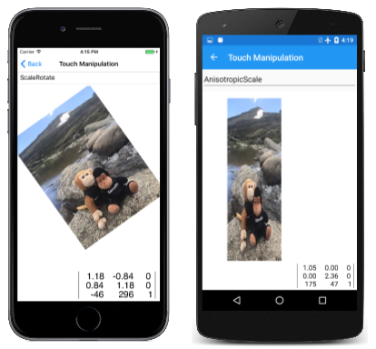
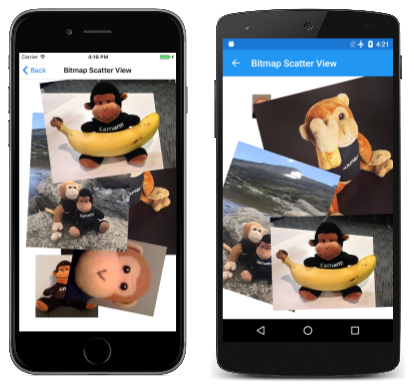

# Touch Manipulations

_Use matrix transforms to implement touch dragging, pinching, and rotation_

In multi-touch environments such as those on mobile devices, users often use their fingers to manipulate objects on the screen. Common gestures such as a one-finger drag and a two-finger pinch can move and scale objects, or even rotate them. These gestures are generally implemented using transform matrices, and this article shows you how to do that.


All the samples shown here use the built-in touch support in `SKCanvasView`. To enable touch events, set `EnableTouchEvents="True"` on the `SKCanvasView` and handle the `Touch` event. The event provides `SKTouchEventArgs` which includes the touch `Location` already in pixel coordinates and an `ActionType` property indicating the type of touch action.

## Dragging and Translation

One of the most important applications of matrix transforms is touch processing. A single [`SKMatrix`](xref:SkiaSharp.SKMatrix) value can consolidate a series of touch operations. 

For single-finger dragging, the `SKMatrix` value performs translation. This is demonstrated in the **Bitmap Dragging** page. The XAML file instantiates an `SKCanvasView` with touch events enabled:

```xaml
<ContentPage xmlns="http://schemas.microsoft.com/dotnet/2021/maui"
             xmlns:x="http://schemas.microsoft.com/winfx/2009/xaml"
             xmlns:skia="clr-namespace:SkiaSharp.Views.Maui.Controls;assembly=SkiaSharp.Views.Maui.Controls"
             x:Class="SkiaSharpFormsDemos.Transforms.BitmapDraggingPage"
             Title="Bitmap Dragging">
    
    <Grid BackgroundColor="White">
        <skia:SKCanvasView x:Name="canvasView"
                           EnableTouchEvents="True"
                           Touch="OnTouch"
                           PaintSurface="OnCanvasViewPaintSurface" />
    </Grid>
</ContentPage>
```

The code-behind file loads in a bitmap from the Resources/Raw folder in its constructor and displays it in the `PaintSurface` handler:

```csharp
public partial class BitmapDraggingPage : ContentPage
{
    // Bitmap and matrix for display
    SKBitmap? bitmap;
    SKMatrix matrix = SKMatrix.CreateIdentity();
    ···

    public BitmapDraggingPage()
    {
        InitializeComponent();

        _ = LoadBitmapAsync();
    }

    async Task LoadBitmapAsync()
    {
        using Stream stream = await FileSystem.OpenAppPackageFileAsync("SeatedMonkey.jpg");
        bitmap = SKBitmap.Decode(stream);
        canvasView.InvalidateSurface();
    }
    ···
    void OnCanvasViewPaintSurface(object? sender, SKPaintSurfaceEventArgs args)
    {
        SKImageInfo info = args.Info;
        SKSurface surface = args.Surface;
        SKCanvas canvas = surface.Canvas;

        canvas.Clear();

        if (bitmap is null)
            return;

        // Display the bitmap
        canvas.SetMatrix(matrix);
        canvas.DrawBitmap(bitmap, new SKPoint());
    }
}
```

Without any further code, the `SKMatrix` value is always the identify matrix, and it would have no effect on the display of the bitmap. The goal of the `OnTouch` handler set in the XAML file is to alter the matrix value to reflect touch manipulations.

The `OnTouch` handler receives touch events with the location already in pixel coordinates via `SKTouchEventArgs`:

```csharp
public partial class BitmapDraggingPage : ContentPage
{
    ···
    // Touch information
    long touchId = -1;
    SKPoint previousPoint;
    ···
    void OnTouch(object? sender, SKTouchEventArgs e)
    {
        if (bitmap is null)
            return;

        SKPoint point = e.Location;

        switch (e.ActionType)
        {
            case SKTouchAction.Pressed:
                // Find transformed bitmap rectangle
                SKRect rect = new SKRect(0, 0, bitmap.Width, bitmap.Height);
                rect = matrix.MapRect(rect);

                // Determine if the touch was within that rectangle
                if (rect.Contains(point))
                {
                    touchId = e.Id;
                    previousPoint = point;
                }
                break;

            case SKTouchAction.Moved:
                if (touchId == e.Id)
                {
                    // Adjust the matrix for the new position
                    matrix.TransX += point.X - previousPoint.X;
                    matrix.TransY += point.Y - previousPoint.Y;
                    previousPoint = point;
                    canvasView.InvalidateSurface();
                }
                break;

            case SKTouchAction.Released:
            case SKTouchAction.Cancelled:
                touchId = -1;
                break;
        }

        e.Handled = true;
    }
    ···
}
```

When a finger first touches the screen, an event of type `SKTouchAction.Pressed` is fired. The first task is to determine if the finger is touching the bitmap. Such a task is often called _hit-testing_. In this case, hit-testing can be accomplished by creating an `SKRect` value corresponding to the bitmap, applying the matrix transform to it with `MapRect`, and then determining if the touch point is inside the transformed rectangle.

If that is the case, then the `touchId` field is set to the touch ID, and the finger position is saved.

For the `SKTouchAction.Moved` event, the translation factors of the `SKMatrix` value are adjusted based on the current position of the finger, and the new position of the finger. That new position is saved for the next time through, and the `SKCanvasView` is invalidated.

As you experiment with this program, take note that you can only drag the bitmap when your finger touches an area where the bitmap is displayed. Although that restriction is not very important for this program, it becomes crucial when manipulating multiple bitmaps.

## Pinching and Scaling

What do you want to happen when two fingers touch the bitmap? If the two fingers move in parallel, then you probably want the bitmap to move along with the fingers. If the two fingers perform a pinch or stretch operation, then you might want the bitmap to be rotated (to be discussed in the next section) or scaled. When scaling a bitmap, it makes most sense for the two fingers to remain in the same positions relative to the bitmap, and for the bitmap to be scaled accordingly.

Handling two fingers at once seems complicated, but keep in mind that the `Touch` handler only receives information about one finger at a time. If two fingers are manipulating the bitmap, then for each event, one finger has changed position but the other has not changed. In the **Bitmap Scaling** page code below, the finger that has not changed position is called the _pivot_ point because the transform is relative to that point.

One difference between this program and the previous program is that multiple touch IDs must be saved. A dictionary is used for this purpose, where the touch ID is the dictionary key and the dictionary value is the current position of that finger:

```csharp
public partial class BitmapScalingPage : ContentPage
{
    ···
    // Touch information
    Dictionary<long, SKPoint> touchDictionary = new Dictionary<long, SKPoint>();
    ···
    void OnTouch(object? sender, SKTouchEventArgs e)
    {
        SKPoint point = e.Location;

        switch (e.ActionType)
        {
            case SKTouchAction.Pressed:
                // Find transformed bitmap rectangle
                SKRect rect = new SKRect(0, 0, bitmap.Width, bitmap.Height);
                rect = matrix.MapRect(rect);

                // Determine if the touch was within that rectangle
                if (rect.Contains(point) && !touchDictionary.ContainsKey(e.Id))
                {
                    touchDictionary.Add(e.Id, point);
                }
                break;

            case SKTouchAction.Moved:
                if (touchDictionary.ContainsKey(e.Id))
                {
                    // Single-finger drag
                    if (touchDictionary.Count == 1)
                    {
                        SKPoint prevPoint = touchDictionary[e.Id];

                        // Adjust the matrix for the new position
                        matrix.TransX += point.X - prevPoint.X;
                        matrix.TransY += point.Y - prevPoint.Y;
                        canvasView.InvalidateSurface();
                    }
                    // Double-finger scale and drag
                    else if (touchDictionary.Count >= 2)
                    {
                        // Copy two dictionary keys into array
                        long[] keys = new long[touchDictionary.Count];
                        touchDictionary.Keys.CopyTo(keys, 0);

                        // Find index of non-moving (pivot) finger
                        int pivotIndex = (keys[0] == e.Id) ? 1 : 0;

                        // Get the three points involved in the transform
                        SKPoint pivotPoint = touchDictionary[keys[pivotIndex]];
                        SKPoint prevPoint = touchDictionary[e.Id];
                        SKPoint newPoint = point;

                        // Calculate two vectors
                        SKPoint oldVector = prevPoint - pivotPoint;
                        SKPoint newVector = newPoint - pivotPoint;

                        // Scaling factors are ratios of those
                        float scaleX = newVector.X / oldVector.X;
                        float scaleY = newVector.Y / oldVector.Y;

                        if (!float.IsNaN(scaleX) && !float.IsInfinity(scaleX) &&
                            !float.IsNaN(scaleY) && !float.IsInfinity(scaleY))
                        {
                            // If something bad hasn't happened, calculate a scale and translation matrix
                            SKMatrix scaleMatrix = 
                                SKMatrix.CreateScale(scaleX, scaleY, pivotPoint.X, pivotPoint.Y);

                            matrix = matrix.PostConcat(scaleMatrix);
                            canvasView.InvalidateSurface();
                        }
                    }

                    // Store the new point in the dictionary
                    touchDictionary[e.Id] = point;
                }

                break;

            case SKTouchAction.Released:
            case SKTouchAction.Cancelled:
                if (touchDictionary.ContainsKey(e.Id))
                {
                    touchDictionary.Remove(e.Id);
                }
                break;
        }

        e.Handled = true;
    }
    ···
}
```

The handling of the `Pressed` action is almost the same as the previous program except that the ID and touch point are added to the dictionary. The `Released` and `Cancelled` actions remove the dictionary entry.

The handling for the `Moved` action is more complex, however. If there's only one finger involved, then the processing is very much the same as the previous program. For two or more fingers, the program must also obtain information from the dictionary involving the finger that is not moving. It does this by copying the dictionary keys into an array and then comparing the first key with the ID of the finger being moved. That allows the program to obtain the pivot point corresponding to the finger that is not moving.

Next, the program calculates two vectors of the new finger position relative to the pivot point, and the old finger position relative to the pivot point. The ratios of these vectors are scaling factors. Because division by zero is a possibility, these must be checked for infinite values or NaN (not a number) values. If all is well, a scaling transform is concatenated with the `SKMatrix` value saved as a field.

As you experiment with this page, you'll notice that you can drag the bitmap with one or two fingers, or scale it with two fingers. The scaling is _anisotropic_, which means that the scaling can be different in the horizontal and vertical directions. This distorts the aspect ratio, but also allows you to flip the bitmap to make a mirror image. You might also discover that you can shrink the bitmap to a zero dimension, and it disappears. In production code, you'll want to guard against this.

## Two-finger rotation

The **Bitmap Rotate** page allows you to use two fingers for either rotation or isotropic scaling. The bitmap always retains its correct aspect ratio. Using two fingers for both rotation and anisotropic scaling does not work very well because the movement of the fingers is very similar for both tasks.

The first big difference in this program is the hit-testing logic. The previous programs used the `Contains` method of `SKRect` to determine if the touch point is within the transformed rectangle that corresponds to the bitmap. But as the user manipulates the bitmap, the bitmap might be rotated, and `SKRect` cannot properly represent a rotated rectangle. You might fear that the hit-testing logic needs to implement rather complex analytic geometry in that case.

However, a shortcut is available: Determining if a point lies within the boundaries of a transformed rectangle is the same as determining if an inverse transformed point lies within the boundaries of the untransformed rectangle. That's a much easier calculation, and the logic can continue to use the convenient `Contains` method:

```csharp
public partial class BitmapRotationPage : ContentPage
{
    ···
    // Touch information
    Dictionary<long, SKPoint> touchDictionary = new Dictionary<long, SKPoint>();
    ···
    void OnTouch(object? sender, SKTouchEventArgs e)
    {
        SKPoint point = e.Location;

        switch (e.ActionType)
        {
            case SKTouchAction.Pressed:
                if (!touchDictionary.ContainsKey(e.Id))
                {
                    // Invert the matrix
                    if (matrix.TryInvert(out SKMatrix inverseMatrix))
                    {
                        // Transform the point using the inverted matrix
                        SKPoint transformedPoint = inverseMatrix.MapPoint(point);

                        // Check if it's in the untransformed bitmap rectangle
                        SKRect rect = new SKRect(0, 0, bitmap.Width, bitmap.Height);

                        if (rect.Contains(transformedPoint))
                        {
                            touchDictionary.Add(e.Id, point);
                        }
                    }
                }
                break;

            case SKTouchAction.Moved:
                if (touchDictionary.ContainsKey(e.Id))
                {
                    // Single-finger drag
                    if (touchDictionary.Count == 1)
                    {
                        SKPoint prevPoint = touchDictionary[e.Id];

                        // Adjust the matrix for the new position
                        matrix.TransX += point.X - prevPoint.X;
                        matrix.TransY += point.Y - prevPoint.Y;
                        canvasView.InvalidateSurface();
                    }
                    // Double-finger rotate, scale, and drag
                    else if (touchDictionary.Count >= 2)
                    {
                        // Copy two dictionary keys into array
                        long[] keys = new long[touchDictionary.Count];
                        touchDictionary.Keys.CopyTo(keys, 0);

                        // Find index non-moving (pivot) finger
                        int pivotIndex = (keys[0] == e.Id) ? 1 : 0;

                        // Get the three points in the transform
                        SKPoint pivotPoint = touchDictionary[keys[pivotIndex]];
                        SKPoint prevPoint = touchDictionary[e.Id];
                        SKPoint newPoint = point;

                        // Calculate two vectors
                        SKPoint oldVector = prevPoint - pivotPoint;
                        SKPoint newVector = newPoint - pivotPoint;

                        // Find angles from pivot point to touch points
                        float oldAngle = (float)Math.Atan2(oldVector.Y, oldVector.X);
                        float newAngle = (float)Math.Atan2(newVector.Y, newVector.X);

                        // Calculate rotation matrix
                        float angle = newAngle - oldAngle;
                        SKMatrix touchMatrix = SKMatrix.CreateRotation(angle, pivotPoint.X, pivotPoint.Y);

                        // Effectively rotate the old vector
                        float magnitudeRatio = Magnitude(oldVector) / Magnitude(newVector);
                        oldVector.X = magnitudeRatio * newVector.X;
                        oldVector.Y = magnitudeRatio * newVector.Y;

                        // Isotropic scaling!
                        float scale = Magnitude(newVector) / Magnitude(oldVector);

                        if (!float.IsNaN(scale) && !float.IsInfinity(scale))
                        {
                            touchMatrix = touchMatrix.PostConcat(
                                SKMatrix.CreateScale(scale, scale, pivotPoint.X, pivotPoint.Y));

                            matrix = matrix.PostConcat(touchMatrix);
                            canvasView.InvalidateSurface();
                        }
                    }

                    // Store the new point in the dictionary
                    touchDictionary[e.Id] = point;
                }

                break;

            case SKTouchAction.Released:
            case SKTouchAction.Cancelled:
                if (touchDictionary.ContainsKey(e.Id))
                {
                    touchDictionary.Remove(e.Id);
                }
                break;
        }

        e.Handled = true;
    }

    float Magnitude(SKPoint point)
    {
        return (float)Math.Sqrt(Math.Pow(point.X, 2) + Math.Pow(point.Y, 2));
    }
    ···
}
```

The logic for the `Moved` event starts out like the previous program. Two vectors named `oldVector` and `newVector` are calculated based on the previous and the current point of the moving finger and the pivot point of the unmoving finger. But then angles of these vectors are determined, and the difference is the rotation angle.

Scaling might also be involved, so the old vector is rotated based on the rotation angle. The relative magnitude of the two vectors is now the scaling factor. Notice that the same `scale` value is used for horizontal and vertical scaling so that scaling is isotropic. The `matrix` field is adjusted by both the rotation matrix and a scale matrix.

If your application needs to implement touch processing for a single bitmap (or other object), you can adapt the code from these three samples for your own application. But if you need to implement touch processing for multiple bitmaps, you'll probably want to encapsulate these touch operations in other classes.

## Encapsulating the Touch Operations

The **Touch Manipulation** page demonstrates the touch manipulation of a single bitmap, but using several other files that encapsulate much of the logic shown above. The first of these files is the [`TouchManipulationMode`](https://github.com/mono/SkiaSharp/blob/docs/samples/Demos/Demos/SkiaSharpFormsDemos/Transforms/TouchManipulationMode.cs) enumeration, which indicates the different types of touch manipulation implemented by the code you'll be seeing:

```csharp
enum TouchManipulationMode
{
    None,
    PanOnly,
    IsotropicScale,     // includes panning
    AnisotropicScale,   // includes panning
    ScaleRotate,        // implies isotropic scaling
    ScaleDualRotate     // adds one-finger rotation
}
```

`PanOnly` is a one-finger drag that is implemented with translation. All the subsequent options also include panning but involve two fingers: `IsotropicScale` is a pinch operation that results in the object scaling equally in the horizontal and vertical directions. `AnisotropicScale` allows unequal scaling.

The `ScaleRotate` option is for two-finger scaling and rotation. Scaling is isotropic. As mentioned earlier, implementing two-finger rotation with anisotropic scaling is problematic because the finger movements are essentially the same.

The `ScaleDualRotate` option adds one-finger rotation. When a single finger drags the object, the dragged object is first rotated around its center so that the center of the object lines up with the dragging vector.

The [**TouchManipulationPage.xaml**](https://github.com/mono/SkiaSharp/blob/docs/samples/Demos/Demos/SkiaSharpFormsDemos/Transforms/TouchManipulationPage.xaml) file includes a `Picker` with the members of the `TouchManipulationMode` enumeration:

```xaml
<?xml version="1.0" encoding="utf-8" ?>
<ContentPage xmlns="http://schemas.microsoft.com/dotnet/2021/maui"
             xmlns:x="http://schemas.microsoft.com/winfx/2009/xaml"
             xmlns:skia="clr-namespace:SkiaSharp.Views.Maui.Controls;assembly=SkiaSharp.Views.Maui.Controls"
             xmlns:local="clr-namespace:SkiaSharpFormsDemos.Transforms"
             x:Class="SkiaSharpFormsDemos.Transforms.TouchManipulationPage"
             Title="Touch Manipulation">
    <Grid>
        <Grid.RowDefinitions>
            <RowDefinition Height="Auto" />
            <RowDefinition Height="*" />
        </Grid.RowDefinitions>

        <Picker Title="Touch Mode"
                Grid.Row="0"
                SelectedIndexChanged="OnTouchModePickerSelectedIndexChanged">
            <Picker.ItemsSource>
                <x:Array Type="{x:Type local:TouchManipulationMode}">
                    <x:Static Member="local:TouchManipulationMode.None" />
                    <x:Static Member="local:TouchManipulationMode.PanOnly" />
                    <x:Static Member="local:TouchManipulationMode.IsotropicScale" />
                    <x:Static Member="local:TouchManipulationMode.AnisotropicScale" />
                    <x:Static Member="local:TouchManipulationMode.ScaleRotate" />
                    <x:Static Member="local:TouchManipulationMode.ScaleDualRotate" />
                </x:Array>
            </Picker.ItemsSource>
            <Picker.SelectedIndex>
                4
            </Picker.SelectedIndex>
        </Picker>
        
        <Grid BackgroundColor="White"
              Grid.Row="1">
            
            <skia:SKCanvasView x:Name="canvasView"
                               EnableTouchEvents="True"
                               Touch="OnTouch"
                               PaintSurface="OnCanvasViewPaintSurface" />
        </Grid>
    </Grid>
</ContentPage>
```

The `SKCanvasView` has touch events enabled and handles them directly.

The [**TouchManipulationPage.xaml.cs**](https://github.com/mono/SkiaSharp/blob/docs/samples/Demos/Demos/SkiaSharpFormsDemos/Transforms/TouchManipulationPage.xaml.cs) code-behind file has a `bitmap` field but it is not of type `SKBitmap`. The type is `TouchManipulationBitmap` (a class you'll see shortly):

```csharp
public partial class TouchManipulationPage : ContentPage
{
    TouchManipulationBitmap? bitmap;
    ...

    public TouchManipulationPage()
    {
        InitializeComponent();

        _ = LoadBitmapAsync();
    }

    async Task LoadBitmapAsync()
    {
        using Stream stream = await FileSystem.OpenAppPackageFileAsync("MountainClimbers.jpg");
        var loadedBitmap = SKBitmap.Decode(stream);
        bitmap = new TouchManipulationBitmap(loadedBitmap);
        bitmap.TouchManager.Mode = TouchManipulationMode.ScaleRotate;
        canvasView.InvalidateSurface();
    }
    ...
}
```

The constructor instantiates a `TouchManipulationBitmap` object, passing to the constructor an `SKBitmap` obtained from the Resources/Raw folder. The constructor concludes by setting the `Mode` property of the `TouchManager` property of the `TouchManipulationBitmap` object to a member of the `TouchManipulationMode` enumeration.

The `SelectedIndexChanged` handler for the `Picker` also sets this `Mode` property:

```csharp
public partial class TouchManipulationPage : ContentPage
{
    ...
    void OnTouchModePickerSelectedIndexChanged(object? sender, EventArgs args)
    {
        if (bitmap is not null)
        {
            Picker picker = (Picker)sender;
            bitmap.TouchManager.Mode = (TouchManipulationMode)picker.SelectedItem;
        }
    }
    ...
}
```

The `Touch` handler of the `SKCanvasView` instantiated in the XAML file calls two methods in `TouchManipulationBitmap` named `HitTest` and `ProcessTouchEvent`:

```csharp
public partial class TouchManipulationPage : ContentPage
{
    ...
    List<long> touchIds = new List<long>();
    ...
    void OnTouch(object? sender, SKTouchEventArgs e)
    {
        if (bitmap is null)
            return;

        SKPoint point = e.Location;

        switch (e.ActionType)
        {
            case SKTouchAction.Pressed:
                if (bitmap.HitTest(point))
                {
                    touchIds.Add(e.Id);
                    bitmap.ProcessTouchEvent(e.Id, e.ActionType, point);
                    break;
                }
                break;

            case SKTouchAction.Moved:
                if (touchIds.Contains(e.Id))
                {
                    bitmap.ProcessTouchEvent(e.Id, e.ActionType, point);
                    canvasView.InvalidateSurface();
                }
                break;

            case SKTouchAction.Released:
            case SKTouchAction.Cancelled:
                if (touchIds.Contains(e.Id))
                {
                    bitmap.ProcessTouchEvent(e.Id, e.ActionType, point);
                    touchIds.Remove(e.Id);
                    canvasView.InvalidateSurface();
                }
                break;
        }

        e.Handled = true;
    }
    ...
}
```

If the `HitTest` method returns `true` &mdash; meaning that a finger has touched the screen within the area occupied by the bitmap &mdash; then the touch ID is added to the `TouchIds` collection. This ID represents the sequence of touch events for that finger until the finger lifts from the screen. If multiple fingers touch the bitmap, then the `touchIds` collection contains a touch ID for each finger.

The `Touch` handler also calls the `ProcessTouchEvent` class in `TouchManipulationBitmap`. This is where some (but not all) of the real touch processing occurs.

The [`TouchManipulationBitmap`](https://github.com/mono/SkiaSharp/blob/docs/samples/Demos/Demos/SkiaSharpFormsDemos/Transforms/TouchManipulationBitmap.cs) class is a wrapper class for `SKBitmap` that contains code to render the bitmap and process touch events. It works in conjunction with more generalized code in a `TouchManipulationManager` class (which you'll see shortly).

The `TouchManipulationBitmap` constructor saves the `SKBitmap` and instantiates two properties, the `TouchManager` property of type `TouchManipulationManager` and the `Matrix` property of type `SKMatrix`:

```csharp
class TouchManipulationBitmap
{
    SKBitmap bitmap;
    ...

    public TouchManipulationBitmap(SKBitmap bitmap)
    {
        this.bitmap = bitmap;
        Matrix = SKMatrix.CreateIdentity();

        TouchManager = new TouchManipulationManager
        {
            Mode = TouchManipulationMode.ScaleRotate
        };
    }

    public TouchManipulationManager TouchManager { set; get; }

    public SKMatrix Matrix { set; get; }
    ...
}
```

This `Matrix` property is the accumulated transform resulting from all the touch activity. As you'll see, each touch event is resolved into a matrix, which is then concatenated with the `SKMatrix` value stored by the `Matrix` property.

The `TouchManipulationBitmap` object draws itself in its `Paint` method. The argument is an `SKCanvas` object. This `SKCanvas` might already have a transform applied to it, so the `Paint` method concatenates the `Matrix` property associated with the bitmap to the existing transform, and restores the canvas when it has finished:

```csharp
class TouchManipulationBitmap
{
    ...
    public void Paint(SKCanvas canvas)
    {
        canvas.Save();
        SKMatrix matrix = Matrix;
        canvas.Concat(ref matrix);
        canvas.DrawBitmap(bitmap, 0, 0);
        canvas.Restore();
    }
    ...
}
```

The `HitTest` method returns `true` if the user touches the screen at a point within the boundaries of the bitmap. This uses the logic shown earlier in the **Bitmap Rotation** page:

```csharp
class TouchManipulationBitmap
{
    ...
    public bool HitTest(SKPoint location)
    {
        // Invert the matrix
        SKMatrix inverseMatrix;

        if (Matrix.TryInvert(out inverseMatrix))
        {
            // Transform the point using the inverted matrix
            SKPoint transformedPoint = inverseMatrix.MapPoint(location);

            // Check if it's in the untransformed bitmap rectangle
            SKRect rect = new SKRect(0, 0, bitmap.Width, bitmap.Height);
            return rect.Contains(transformedPoint);
        }
        return false;
    }
    ...
}
```

The second public method in `TouchManipulationBitmap` is `ProcessTouchEvent`. When this method is called, it has already been established that the touch event belongs to this particular bitmap. The method maintains a dictionary of [`TouchManipulationInfo`](https://github.com/mono/SkiaSharp/blob/docs/samples/Demos/Demos/SkiaSharpFormsDemos/Transforms/TouchManipulationInfo.cs) objects, which is simply the previous point and the new point of each finger:

```csharp
class TouchManipulationInfo
{
    public SKPoint PreviousPoint { set; get; }

    public SKPoint NewPoint { set; get; }
}
```

Here's the dictionary and the `ProcessTouchEvent` method itself:

```csharp
class TouchManipulationBitmap
{
    ...
    Dictionary<long, TouchManipulationInfo> touchDictionary =
        new Dictionary<long, TouchManipulationInfo>();
    ...
    public void ProcessTouchEvent(long id, SKTouchAction type, SKPoint location)
    {
        switch (type)
        {
            case SKTouchAction.Pressed:
                touchDictionary.Add(id, new TouchManipulationInfo
                {
                    PreviousPoint = location,
                    NewPoint = location
                });
                break;

            case SKTouchAction.Moved:
                TouchManipulationInfo info = touchDictionary[id];
                info.NewPoint = location;
                Manipulate();
                info.PreviousPoint = info.NewPoint;
                break;

            case SKTouchAction.Released:
                touchDictionary[id].NewPoint = location;
                Manipulate();
                touchDictionary.Remove(id);
                break;

            case SKTouchAction.Cancelled:
                touchDictionary.Remove(id);
                break;
        }
    }
    ...
}
```

In the `Moved` and `Released` events, the method calls `Manipulate`. At these times, the `touchDictionary` contains one or more `TouchManipulationInfo` objects. If the `touchDictionary` contains one item, it is likely that the `PreviousPoint` and `NewPoint` values are unequal and represent the movement of a finger. If multiple fingers are touching the bitmap, the dictionary contains more than one item, but only one of these items has different `PreviousPoint` and `NewPoint` values. All the rest have equal `PreviousPoint` and `NewPoint` values.

This is important: The `Manipulate` method can assume that it's processing the movement of only one finger. At the time of this call none of the other fingers are moving, and if they really are moving (as is likely), those movements will be processed in future calls to `Manipulate`.

The `Manipulate` method first copies the dictionary to an array for convenience. It ignores anything other than the first two entries. If more than two fingers are attempting to manipulate the bitmap, the others are ignored. `Manipulate` is the final member of `TouchManipulationBitmap`:

```csharp
class TouchManipulationBitmap
{
    ...
    void Manipulate()
    {
        TouchManipulationInfo[] infos = new TouchManipulationInfo[touchDictionary.Count];
        touchDictionary.Values.CopyTo(infos, 0);
        SKMatrix touchMatrix = SKMatrix.CreateIdentity();

        if (infos.Length == 1)
        {
            SKPoint prevPoint = infos[0].PreviousPoint;
            SKPoint newPoint = infos[0].NewPoint;
            SKPoint pivotPoint = Matrix.MapPoint(bitmap.Width / 2, bitmap.Height / 2);

            touchMatrix = TouchManager.OneFingerManipulate(prevPoint, newPoint, pivotPoint);
        }
        else if (infos.Length >= 2)
        {
            int pivotIndex = infos[0].NewPoint == infos[0].PreviousPoint ? 0 : 1;
            SKPoint pivotPoint = infos[pivotIndex].NewPoint;
            SKPoint newPoint = infos[1 - pivotIndex].NewPoint;
            SKPoint prevPoint = infos[1 - pivotIndex].PreviousPoint;

            touchMatrix = TouchManager.TwoFingerManipulate(prevPoint, newPoint, pivotPoint);
        }

        SKMatrix matrix = Matrix;
        matrix = matrix.PostConcat(touchMatrix);
        Matrix = matrix;
    }
}
```

If one finger is manipulating the bitmap, `Manipulate` calls the `OneFingerManipulate` method of the `TouchManipulationManager` object. For two fingers, it calls `TwoFingerManipulate`. The arguments to these methods are the same: the `prevPoint` and `newPoint` arguments represent the finger that is moving. But the `pivotPoint` argument is different for the two calls:

For one-finger manipulation, the `pivotPoint` is the center of the bitmap. This is to allow for one-finger rotation. For two-finger manipulation, the event indicates the movement of only one finger, so that the `pivotPoint` is the finger that is not moving.

In both cases, `TouchManipulationManager` returns an `SKMatrix` value, which the method concatenates with the current `Matrix` property that `TouchManipulationPage` uses to render the bitmap.

`TouchManipulationManager` is generalized and uses no other files except `TouchManipulationMode`. You might be able to use this class without change in your own applications. It defines a single property of type `TouchManipulationMode`:

```csharp
class TouchManipulationManager
{
    public TouchManipulationMode Mode { set; get; }
    ...
}
```

However, you'll probably want to avoid the `AnisotropicScale` option. It's very easy with this option to manipulate the bitmap so that one of the scaling factors becomes zero. That makes the bitmap disappear from sight, never to return. If you truly do need anisotropic scaling, you'll want to enhance the logic to avoid undesirable outcomes.

`TouchManipulationManager` makes use of vectors, but since there is no `SKVector` structure in SkiaSharp, `SKPoint` is used instead. `SKPoint` supports the subtraction operator, and the result can be treated as a vector. The only vector-specific logic that needed to be added is a `Magnitude` calculation:

```csharp
class TouchManipulationManager
{
    ...
    float Magnitude(SKPoint point)
    {
        return (float)Math.Sqrt(Math.Pow(point.X, 2) + Math.Pow(point.Y, 2));
    }
}
```

Whenever rotation has been selected, both the one-finger and two-finger manipulation methods handle the rotation first. If any rotation is detected, then the rotation component is effectively removed. What remains is interpreted as panning and scaling.

Here's the `OneFingerManipulate` method. If one-finger rotation has not been enabled, then the logic is simple &mdash; it simply uses the previous point and new point to construct a vector named `delta` that corresponds precisely to translation. With one-finger rotation enabled, the method uses angles from the pivot point (the center of the bitmap) to the previous point and new point to construct a rotation matrix:

```csharp
class TouchManipulationManager
{
    public TouchManipulationMode Mode { set; get; }

    public SKMatrix OneFingerManipulate(SKPoint prevPoint, SKPoint newPoint, SKPoint pivotPoint)
    {
        if (Mode == TouchManipulationMode.None)
        {
            return SKMatrix.CreateIdentity();
        }

        SKMatrix touchMatrix = SKMatrix.CreateIdentity();
        SKPoint delta = newPoint - prevPoint;

        if (Mode == TouchManipulationMode.ScaleDualRotate)  // One-finger rotation
        {
            SKPoint oldVector = prevPoint - pivotPoint;
            SKPoint newVector = newPoint - pivotPoint;

            // Avoid rotation if fingers are too close to center
            if (Magnitude(newVector) > 25 && Magnitude(oldVector) > 25)
            {
                float prevAngle = (float)Math.Atan2(oldVector.Y, oldVector.X);
                float newAngle = (float)Math.Atan2(newVector.Y, newVector.X);

                // Calculate rotation matrix
                float angle = newAngle - prevAngle;
                touchMatrix = SKMatrix.CreateRotation(angle, pivotPoint.X, pivotPoint.Y);

                // Effectively rotate the old vector
                float magnitudeRatio = Magnitude(oldVector) / Magnitude(newVector);
                oldVector.X = magnitudeRatio * newVector.X;
                oldVector.Y = magnitudeRatio * newVector.Y;

                // Recalculate delta
                delta = newVector - oldVector;
            }
        }

        // Multiply the rotation matrix by a translation matrix
        touchMatrix = touchMatrix.PostConcat(SKMatrix.CreateTranslation(delta.X, delta.Y));

        return touchMatrix;
    }
    ...
}
```

In the `TwoFingerManipulate` method, the pivot point is the position of the finger that's not moving in this particular touch event. The rotation is very similar to the one-finger rotation, and then the vector named `oldVector` (based on the previous point) is adjusted for the rotation. The remaining movement is interpreted as scaling:

```csharp
class TouchManipulationManager
{
    ...
    public SKMatrix TwoFingerManipulate(SKPoint prevPoint, SKPoint newPoint, SKPoint pivotPoint)
    {
        SKMatrix touchMatrix = SKMatrix.CreateIdentity();
        SKPoint oldVector = prevPoint - pivotPoint;
        SKPoint newVector = newPoint - pivotPoint;

        if (Mode == TouchManipulationMode.ScaleRotate ||
            Mode == TouchManipulationMode.ScaleDualRotate)
        {
            // Find angles from pivot point to touch points
            float oldAngle = (float)Math.Atan2(oldVector.Y, oldVector.X);
            float newAngle = (float)Math.Atan2(newVector.Y, newVector.X);

            // Calculate rotation matrix
            float angle = newAngle - oldAngle;
            touchMatrix = SKMatrix.CreateRotation(angle, pivotPoint.X, pivotPoint.Y);

            // Effectively rotate the old vector
            float magnitudeRatio = Magnitude(oldVector) / Magnitude(newVector);
            oldVector.X = magnitudeRatio * newVector.X;
            oldVector.Y = magnitudeRatio * newVector.Y;
        }

        float scaleX = 1;
        float scaleY = 1;

        if (Mode == TouchManipulationMode.AnisotropicScale)
        {
            scaleX = newVector.X / oldVector.X;
            scaleY = newVector.Y / oldVector.Y;

        }
        else if (Mode == TouchManipulationMode.IsotropicScale ||
                 Mode == TouchManipulationMode.ScaleRotate ||
                 Mode == TouchManipulationMode.ScaleDualRotate)
        {
            scaleX = scaleY = Magnitude(newVector) / Magnitude(oldVector);
        }

        if (!float.IsNaN(scaleX) && !float.IsInfinity(scaleX) &&
            !float.IsNaN(scaleY) && !float.IsInfinity(scaleY))
        {
            touchMatrix = touchMatrix.PostConcat(
                SKMatrix.CreateScale(scaleX, scaleY, pivotPoint.X, pivotPoint.Y));
        }

        return touchMatrix;
    }
    ...
}
```

You'll notice there is no explicit translation in this method. However, both the `CreateRotation` and `CreateScale` methods are based on the pivot point, and that includes implicit translation. If you're using two fingers on the bitmap and dragging them in the same direction, `TouchManipulation` will get a series of touch events alternating between the two fingers. As each finger moves relative to the other, scaling or rotation results, but it's negated by the other finger's movement, and the result is translation.

The only remaining part of the **Touch Manipulation** page is the `PaintSurface` handler in the `TouchManipulationPage` code-behind file. This calls the `Paint` method of the `TouchManipulationBitmap`, which applies the matrix representing the accumulated touch activity:

```csharp
public partial class TouchManipulationPage : ContentPage
{
    ...
    MatrixDisplay matrixDisplay = new MatrixDisplay();
    ...
    void OnCanvasViewPaintSurface(object? sender, SKPaintSurfaceEventArgs args)
    {
        SKImageInfo info = args.Info;
        SKSurface surface = args.Surface;
        SKCanvas canvas = surface.Canvas;

        canvas.Clear();

        if (bitmap is null)
            return;

        // Display the bitmap
        bitmap.Paint(canvas);

        // Display the matrix in the lower-right corner
        SKSize matrixSize = matrixDisplay.Measure(bitmap.Matrix);

        matrixDisplay.Paint(canvas, bitmap.Matrix,
            new SKPoint(info.Width - matrixSize.Width,
                        info.Height - matrixSize.Height));
    }
}
```

The `PaintSurface` handler concludes by displaying a `MatrixDisplay` object showing the accumulated touch matrix:

[](touch-images/touchmanipulation-large.png#lightbox "Triple screenshot of the Touch Manipulation page")

## Manipulating Multiple Bitmaps

One of the advantages of isolating touch-processing code in classes such as `TouchManipulationBitmap` and `TouchManipulationManager` is the ability to reuse these classes in a program that allows the user to manipulate multiple bitmaps.

The **Bitmap Scatter View** page demonstrates how this is done. Rather than defining a field of type `TouchManipulationBitmap`, the [`BitmapScatterPage`](https://github.com/mono/SkiaSharp/blob/docs/samples/Demos/Demos/SkiaSharpFormsDemos/Transforms/BitmapScatterViewPage.xaml.cs) class defines a `List` of bitmap objects:

```csharp
public partial class BitmapScatterViewPage : ContentPage
{
    List<TouchManipulationBitmap> bitmapCollection =
        new List<TouchManipulationBitmap>();
    bool bitmapsLoaded;
    ...
    public BitmapScatterViewPage()
    {
        InitializeComponent();

        LoadBitmapsAsync();
    }

    async void LoadBitmapsAsync()
    {
        // Load in all the available bitmaps
        string[] filenames = { "SeatedMonkey.jpg", "MountainClimbers.jpg", "Banana.jpg" };
        SKPoint position = new SKPoint();

        foreach (string filename in filenames)
        {
            using Stream stream = await FileSystem.OpenAppPackageFileAsync(filename);
            var bitmap = SKBitmap.Decode(stream);
            bitmapCollection.Add(new TouchManipulationBitmap(bitmap)
            {
                Matrix = SKMatrix.CreateTranslation(position.X, position.Y),
            });
            position.X += 100;
            position.Y += 100;
        }
        bitmapsLoaded = true;
        canvasView.InvalidateSurface();
    }
    ...
}
```

The constructor loads in all of the bitmaps available in the Resources/Raw folder, and adds them to the `bitmapCollection`. Notice that the `Matrix` property is initialized on each `TouchManipulationBitmap` object, so the upper-left corners of each bitmap are offset by 100 pixels.

The `BitmapScatterView` page also needs to handle touch events for multiple bitmaps. Rather than defining a `List` of touch IDs of currently manipulated `TouchManipulationBitmap` objects, this program requires a dictionary:

```csharp
public partial class BitmapScatterViewPage : ContentPage
{
    ...
    Dictionary<long, TouchManipulationBitmap> bitmapDictionary =
       new Dictionary<long, TouchManipulationBitmap>();
    ...
    void OnTouch(object? sender, SKTouchEventArgs e)
    {
        if (!bitmapsLoaded)
            return;

        SKPoint point = e.Location;

        switch (e.ActionType)
        {
            case SKTouchAction.Pressed:
                for (int i = bitmapCollection.Count - 1; i >= 0; i--)
                {
                    TouchManipulationBitmap bitmap = bitmapCollection[i];

                    if (bitmap.HitTest(point))
                    {
                        // Move bitmap to end of collection
                        bitmapCollection.Remove(bitmap);
                        bitmapCollection.Add(bitmap);

                        // Do the touch processing
                        bitmapDictionary.Add(e.Id, bitmap);
                        bitmap.ProcessTouchEvent(e.Id, e.ActionType, point);
                        canvasView.InvalidateSurface();
                        break;
                    }
                }
                break;

            case SKTouchAction.Moved:
                if (bitmapDictionary.ContainsKey(e.Id))
                {
                    TouchManipulationBitmap bitmap = bitmapDictionary[e.Id];
                    bitmap.ProcessTouchEvent(e.Id, e.ActionType, point);
                    canvasView.InvalidateSurface();
                }
                break;

            case SKTouchAction.Released:
            case SKTouchAction.Cancelled:
                if (bitmapDictionary.ContainsKey(e.Id))
                {
                    TouchManipulationBitmap bitmap = bitmapDictionary[e.Id];
                    bitmap.ProcessTouchEvent(e.Id, e.ActionType, point);
                    bitmapDictionary.Remove(e.Id);
                    canvasView.InvalidateSurface();
                }
                break;
        }

        e.Handled = true;
    }
    ...
}
```

Notice how the `Pressed` logic loops through the `bitmapCollection` in reverse. The bitmaps often overlap each other. The bitmaps later in the collection visually lie on top of the bitmaps earlier in the collection. If there are multiple bitmaps under the finger that presses on the screen, the topmost one must be the one that is manipulated by that finger.

Also notice that the `Pressed` logic moves that bitmap to the end of the collection so that it visually moves to the top of the pile of other bitmaps.

In the `Moved` and `Released` events, the `Touch` handler calls the `ProcessingTouchEvent` method in `TouchManipulationBitmap` just like the earlier program.

Finally, the `PaintSurface` handler calls the `Paint` method of each `TouchManipulationBitmap` object:

```csharp
public partial class BitmapScatterViewPage : ContentPage
{
    ...
    void OnCanvasViewPaintSurface(object? sender, SKPaintSurfaceEventArgs args)
    {
        SKCanvas canvas = args.Surface.Canvas;
        canvas.Clear();

        if (!bitmapsLoaded)
            return;

        foreach (TouchManipulationBitmap bitmap in bitmapCollection)
        {
            bitmap.Paint(canvas);
        }
    }
}
```

The code loops through the collection and displays the pile of bitmaps from the beginning of the collection to the end:

[](touch-images/bitmapscatterview-large.png#lightbox "Triple screenshot of the Bitmap Scatter View page")

## Single-Finger Scaling

A scaling operation generally requires a pinch gesture using two fingers. However, it's possible to implement scaling with a single finger by having the finger move the corners of a bitmap.

This is demonstrated in the **Single Finger Corner Scale** page. Because this sample uses a somewhat different type of scaling than that implemented in the `TouchManipulationManager` class, it does not use that class or the `TouchManipulationBitmap` class. Instead, all the touch logic is in the code-behind file. This is somewhat simpler logic than usual because it tracks only one finger at a time, and simply ignores any secondary fingers that might be touching the screen.

The [**SingleFingerCornerScale.xaml**](https://github.com/mono/SkiaSharp/blob/docs/samples/Demos/Demos/SkiaSharpFormsDemos/Transforms/SingleFingerCornerScalePage.xaml) page instantiates the `SKCanvasView` class with touch events enabled:

```xaml
<ContentPage xmlns="http://schemas.microsoft.com/dotnet/2021/maui"
             xmlns:x="http://schemas.microsoft.com/winfx/2009/xaml"
             xmlns:skia="clr-namespace:SkiaSharp.Views.Maui.Controls;assembly=SkiaSharp.Views.Maui.Controls"
             x:Class="SkiaSharpFormsDemos.Transforms.SingleFingerCornerScalePage"
             Title="Single Finger Corner Scale">

    <Grid BackgroundColor="White"
          Grid.Row="1">

        <skia:SKCanvasView x:Name="canvasView"
                           EnableTouchEvents="True"
                           Touch="OnTouch"
                           PaintSurface="OnCanvasViewPaintSurface" />
    </Grid>
</ContentPage>
```

The [**SingleFingerCornerScalePage.xaml.cs**](https://github.com/mono/SkiaSharp/blob/docs/samples/Demos/Demos/SkiaSharpFormsDemos/Transforms/SingleFingerCornerScalePage.xaml.cs) file loads a bitmap from the Resources/Raw folder and displays it using an `SKMatrix` object defined as a field:

```csharp
public partial class SingleFingerCornerScalePage : ContentPage
{
    SKBitmap? bitmap;
    SKMatrix currentMatrix = SKMatrix.CreateIdentity();
    ···

    public SingleFingerCornerScalePage()
    {
        InitializeComponent();

        _ = LoadBitmapAsync();
    }

    async Task LoadBitmapAsync()
    {
        using Stream stream = await FileSystem.OpenAppPackageFileAsync("SeatedMonkey.jpg");
        bitmap = SKBitmap.Decode(stream);
        canvasView.InvalidateSurface();
    }

    void OnCanvasViewPaintSurface(object? sender, SKPaintSurfaceEventArgs args)
    {
        SKImageInfo info = args.Info;
        SKSurface surface = args.Surface;
        SKCanvas canvas = surface.Canvas;

        canvas.Clear();

        if (bitmap is null)
            return;

        canvas.SetMatrix(currentMatrix);
        canvas.DrawBitmap(bitmap, 0, 0);
    }
    ···
}
```

This `SKMatrix` object is modified by the touch logic shown below.

The remainder of the code-behind file is the `Touch` event handler. It begins by getting the current location of the finger as an `SKPoint` value directly from the event args. For the `Pressed` action type, the handler checks that no other finger is touching the screen, and that the finger is within the bounds of the bitmap.

The crucial part of the code is an `if` statement involving two calls to the `Math.Pow` method. This math checks if the finger location is outside of an ellipse that fills the bitmap. If so, then that's a scaling operation. The finger is near one of the corners of the bitmap, and a pivot point is determined that is the opposite corner. If the finger is within this ellipse, it's a regular panning operation:

```csharp
public partial class SingleFingerCornerScalePage : ContentPage
{
    SKBitmap? bitmap;
    SKMatrix currentMatrix = SKMatrix.CreateIdentity();

    // Information for translating and scaling
    long? touchId = null;
    SKPoint pressedLocation;
    SKMatrix pressedMatrix;

    // Information for scaling
    bool isScaling;
    SKPoint pivotPoint;
    ···

    void OnTouch(object? sender, SKTouchEventArgs e)
    {
        if (bitmap is null)
            return;

        SKPoint point = e.Location;

        switch (e.ActionType)
        {
            case SKTouchAction.Pressed:
                // Track only one finger
                if (touchId.HasValue)
                    return;

                // Check if the finger is within the boundaries of the bitmap
                SKRect rect = new SKRect(0, 0, bitmap.Width, bitmap.Height);
                rect = currentMatrix.MapRect(rect);
                if (!rect.Contains(point))
                    return;

                // First assume there will be no scaling
                isScaling = false;

                // If touch is outside interior ellipse, make this a scaling operation
                if (Math.Pow((point.X - rect.MidX) / (rect.Width / 2), 2) +
                    Math.Pow((point.Y - rect.MidY) / (rect.Height / 2), 2) > 1)
                {
                    isScaling = true;
                    float xPivot = point.X < rect.MidX ? rect.Right : rect.Left;
                    float yPivot = point.Y < rect.MidY ? rect.Bottom : rect.Top;
                    pivotPoint = new SKPoint(xPivot, yPivot);
                }

                // Common for either pan or scale
                touchId = e.Id;
                pressedLocation = point;
                pressedMatrix = currentMatrix;
                break;

            case SKTouchAction.Moved:
                if (!touchId.HasValue || e.Id != touchId.Value)
                    return;

                SKMatrix matrix = SKMatrix.CreateIdentity();

                // Translating
                if (!isScaling)
                {
                    SKPoint delta = point - pressedLocation;
                    matrix = SKMatrix.CreateTranslation(delta.X, delta.Y);
                }
                // Scaling
                else
                {
                    float scaleX = (point.X - pivotPoint.X) / (pressedLocation.X - pivotPoint.X);
                    float scaleY = (point.Y - pivotPoint.Y) / (pressedLocation.Y - pivotPoint.Y);
                    matrix = SKMatrix.CreateScale(scaleX, scaleY, pivotPoint.X, pivotPoint.Y);
                }

                // Concatenate the matrices
                matrix = matrix.PreConcat(pressedMatrix);
                currentMatrix = matrix;
                canvasView.InvalidateSurface();
                break;

            case SKTouchAction.Released:
            case SKTouchAction.Cancelled:
                touchId = null;
                break;
        }

        e.Handled = true;
    }
}
```

The `Moved` action type calculates a matrix corresponding to the touch activity from the time the finger pressed the screen up to this time. It concatenates that matrix with the matrix in effect at the time the finger first pressed the bitmap. The scaling operation is always relative to the corner opposite to the one that the finger touched.

For small or oblong bitmaps, an interior ellipse might occupy most of the bitmap and leave tiny areas at the corners to scale the bitmap. You might prefer a somewhat different approach, in which case you can replace that entire `if` block that sets `isScaling` to `true` with this code:

```csharp
float halfHeight = rect.Height / 2;
float halfWidth = rect.Width / 2;

// Top half of bitmap
if (point.Y < rect.MidY)
{
    float yRelative = (point.Y - rect.Top) / halfHeight;

    // Upper-left corner
    if (point.X < rect.MidX - yRelative * halfWidth)
    {
        isScaling = true;
        pivotPoint = new SKPoint(rect.Right, rect.Bottom);
    }
    // Upper-right corner
    else if (point.X > rect.MidX + yRelative * halfWidth)
    {
        isScaling = true;
        pivotPoint = new SKPoint(rect.Left, rect.Bottom);
    }
}
// Bottom half of bitmap
else
{
    float yRelative = (point.Y - rect.MidY) / halfHeight;

    // Lower-left corner
    if (point.X < rect.Left + yRelative * halfWidth)
    {
        isScaling = true;
        pivotPoint = new SKPoint(rect.Right, rect.Top);
    }
    // Lower-right corner
    else if (point.X > rect.Right - yRelative * halfWidth)
    {
        isScaling = true;
        pivotPoint = new SKPoint(rect.Left, rect.Top);
    }
}
```

This code effectively divides the area of the bitmap into an interior diamond shape and four triangles at the corners. This allows much larger areas at the corners to grab and scale the bitmap.

## Related Links

- [SkiaSharp APIs](/dotnet/api/skiasharp)
