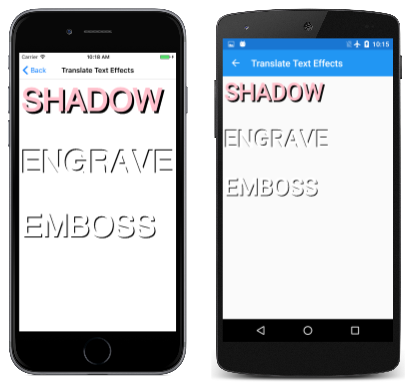

# The Translate Transform

_Learn how to use the translate transform to shift SkiaSharp graphics_

The simplest type of transform in SkiaSharp is the *translate* or *translation* transform. This transform shifts graphical objects in the horizontal and vertical directions. In a sense, translation is the most unnecessary transform because you can usually accomplish the same effect by simply changing the coordinates that you're using in the drawing function. When rendering a path, however, all the coordinates are encapsulated in the path, so it's much easier applying a translate transform to shift the entire path.

Translation is also useful for animation and for simple text effects:


The [`Translate`](xref:SkiaSharp.SKCanvas.Translate(System.Single,System.Single)) method in `SKCanvas` has two parameters that cause subsequently drawn graphics objects to be shifted horizontally and vertically:

```csharp
public void Translate (Single dx, Single dy)
```

These arguments may be negative. A second [`Translate`](xref:SkiaSharp.SKCanvas.Translate(SkiaSharp.SKPoint)) method combines the two translation values in a single `SKPoint` value:

```csharp
public void Translate (SKPoint point)
```

The **Accumulated Translate** page of the sample program demonstrates that multiple calls of the `Translate` method are cumulative. The [`AccumulatedTranslatePage`](https://github.com/xamarin/xamarin-forms-samples/blob/master/SkiaSharpForms/Demos/Demos/SkiaSharpFormsDemos/Transforms/AccumulatedTranslatePage.cs) class displays 20 versions of the same rectangle, each one offset from the previous rectangle just enough so they stretch along the diagonal. Here's the `PaintSurface` event handler:

```csharp
void OnCanvasViewPaintSurface(object sender, SKPaintSurfaceEventArgs args)
{
    SKImageInfo info = args.Info;
    SKSurface surface = args.Surface;
    SKCanvas canvas = surface.Canvas;

    canvas.Clear();

    using (SKPaint strokePaint = new SKPaint())
    {
        strokePaint.Color = SKColors.Black;
        strokePaint.Style = SKPaintStyle.Stroke;
        strokePaint.StrokeWidth = 3;

        int rectangleCount = 20;
        SKRect rect = new SKRect(0, 0, 250, 250);
        float xTranslate = (info.Width - rect.Width) / (rectangleCount - 1);
        float yTranslate = (info.Height - rect.Height) / (rectangleCount - 1);

        for (int i = 0; i < rectangleCount; i++)
        {
            canvas.DrawRect(rect, strokePaint);
            canvas.Translate(xTranslate, yTranslate);
        }
    }
}
```

The successive rectangles trickle down the page:

[](translate-images/accumulatedtranslate-large.png#lightbox "Triple screenshot of the Accumulated Translate page")

If the accumulated translation factors are `dx` and `dy`, and the point you specify in a drawing function is (`x`, `y`), then the graphical object is rendered at the point (`x'`, `y'`), where:

x' = x + dx

y' = y + dy

These are known as the *transform formulas* for translation. The default values of `dx` and `dy` for a new `SKCanvas` are 0.

It is common to use the translate transform for shadow effects and similar techniques, as the **Translate Text Effects** page demonstrates. Here's the relevant part of the `PaintSurface` handler in the [`TranslateTextEffectsPage`](https://github.com/xamarin/xamarin-forms-samples/blob/master/SkiaSharpForms/Demos/Demos/SkiaSharpFormsDemos/Transforms/TranslateTextEffectsPage.cs) class:

```csharp
float textSize = 150;

using (SKPaint textPaint = new SKPaint())
{
    textPaint.Style = SKPaintStyle.Fill;
    textPaint.TextSize = textSize;
    textPaint.FakeBoldText = true;

    float x = 10;
    float y = textSize;

    // Shadow
    canvas.Translate(10, 10);
    textPaint.Color = SKColors.Black;
    canvas.DrawText("SHADOW", x, y, textPaint);
    canvas.Translate(-10, -10);
    textPaint.Color = SKColors.Pink;
    canvas.DrawText("SHADOW", x, y, textPaint);

    y += 2 * textSize;

    // Engrave
    canvas.Translate(-5, -5);
    textPaint.Color = SKColors.Black;
    canvas.DrawText("ENGRAVE", x, y, textPaint);
    canvas.ResetMatrix();
    textPaint.Color = SKColors.White;
    canvas.DrawText("ENGRAVE", x, y, textPaint);

    y += 2 * textSize;

    // Emboss
    canvas.Save();
    canvas.Translate(5, 5);
    textPaint.Color = SKColors.Black;
    canvas.DrawText("EMBOSS", x, y, textPaint);
    canvas.Restore();
    textPaint.Color = SKColors.White;
    canvas.DrawText("EMBOSS", x, y, textPaint);
}
```

In each of the three examples, `Translate` is called for displaying the text to offset it from the location given by the `x` and `y` variables. Then the text is displayed again in another color with no translation effect:

[](translate-images/translatetexteffects-large.png#lightbox "Triple screenshot of the Translate Text Effects page")

Each of the three examples shows a different way of negating the `Translate` call:

The first example simply calls `Translate` again but with negative values. Because the `Translate` calls are cumulative, this sequence of calls simply restores the total translation to the default values of zero.

The second example calls [`ResetMatrix`](xref:SkiaSharp.SKCanvas.ResetMatrix). This causes all transforms to return to their default state.

The third example saves the state of the `SKCanvas` object with a call to [`Save`](xref:SkiaSharp.SKCanvas.Save) and then restores the state with a call to [`Restore`](xref:SkiaSharp.SKCanvas.Restore). This is the most versatile way to manipulate transforms for a series of drawing operations. These `Save` and `Restore` calls function like a stack: You can call `Save` multiple times, and then call `Restore` in reverse sequence to return to previous states. The `Save` method returns an integer, and you can pass that integer to [`RestoreToCount`](xref:SkiaSharp.SKCanvas.RestoreToCount*) to effectively call `Restore` multiple times. The [`SaveCount`](xref:SkiaSharp.SKCanvas.SaveCount) property returns the number of states currently saved on the stack.

You can also use the [`SKAutoCanvasRestore`](xref:SkiaSharp.SKAutoCanvasRestore) class for restoring the canvas state. The constructor of this class is intended to be called in a `using` statement; the canvas state is automatically restored at the end of the `using` block.

However, you don't have to worry about transforms carrying over from one call of the `PaintSurface` handler to the next. Each new call to `PaintSurface` delivers a fresh `SKCanvas` object with default transforms.

Another common use of the `Translate` transform is for rendering a visual object that has been originally created using coordinates that are convenient for drawing. For example, you might want to specify coordinates for an analog clock with a center at the point (0, 0). You can then use transforms to display the clock where you want it. This technique is demonstrated in the [**Hendecagram Array**] page. The [`HendecagramArrayPage`](https://github.com/xamarin/xamarin-forms-samples/blob/master/SkiaSharpForms/Demos/Demos/SkiaSharpFormsDemos/Transforms/HendecagramArrayPage.cs) class begins by creating an `SKPath` object for an 11-pointed star. The `HendecagramPath` object is defined as public, static, and read-only so that it can be accessed from other demonstration programs. It is created in a static constructor:

```csharp
public class HendecagramArrayPage : ContentPage
{
    ...
    public static readonly SKPath HendecagramPath;

    static HendecagramArrayPage()
    {
        // Create 11-pointed star
        HendecagramPath = new SKPath();
        for (int i = 0; i < 11; i++)
        {
            double angle = 5 * i * 2 * Math.PI / 11;
            SKPoint pt = new SKPoint(100 * (float)Math.Sin(angle),
                                    -100 * (float)Math.Cos(angle));
            if (i == 0)
            {
                HendecagramPath.MoveTo(pt);
            }
            else
            {
                HendecagramPath.LineTo(pt);
            }
        }
        HendecagramPath.Close();
    }
}
```

If the center of the star is the point (0, 0), all the points of the star are on a circle surrounding that point. Each point is a combination of sine and cosine values of an angle that increases by 5/11ths of 360 degrees. (It's also possible to create an 11-pointed star by increasing the angle by 2/11th, 3/11ths, or 4/11th of the circle.) The radius of that circle is set as 100.

If this path is rendered without any transforms, the center will be positioned at the upper-left corner of the `SKCanvas`, and only a quarter of it will be visible. The `PaintSurface` handler of `HendecagramPage` instead uses `Translate` to tile the canvas with multiple copies of the star, each one randomly colored:

```csharp
public class HendecagramArrayPage : ContentPage
{
    Random random = new Random();
    ...
    void OnCanvasViewPaintSurface(object sender, SKPaintSurfaceEventArgs args)
    {
        SKImageInfo info = args.Info;
        SKSurface surface = args.Surface;
        SKCanvas canvas = surface.Canvas;

        canvas.Clear();

        using (SKPaint paint = new SKPaint())
        {
            for (int x = 100; x < info.Width + 100; x += 200)
                for (int y = 100; y < info.Height + 100; y += 200)
                {
                    // Set random color
                    byte[] bytes = new byte[3];
                    random.NextBytes(bytes);
                    paint.Color = new SKColor(bytes[0], bytes[1], bytes[2]);

                    // Display the hendecagram
                    canvas.Save();
                    canvas.Translate(x, y);
                    canvas.DrawPath(HendecagramPath, paint);
                    canvas.Restore();
                }
        }
    }
}

```

Here's the result:

[](translate-images/hendecagramarray-large.png#lightbox "Triple screenshot of the Hendecagram Array page")

Animations often involve transforms. The **Hendecagram Animation** page moves the 11-pointed star around in a circle. The [`HendecagramAnimationPage`](https://github.com/xamarin/xamarin-forms-samples/blob/master/SkiaSharpForms/Demos/Demos/SkiaSharpFormsDemos/Transforms/HendecagramAnimationPage.cs) class begins with some fields and overrides of the `OnAppearing` and `OnDisappearing` methods to start and stop a .NET MAUI timer:

```csharp
public class HendecagramAnimationPage : ContentPage
{
    const double cycleTime = 5000;      // in milliseconds

    SKCanvasView canvasView;
    Stopwatch stopwatch = new Stopwatch();
    bool pageIsActive;
    float angle;

    public HendecagramAnimationPage()
    {
        Title = "Hedecagram Animation";

        canvasView = new SKCanvasView();
        canvasView.PaintSurface += OnCanvasViewPaintSurface;
        Content = canvasView;
    }

    protected override void OnAppearing()
    {
        base.OnAppearing();
        pageIsActive = true;
        stopwatch.Start();

        Device.StartTimer(TimeSpan.FromMilliseconds(33), () =>
        {
            double t = stopwatch.Elapsed.TotalMilliseconds % cycleTime / cycleTime;
            angle = (float)(360 * t);
            canvasView.InvalidateSurface();

            if (!pageIsActive)
            {
                stopwatch.Stop();
            }

            return pageIsActive;
        });
    }

    protected override void OnDisappearing()
    {
        base.OnDisappearing();
        pageIsActive = false;
    }
    ...
}
```

The `angle` field is animated from 0 degrees to 360 degrees every 5 seconds. The `PaintSurface` handler uses the `angle` property in two ways: to specify the hue of the color in the `SKColor.FromHsl` method, and as an argument to the `Math.Sin` and `Math.Cos` methods to govern the location of the star:

```csharp
public class HendecagramAnimationPage : ContentPage
{
    ...
    void OnCanvasViewPaintSurface(object sender, SKPaintSurfaceEventArgs args)
    {
        SKImageInfo info = args.Info;
        SKSurface surface = args.Surface;
        SKCanvas canvas = surface.Canvas;

        canvas.Clear();
        canvas.Translate(info.Width / 2, info.Height / 2);
        float radius = (float)Math.Min(info.Width, info.Height) / 2 - 100;

        using (SKPaint paint = new SKPaint())
        {
            paint.Style = SKPaintStyle.Fill;
            paint.Color = SKColor.FromHsl(angle, 100, 50);

            float x = radius * (float)Math.Sin(Math.PI * angle / 180);
            float y = -radius * (float)Math.Cos(Math.PI * angle / 180);
            canvas.Translate(x, y);
            canvas.DrawPath(HendecagramPage.HendecagramPath, paint);
        }
    }
}
```

The `PaintSurface` handler calls the `Translate` method twice, first to translate to the center of the canvas, and then to translate to the circumference of a circle centered around (0, 0). The radius of the circle is set to be as large as possible while still keeping the star within the confines of the page:

[](translate-images/hendecagramanimation-large.png#lightbox "Triple screenshot of the Hendecagram Animation page")

Notice that the star maintains the same orientation as it revolves around the center of the page. It doesn't rotate at all. That's a job for a rotate transform.

## Related Links

- [SkiaSharp APIs](/dotnet/api/skiasharp)
