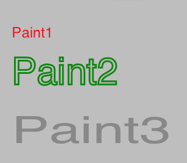
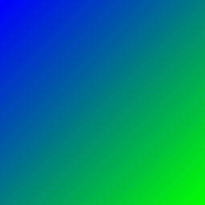

## Remarks

Anytime you draw something in SkiaSharp, and want to specify what color it is, 
or how it blends with the background, or what style or font to draw it in, you 
specify those attributes in a paint.

Unlike <xref:SkiaSharp.SKCanvas>, an paint object does not maintain an 
internal stack of state. That is, there is no save/restore on a paint. 
However, paint objects are relatively light-weight, so the client may create 
and maintain any number of paint objects, each set up for a particular use.

Factoring all of these color and stylistic attributes out of the canvas state, 
and into (multiple) paint objects, allows the save and restore operations on 
the <xref:SkiaSharp.SKCanvas> to be that much more efficient, as all they have 
to do is maintain the stack of matrix and clip settings.

### Effects

Beyond simple attributes such as color, strokes, and text values, paints 
support effects. These are subclasses of different aspects of the drawing 
pipeline, that when referenced by a paint, are called to override some part 
of the drawing pipeline.

There are five types of effects that can be assigned to an paint object:

| Property Name | Description                                                                                   |
|---------------|-----------------------------------------------------------------------------------------------|
| Blend Mode    | Blend modes and Duff-Porter transfer modes                                                    |
| Color Filter  | Modifies the source colors before applying the BlendMode                                      |
| Mask Filter   | Modification of the alpha mask before it is colorized and drawn (for example, blur)           |
| Path Effect   | Modification of the geometry (path) before the alpha mask is generated (for example, dashing) |
| Shader        | Gradients and bitmap patterns                                                                 |

## Examples

### Simple Example

The following example shows three different paints, each set up to draw in a 
different style. The caller can intermix these paints freely, either using 
them as is, or modifying them as the drawing proceeds.

```csharp
var info = new SKImageInfo(256, 256);
using (var surface = SKSurface.Create(info)) {
    SKCanvas canvas = surface.Canvas;

    canvas.Clear(SKColors.White);

    var paint1 = new SKPaint {
        TextSize = 64.0f,
        IsAntialias = true,
        Color = new SKColor(255, 0, 0),
        Style = SKPaintStyle.Fill
    };

    var paint2 = new SKPaint {
        TextSize = 64.0f,
        IsAntialias = true,
        Color = new SKColor(0, 136, 0),
        Style = SKPaintStyle.Stroke,
        StrokeWidth = 3
    };

    var paint3 = new SKPaint {
        TextSize = 64.0f,
        IsAntialias = true,
        Color = new SKColor(136, 136, 136),
        TextScaleX = 1.5f
    };

    var text = "Skia!";
    canvas.DrawText(text, 20.0f, 64.0f, paint1);
    canvas.DrawText(text, 20.0f, 144.0f, paint2);
    canvas.DrawText(text, 20.0f, 224.0f, paint3);
}
```

The example above produces the following:



### Effects Example

The following example draws using a gradient instead of a single color. To do, 
this a `SKShader` is assigned to the paint. Anything drawn with that paint 
will be drawn with the gradient specified in the call to
`SKShader.CreateLinearGradient`.

```csharp
var info = new SKImageInfo(256, 256);
using (var surface = SKSurface.Create(info)) {
    SKCanvas canvas = surface.Canvas;

    canvas.Clear(SKColors.White);

    // create a gradient
    var colors = new[] {
        SKColors.Blue,
        SKColors.Yellow
    };
    var shader = SKShader.CreateLinearGradient(
        new SKPoint(0.0f, 0.0f),
        new SKPoint(256.0f, 256.0f),
        colors,
        null,
        SKShaderTileMode.Clamp);

    // assign the gradient to the paint
    var paint = new SKPaint {
        Shader = shader
    };

    canvas.DrawPaint(paint);
}
```

The example above produces the following:


