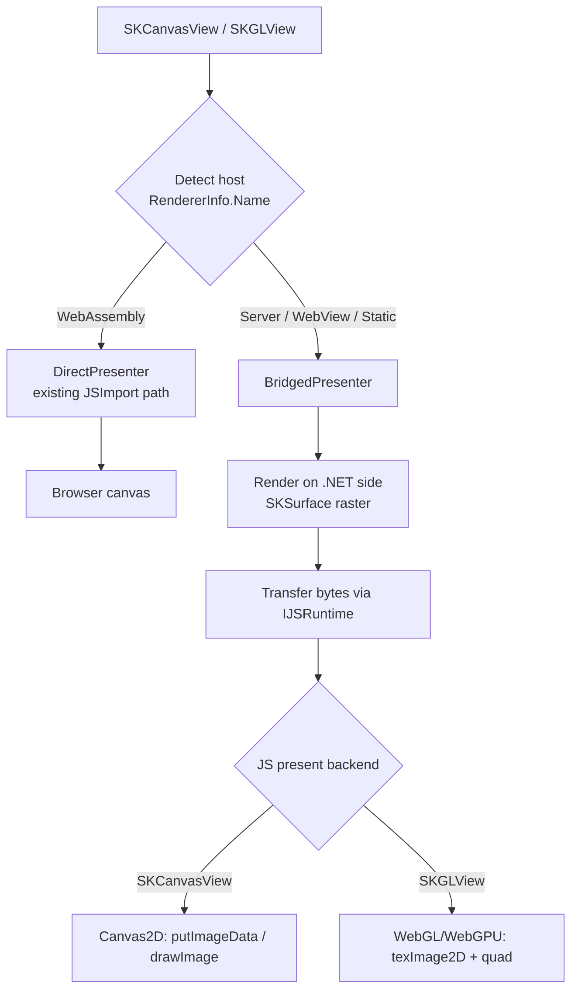
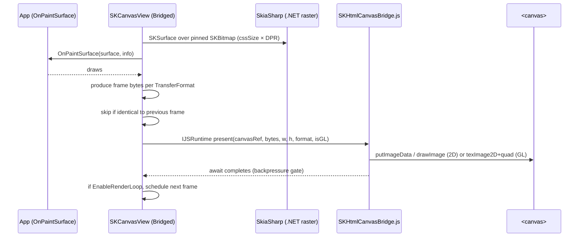

# Design Spec: Blazor Server / Hybrid / Auto support for SkiaSharp

Issue: [#1194 — Support SkiaSharp as a Blazor Extension](https://github.com/mono/SkiaSharp/issues/1194)
Component: `SkiaSharp.Views.Blazor` (`SKCanvasView`, `SKGLView`)

> **Status:** design specification / living architectural reference. It captures the
> architecture and the compatibility contract for multi-host Blazor rendering so we can
> validate over time that changes do not break the model. Real tests remain the enforcement
> mechanism; this document explains *why* the shape is what it is.

---

## 1. Summary

`SkiaSharp.Views.Blazor` today renders **only** inside Blazor WebAssembly running in the
browser. This spec extends the existing components so the **same** `SKCanvasView` /
`SKGLView` also work under **Blazor Server**, **Blazor Hybrid** (`BlazorWebView` in
MAUI/WPF/WinForms), **static SSR**, and **Interactive Auto** — with no source changes for
existing WebAssembly users.

The core idea: keep the fast in-browser path exactly as-is, and add a second **"bridged"**
path where SkiaSharp renders on the .NET side (server or native host), transfers the pixels
to the browser, and a small JavaScript module paints them into the same HTML `<canvas>`. A
single component chooses between the two at runtime based on where it is executing.

## 2. Goals

- One component set (`SKCanvasView`, `SKGLView`) that runs on **every** Blazor host model.
- **Zero breaking changes** for existing WebAssembly consumers (API + behaviour identical).
- Basic rendering + frame streaming for Server/Hybrid at whatever frame rate the transport
  can sustain; animation supported via the existing `EnableRenderLoop`.
- Interactivity (pointer/wheel/etc.) using the standard Blazor event model.
- Correct behaviour across the **Interactive Auto** transition (Server on first visit,
  WebAssembly on later visits) with no consumer effort.

## 3. Non-goals

- GPU-accelerated *drawing* on the server (server-side drawing is CPU raster; a real
  server/native `GRContext` is a documented future extension, not part of this work).
- A gesture/hit-testing framework (SkiaSharp stays low-level; apps own hit-testing).
- Changing anything under `externals/skia` or the C API — this is pure
  managed/Razor/TypeScript/packaging work.

## 4. Background: why the current component is browser-only

`SKCanvasView`/`SKGLView` are annotated `[SupportedOSPlatform("browser")]` and use
`[JSImport]` to call an in-browser JavaScript module (`SKHtmlCanvas.js`). Rendering happens
in the browser's own WebAssembly copy of `libSkiaSharp`:

- `SKCanvasView` renders into a pinned pixel buffer and calls `putImageData` on a 2D canvas.
- `SKGLView` creates a WebGL context and renders through a `GRContext` (real GPU).

This is optimal for WebAssembly but impossible for Server/Hybrid, where the C# runs on the
server (or in a native host process), not in the browser. There is no in-browser
`libSkiaSharp` to call and no `[JSImport]` runtime available to that code path.

## 5. Architecture overview

Two **present strategies** behind one component:

| Strategy   | Where drawing happens | How pixels reach the browser | Hosts |
|------------|----------------------|------------------------------|-------|
| **Direct** | Browser (WASM)       | native → `<canvas>` (`JSImport`, existing) | WebAssembly |
| **Bridged**| .NET side (server/native) | encode/copy → `IJSRuntime` → JS paints `<canvas>` | Server, Hybrid, Static |

The component detects its execution location and instantiates the matching strategy. The
public API (`OnPaintSurface`, `EnableRenderLoop`, `Invalidate`, `IgnorePixelScaling`,
`AdditionalAttributes`, …) is identical for both strategies.



Key insight that keeps this small: **Server and Hybrid both reach JavaScript through
`IJSRuntime`** (over SignalR for Server, in-process for the WebView in Hybrid). The C# bridge
code is therefore **identical** for both; only the transport cost differs. So there are only
two strategies to build, not four.

## 6. Host detection

Detection uses the official Blazor API `ComponentBase.RendererInfo` (**.NET 9+**).
`RendererInfo.Name` reports where the component executes:

| `RendererInfo.Name` | Meaning | Strategy |
|---------------------|---------|----------|
| `WebAssembly` | In-browser CSR | **Direct** |
| `Server`      | Interactive SSR over SignalR | **Bridged** |
| `WebView`     | Blazor Hybrid (native host) | **Bridged** |
| `Static`      | Prerender / static SSR (not interactive) | **Bridged (poster only)** |

`RendererInfo.IsInteractive` tells us whether a render loop is even possible (false for
`Static`, so we emit a single poster frame).

**Framework support:** the bridged features require **net9.0+**. The package continues to
target `net6.0`/`net8.0` as **WebAssembly-only** (existing behaviour, unchanged) because
`RendererInfo` does not exist there. On those TFMs the component uses
`OperatingSystem.IsBrowser()` and only ever takes the Direct path.

## 7. Component compatibility changes

- Move `[SupportedOSPlatform("browser")]` **off the component class** and onto the
  `JSImport` interop members only. The assembly must load and run on server/native runtimes;
  only *calling* a `JSImport` method off-browser throws, and those calls are already gated
  behind the Direct strategy (which is chosen only when `IsBrowser()`).
- All new members are additive (new optional parameters, new enums, new options type). No
  existing public signature changes. ABI-safe.

## 8. The bridged frame pipeline

For a bridged component, one frame flows as:



Steps:

1. **Size**: the render target is `cssSize × devicePixelRatio` so output is crisp. The client
   CSS size and DPR are obtained from the existing `SizeWatcher`/`DpiWatcher` and reported to
   the .NET side via a `[JSInvokable]` callback.
2. **Draw**: the component creates an `SKSurface` over a reused, pinned `SKBitmap` and invokes
   `OnPaintSurface` — the same callback signature as today.
3. **Produce bytes** according to the resolved `TransferFormat` (§9).
4. **Suppress** the send if the bytes are byte-identical to the previous frame.
5. **Transfer** via `IJSRuntime.InvokeVoidAsync`. `byte[]` marshals as a binary `Uint8Array`
   (not Base64) on .NET 6+; for Server there is no framework size limit on server→client
   messages.
6. **Backpressure**: the next frame is only scheduled after the previous transfer `await`
   completes, and always renders the latest state (never a backlog). See §11.

## 9. Frame transfer formats

The bytes handed to JavaScript can be produced three ways:

| `TransferFormat` | Producer (.NET) | Presenter (JS) | Notes |
|------------------|-----------------|----------------|-------|
| `Png`  | `SKImage.Encode(Png)`  | `createImageBitmap(blob)` → draw | lossless, keeps alpha, larger |
| `Jpeg` | `SKImage.Encode(Jpeg, q)` | `createImageBitmap(blob)` → draw | small payload, no alpha |
| `Put`  | raw pixels, BGRA→RGBA | `putImageData` / `texImage2D` | no encode/decode, largest payload |

Configuration is layered and **orthogonal to the host**:

- **Global default** via DI options (`AddSkiaSharpViewsBlazor(o => o.TransferFormat = …)` and,
  for Hybrid, a MAUI `UseSkiaSharp` hook).
- **Per-control override** via component parameters `TransferFormat` and `Quality`.

**Host-based defaults** (used when nothing is specified):

- Hybrid (`WebView`) → `Put` (in-process, latency-optimised, no encode/decode).
- Server → `Jpeg` (network, size-optimised); use `Png` when transparency is required.

Because the format is independent of the host, a Server-hosted test page can force `Put`,
`Png`, or `Jpeg` to exercise every transfer path **without needing a real Hybrid device**.

The `Put` path requires converting from SkiaSharp's little-endian BGRA8888 pixels to the RGBA
byte order expected by `ImageData`/`texImage2D`.

## 10. JavaScript module structure

A central design question is how the browser-side JavaScript should be organised now that
there are two rendering paths. The existing code is entirely WebAssembly-centric, so we must
decide whether the bridged path is a bolt-on, an alternative file, or a refactor toward a
shared model — and, critically, **when each module is imported**.

### 10.1 What the existing JS actually does

`wwwroot/SKHtmlCanvas.ts` (class `SKHtmlCanvas`) mixes three concerns:

1. **WASM-only source/context** — `putImageData(ptr,…)` reads pixels directly from the
   emscripten heap (`Module.HEAPU8.buffer` at a pointer); GL uses emscripten's
   `GL.createContext`/`makeContextCurrent` so the in-browser native `GRContext` renders into
   that same context. **Neither works off-browser** — a Server client browser and a Hybrid
   WebView have DOM + WebGL but **no emscripten `Module`/`GL`** (Skia runs natively there, not
   as WASM in the page).
2. **Loop** — a **browser-pull** loop: `requestAnimationFrame` calls back into .NET to draw.
3. **Paint primitives** — the pure-browser bits: sizing the canvas and the final
   `putImageData` onto a 2D context.

`SizeWatcher.ts` and `DpiWatcher.ts` are already generic (they only report size/DPR to .NET)
and are reusable **as-is** by both paths.

### 10.2 How different is the bridged path, really?

Only in two small, isolated places:

| Concern | Direct (WASM) | Bridged (Server/Hybrid) |
|---------|---------------|-------------------------|
| Pixel source | emscripten heap pointer | `Uint8Array`/blob from .NET |
| Loop direction | browser-pull (RAF → .NET) | .NET-push (.NET → `present`) |
| Paint onto canvas | `putImageData` / GL into emscripten ctx | **same paint ops** (`putImageData`/`drawImage`/`texImage2D`) |

The *painting layer is essentially identical*; it is **not radically different**. What
differs is where the bytes come from and who drives the frame. So the right move is a **light
refactor toward a shared paint core**, not a duplicate bolt-on and not a rewrite.

### 10.3 Target module layout

```
wwwroot/
  SizeWatcher.ts        (unchanged, shared)      — reports element size to .NET
  DpiWatcher.ts         (unchanged, shared)      — reports devicePixelRatio to .NET
  SKCanvasPresenter.ts  (NEW, shared, pure-browser) — the "render steps"
      • present2DPixels(canvas, rgba, w, h)      → putImageData
      • present2DBitmap(canvas, imageBitmap)     → drawImage
      • presentGLPixels(canvas, glState, rgba,…) → texImage2D + fullscreen quad
      • presentGLBitmap(canvas, glState, bitmap) → texImage2D + fullscreen quad
      • createPresentationGLContext(canvas)      → plain browser WebGL2 context
      • sizeCanvas(canvas, w, h), element registry helpers
  SKHtmlCanvas.ts       (Direct/WASM; refactored) — emscripten heap read + emscripten GL +
                          browser-pull loop + .NET draw callback; delegates the final paint
                          to SKCanvasPresenter. Behaviour unchanged.
  SKHtmlCanvasBridge.ts (NEW, Bridged; thin, no emscripten)
      • initialize(canvas, isGL)
      • present(canvas, bytesOrBitmapSource, w, h, format, isGL)
          – Png/Jpeg → createImageBitmap(new Blob([bytes],{type})) → present*Bitmap
          – Put      → present*Pixels(bytes)
        No loop logic (the .NET side pushes).
```

`SKCanvasPresenter.ts` contains **only standard browser APIs** — no emscripten, no .NET
callbacks, no loop — so it is safe to import in every host. It is the "new render steps" the
paint code funnels through; both the Direct module and the Bridge module call into it, which
is what keeps the two paths thin and avoids duplicating paint logic.

### 10.4 When each module is imported

Modules are ES modules imported lazily in the component's `OnAfterRenderAsync(firstRender)`,
**per strategy**:

- **Direct** strategy imports `SKHtmlCanvas.js` (which internally imports
  `SKCanvasPresenter.js`) — only ever in the browser/WASM host.
- **Bridged** strategy imports `SKHtmlCanvasBridge.js` (which internally imports
  `SKCanvasPresenter.js`) — used by Server/Hybrid/Static.
- Both strategies import `SizeWatcher.js` / `DpiWatcher.js`.

This separation is not just tidiness: the bridged path **must never import** `SKHtmlCanvas.js`
because that module's methods reference emscripten globals that don't exist in a Server client
browser or a Hybrid WebView. Splitting the emscripten-coupled source into its own file is what
makes the server/hybrid load safe.

### 10.5 Present backend chosen by view type

Within the presenter, the backend is chosen by **view type** so the browser canvas keeps the
context the app asked for:

- `SKCanvasView` → Canvas2D backend (`putImageData` for `Put`, `drawImage` for `Png`/`Jpeg`).
- `SKGLView` → WebGL/WebGPU backend (`texImage2D` + full-screen quad), so GL
  post-processing/augmentation the app applies keeps working and the context type stays stable
  across the Interactive Auto transition. (Server-side drawing is CPU raster this release; a
  future server/native `GRContext` feeds the same texture-upload path unchanged.)

The transfer format (§9) and the present backend (§10.5) are orthogonal: encoded or raw bytes
can each feed either the 2D or GL backend.


## 11. Render loop, invalidation & backpressure

The bridged path reuses the existing API and semantics exactly:

- `Invalidate()` renders and presents one frame.
- `EnableRenderLoop = true` runs a continuous loop (the analogue of the WASM
  `requestAnimationFrame` loop).
- The app owns the frame rate. There are **no framework FPS caps**. An app that wants to run
  slower (e.g. on a poor connection) disables the loop and drives frames with `Invalidate()`.

The one behaviour that is enforced for correctness (not policy) is **backpressure**: the loop
renders and pushes the next frame only after the previous transfer `await` has completed, and
always draws the latest state. This means a slow link naturally self-limits the effective
frame rate instead of building an unbounded queue of frames in memory. Two cheap,
non-configurable optimisations round it out: skip presenting a byte-identical frame, and pause
the loop while the tab/circuit is hidden.

## 12. Input & interactivity

Interactivity uses the standard Blazor event model — no new event API:

- The bridged presentation `<canvas>` receives the same `AdditionalAttributes` splat the WASM
  component already applies, so apps attach `@onpointerdown`, `@onpointermove`, `@onwheel`,
  etc. exactly as they do on WebAssembly today.
- Input events (from client to server) are tiny, well under the 32 KB
  `HubOptions.MaximumReceiveMessageSize` limit that applies to client→server messages.

**Coordinate mapping / DPI.** A canvas has a CSS/layout size and a backing-store size; we
render the backing store at `cssSize × DPR` for crispness. Pointer events report
`OffsetX/OffsetY` in **CSS pixels**, while the scene is drawn in **device pixels**, so a click
maps to scene coordinates with a single ratio:

```
sceneX = offsetX * (canvas.width  / canvas.clientWidth)
sceneY = offsetY * (canvas.height / canvas.clientHeight)
```

This ratio folds in both the DPR and any CSS stretching. It is exactly the mapping WASM apps
already perform, so bridged mode introduces **no new DPI burden**. An optional DPI-aware
mapping helper may be provided for convenience, but it is not required.

## 13. Static SSR & Interactive Auto

- **Static SSR** (`RendererInfo.Name == "Static"`, not interactive): the component renders one
  frame on the server and emits it as a data-URL ``/`<canvas>` in the initial markup, so
  prerendered HTML shows the drawing immediately. No loop, no interactivity.
- **Interactive Auto**: Blazor renders the component with Interactive Server on the first
  visit and Interactive WebAssembly on later visits (after the WASM bundle is cached). Blazor
  never swaps a live component's runtime, so a single component that adapts via `RendererInfo`
  is exactly the supported pattern: the Server leg uses Bridged, the WebAssembly leg uses
  Direct. Because the paint surface is stateless (the app redraws in `OnPaintSurface`), no
  `PersistentComponentState` is needed across the transition.

## 14. Transport facts (verified)

- Server→client (hub→client) SignalR messages have **no framework size limit**, so pushing
  frame bytes to the browser is fine.
- `byte[]` passed to JS interop transfers as a binary `Uint8Array` (not Base64) since .NET 6;
  extremely large payloads can use `IJSStreamReference` if ever needed.
- The 32 KB `HubOptions.MaximumReceiveMessageSize` cap applies only to client→server messages
  — i.e. our tiny input events — so it is a non-issue for frames.

## 15. Public API surface (all additive)

- `SKCanvasView` / `SKGLView`: new optional parameters
  - `TransferFormat` (`SKBlazorTransferFormat?`, null → global/host default)
  - `Quality` (`int?`, applies to `Jpeg`)
- `enum SKBlazorTransferFormat { Png, Jpeg, Put }`
- `class SKBlazorOptions` (global defaults: transfer format, quality)
- `IServiceCollection.AddSkiaSharpViewsBlazor(Action<SKBlazorOptions>? configure = null)`
  (optional; sensible defaults apply if not called). A MAUI `UseSkiaSharp`/host hook exposes
  the same options for Hybrid.
- Internal only: `ISKBlazorPresenter`, `DirectPresenter`, `BridgedPresenter`, host-detection
  helper.

Existing members — `OnPaintSurface`, `EnableRenderLoop`, `Invalidate`, `IgnorePixelScaling`,
`Dpi`, `AdditionalAttributes` — are unchanged.

## 16. Packaging

- Keep everything in the **single** `SkiaSharp.Views.Blazor` package. One shared component
  assembly is what makes Interactive Auto work (it is referenced by both the server and the
  WASM client projects) and gives the simplest consumer story.
- Native assets: `SkiaSharp.NativeAssets.WebAssembly` and the emcc `--js-library` `.props`
  workaround must remain **browser-only** and must not leak into server/hybrid builds.
  Server/Hybrid consumers get the platform native asset from their existing `SkiaSharp`
  reference.
- The new bridge JS ships as a static web asset (served for Server, Hybrid, and WASM alike).

## 17. Testing strategy

Existing harnesses (all use `DeviceRunners.VisualRunners` + xUnit v3):

- `SkiaSharp.Tests.Console` — plain .NET runtime → server-side native rendering + pure logic.
- `SkiaSharp.Tests.Wasm` — a standalone Blazor **WebAssembly** app → the in-browser (Direct)
  suite. (It has no server, so it cannot host Static/Server/Auto — left as-is.)
- `SkiaSharp.Tests.Devices` — a **MAUI** app with `DeviceRunners.UITesting` → device platforms.

Additions:

1. **Unit tests** (in `SkiaSharp.Tests.Console`) for the bridged frame producer: encode
   `Png`/`Jpeg`, `Put` + BGRA→RGBA conversion, identical-frame suppression, size/DPI maths.
   No browser required.
2. **New `SkiaSharp.Tests.Blazor`** — a Blazor **Web App** (ASP.NET Core hosted, net9/net10)
   with pages for `Static`, `InteractiveServer`, `InteractiveAuto`, and `InteractiveWebAssembly`
   using the shared component. Coverage: **bUnit** component tests (mock `IJSRuntime`, assert a
   frame is produced/pushed, throttling/backpressure honoured, transfer formats forced per
   page) + a light **`WebApplicationFactory`** smoke that each page returns 200 with an initial
   poster.
3. **Hybrid page** added to `SkiaSharp.Tests.Devices` — a `BlazorWebView` hosting `SKCanvasView`
   plus a `DeviceRunners.UITesting` assertion that it renders (reuses the device CI matrix).

Coverage map: Console = server-native + logic; Wasm = Direct/in-browser; Tests.Blazor =
Static/Server/Auto web hosting; Devices = Hybrid WebView.

## 18. Implementation phases

Recommended dependency-ordered phases:

0. **dev-doc** — commit this spec to `documentation/dev/blazor-server-hybrid-rendering.md`
   and link it from `AGENTS.md` "Further Reading" + the `documentation/dev/` index.
1. **strategy-refactor** — introduce `ISKBlazorPresenter`; wrap the existing WASM path as
   `DirectPresenter`; components delegate presentation to a strategy (no WASM behaviour change).
2. **host-detection** — `RendererInfo`-based detection (net9+) with `IsBrowser()` fallback;
   static-SSR poster frame.
3. **js-presenter-refactor** — extract shared, pure-browser paint primitives into
   `SKCanvasPresenter.ts` (Canvas2D + WebGL backends); refactor `SKHtmlCanvas.ts` to delegate
   its final paint to it with **no behaviour change** (regression-safe).
4. **bridge-js** — new `SKHtmlCanvasBridge.ts` (`initialize`/`present`, no emscripten) built on
   `SKCanvasPresenter`; wire per-strategy lazy module imports.
5. **bridged-renderer** — `BridgedPresenter`: raster render, transfer per format, versioned
   frames, backpressured loop, `Invalidate()`, identical-frame suppression.
6. **options-di** — `SKBlazorOptions`, `AddSkiaSharpViewsBlazor`, host/per-control resolution.
7. **input-events** — `AdditionalAttributes` splat on the bridged canvas + optional coord
   helper; DPR/size round-trip.
8. **packaging** — browser-only native asset + emcc props; verify single-package Auto flow.
9. **samples** — Blazor Web App sample (Static/Server/Auto) and a Hybrid sample
   (MAUI/WPF `BlazorWebView`).
10. **tests-unit** — bridged frame-producer unit tests in `SkiaSharp.Tests.Console`.
11. **tests-blazor** — new `SkiaSharp.Tests.Blazor` web app + bUnit + `WebApplicationFactory`.
12. **tests-hybrid** — `BlazorWebView` page + UI test in `SkiaSharp.Tests.Devices`.
13. **docs** — update `SkiaSharp.Views.Blazor` API docs + release notes (supported hosts, perf
    guidance, Auto behaviour).

## 19. Risks & open implementation details

- **Assembly loads off-browser** — verified fine; only *calling* `JSImport` off-browser throws,
  and those calls are gated behind the Direct strategy.
- **Server resource use** — each circuit renders server-side (CPU/RAM per user). Add a
  max-canvas-size guard and dispose promptly on circuit teardown. (No FPS cap by design; a size
  guard is still prudent.)
- **Prerender/poster semantics** — confirm `OnPaintSurface` runs during static SSR to produce
  the poster and what shows before interactivity attaches.
- **CI** — the new `SkiaSharp.Tests.Blazor` web app needs a CI lane; decide bUnit +
  `WebApplicationFactory` only vs adding Playwright e2e (pixel-sampling) if available.
- **Back-compat** — existing WASM code and the `OnPaintSurface` signature stay byte-for-byte
  identical; all changes additive/ABI-safe.
- **Build** — managed/Razor/TS/packaging only; no native or C-API changes, so bootstrap via
  `dotnet cake --target=externals-download`.

## 20. References

- Reference implementation studied: [`taublast/DrawnUi` → `src/Blazor/DrawnUi.Server`](https://github.com/taublast/DrawnUi/tree/main/src/Blazor/DrawnUi.Server)
  (headless render → encode → stream bytes → present in ``/`<canvas>`; pointer/resize
  round-trip; DI + frame-format options).
- ASP.NET Core Blazor render modes (`RendererInfo`, Interactive Auto), SignalR guidance, and
  JS interop byte-array transfer (MS Learn).
