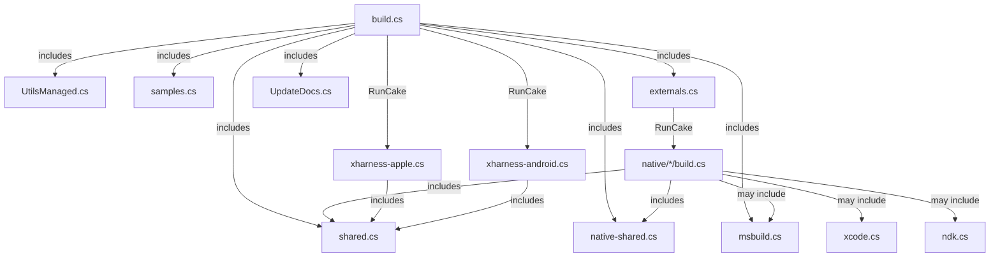

# Build System Architecture

SkiaSharp uses [Cake.Sdk](https://cakebuild.net/docs/running-builds/runners/cake-sdk) with .NET 10 file-based apps for build automation. Build files are `.cs` files using the `#:sdk Cake.Sdk` directive — run directly via `dotnet run --file build.cs`.

## Quick Start

```bash
# Restore tools, then run default target (externals + libs)
dotnet tool restore
dotnet run --file build.cs

# Run a specific target
dotnet run --file build.cs -- --target=externals-download

# See all available targets
dotnet run --file build.cs -- --tree
```

## File Overview

```
SkiaSharp/
├── build.cs                          ← Main entry point (top-level statements)
├── build.ps1 / build.sh              ← CI bootstrappers
├── global.json                       ← Pins .NET SDK + Cake.Sdk version
├── scripts/cake/
│   ├── shared.cs                     ← Core helpers: RunCake, GetVersion, etc.
│   ├── native-shared.cs              ← Native build helpers: GnNinja, RunPython, etc.
│   ├── msbuild.cs                    ← MSBuild/DotNet wrappers
│   ├── externals.cs                  ← External dependency tasks
│   ├── samples.cs                    ← Sample build/test tasks
│   ├── UtilsManaged.cs              ← Test runner, code coverage, archive utils
│   ├── UpdateDocs.cs                 ← API docs generation (NuGetDiff, mdoc)
│   ├── xcode.cs                      ← XCode/Apple build helpers
│   ├── ndk.cs                        ← Android NDK helpers
│   ├── xharness-apple.cs            ← iOS/Catalyst test runner (standalone)
│   └── xharness-android.cs          ← Android test runner (standalone)
├── native/
│   ├── android/build.cs              ← Android native build (standalone)
│   ├── ios/build.cs                  ← iOS native build (standalone)
│   ├── macos/build.cs                ← macOS native build (standalone)
│   ├── tvos/build.cs                 ← tvOS native build (standalone)
│   ├── linux/build.cs                ← Linux native build (standalone)
│   ├── windows/build.cs              ← Windows native build (standalone)
│   ├── wasm/build.cs                 ← WebAssembly native build (standalone)
│   ├── tizen/build.cs                ← Tizen native build (standalone)
│   ├── winui/build.cs                ← WinUI native build (standalone)
│   ├── winui-angle/build.cs          ← WinUI ANGLE build (standalone)
│   ├── maccatalyst/build.cs          ← Delegates to ios/build.cs
│   ├── nanoserver/build.cs           ← Delegates to windows/build.cs
│   ├── linuxnodeps/build.cs          ← Delegates to linux/build.cs
│   └── linux-clang-cross/build.cs    ← Delegates to linux/build.cs
```

## Architecture

### Two Kinds of Build Files

**1. Main build (`build.cs`)** — the only file with top-level statements:
- Defines all `#:package` directives (NuGet addins)
- Includes helper files via `#:property IncludeAdditionalFiles=...`
- Contains task definitions and `RunTarget(TARGET)`
- Declares shared state as `internal static` fields in `partial class Program`

**2. Standalone builds** (`native/*/build.cs`, `xharness-*.cs`) — each is a separate entry point:
- Has own `#:sdk Cake.Sdk` directive
- Includes its own subset of helper files via `IncludeAdditionalFiles`
- Invoked via `RunCake()` from the main build
- Has own `RunTarget(TARGET)` at the end

### How Files Connect



### Shared State Pattern

Cake.Sdk uses `partial class Program` for multi-file builds. Variables shared between files must be `internal static` fields initialized in `Main_*` methods (not field initializers) because the Cake context isn't available during static construction:

```csharp
// ❌ Wrong — crashes at startup (Cake context not ready)
internal static string TARGET = Argument("target", "Default");

// ✅ Correct — initialized when Cake context is available
internal static string TARGET;
private static void Main_Shared()
{
    TARGET = Argument("target", "Default");
}
```

`Main_*` methods are auto-discovered by Cake.Sdk and execute in alphabetical order before top-level statements.

### Dependency Graph for Shared Helpers

| Helper File | Provides | Depends On |
|-------------|----------|------------|
| `shared.cs` | TARGET, CONFIGURATION, BUILD_ARCH, RunCake(), GetVersion() | — |
| `native-shared.cs` | GnNinja(), RunPython(), CheckDeps(), git-sync-deps task | shared.cs (ROOT_PATH) |
| `msbuild.cs` | RunMSBuild(), RunDotNetBuild/Pack(), PACKAGE_CACHE_PATH | shared.cs (ROOT_PATH) |
| `ndk.cs` | CheckAlignment(), StripCopy(), RunNdkBuild() | shared.cs (PROFILE_PATH) |
| `xcode.cs` | RunXCodeBuild(), StripSign(), RunLipo(), CreateFatFramework() | — |
| `UtilsManaged.cs` | RunTests(), RunDotNetTest(), DownloadPackageAsync() | msbuild.cs |
| `externals.cs` | externals-* tasks | shared.cs, native-shared.cs |
| `samples.cs` | samples-* tasks | msbuild.cs |
| `UpdateDocs.cs` | docs tasks, CreateNuGetDiffAsync() | msbuild.cs |

### Native Build IncludeAdditionalFiles Map

| Platform | Included Helpers | Extra Packages |
|----------|-----------------|----------------|
| android | shared, native-shared, ndk | — |
| ios, macos, tvos | shared, native-shared, xcode | Cake.XCode |
| linux, wasm | shared, native-shared | — |
| windows | shared, native-shared, msbuild | — |
| winui, winui-angle | shared, native-shared, msbuild | — |
| tizen | shared, native-shared | Cake.FileHelpers |
| maccatalyst, nanoserver, linuxnodeps, linux-clang-cross | shared | — |

## Key Targets

| Target | Description |
|--------|-------------|
| `Default` | Build externals + managed libs |
| `Everything` | Build, pack, test, and sample everything |
| `externals` | Build all native dependencies |
| `externals-download` | Download pre-built native binaries |
| `externals-{platform}` | Build native for specific platform |
| `libs` | Build managed C# assemblies |
| `tests` | Run all test suites |
| `tests-netcore` | Run .NET Core tests |
| `tests-netfx` | Run .NET Framework tests (Windows) |
| `nuget` | Pack all NuGet packages |
| `samples` | Generate, prepare, and build samples |
| `update-docs` | Regenerate API documentation |
| `clean` | Remove all build artifacts |

## CI/CD

### Azure DevOps
The main CI pipeline uses `scripts/azure-templates-jobs-bootstrapper.yml` which runs:
```bash
dotnet tool restore
dotnet run --file build.cs -- --target=<target> --verbosity=<verbosity>
```

### GitHub Actions
- **Build Site** (`.github/workflows/build-site.yml`) — docs site generation
- **Samples** (`.github/workflows/samples.yml`) — sample project validation

### Docker Builds
Cross-compilation for Linux ARM/RISC-V uses Docker containers:
- `scripts/Docker/_clang-cross-common.sh` — orchestrates cross-compilation
- `scripts/Docker/wasm/build-local.sh` — local WASM builds

## Technology Stack

- **Cake.Sdk 6.1.1** — MSBuild SDK providing Cake DSL in .cs files
- **.NET 10** — required for file-based app support (`dotnet run --file`)
- **Cake addins**: Cake.Xamarin, Cake.XCode, Cake.FileHelpers, Cake.Json
- **NuGet tools**: mdoc, xunit.runner.console, vswhere (installed via `InstallTool()`)
- **Build tools**: GN + Ninja (Skia), XCode, MSBuild, Android NDK
