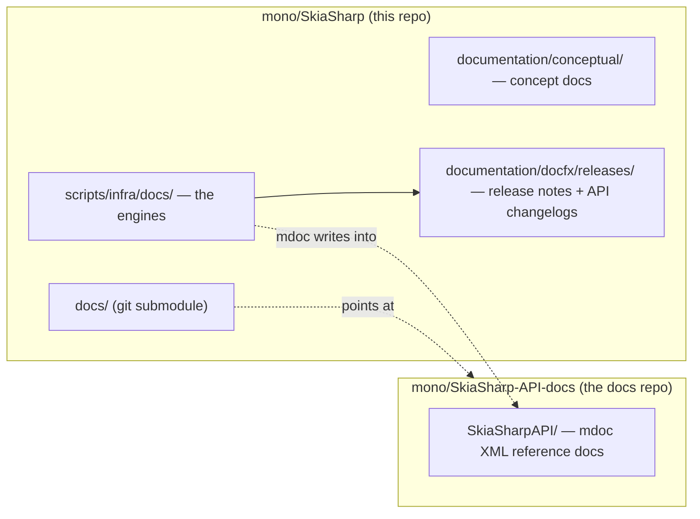
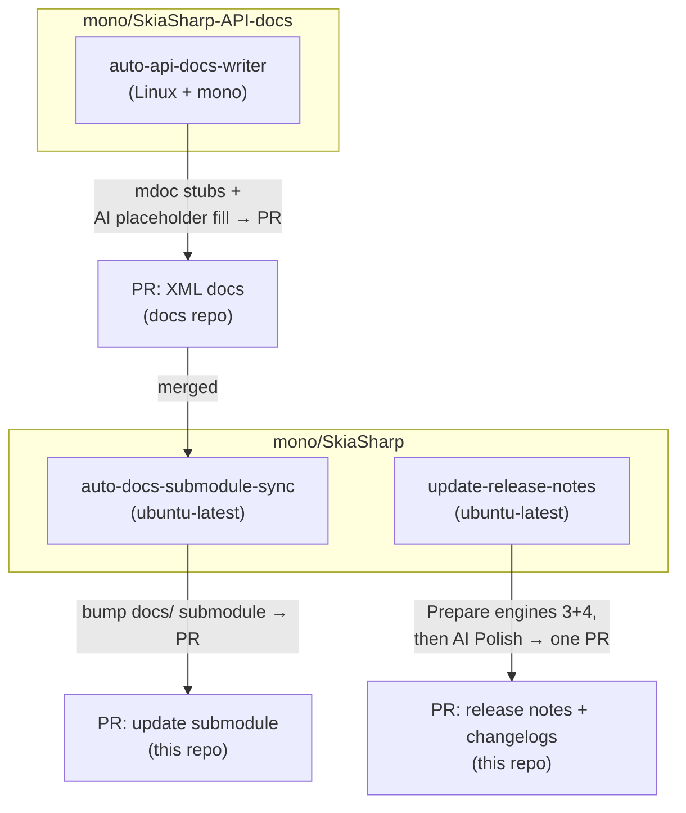

# SkiaSharp documentation — how the pieces fit together

This is the **map** of SkiaSharp's documentation system: what gets generated, by
which engine, driven by which skill, on which workflow, and in which repository.
Start here, then follow the links to the two deep-dive documents:

- **[writing-docs.md](writing-docs.md)** — the operator how-to: prerequisites, the
  local commands, editing API docs, and the Cake target reference.
- **[release-notes-and-changelogs.md](release-notes-and-changelogs.md)** — the
  behavior **spec** for the release-notes and API-changelog engines (the versioning
  model, `versions.json`, file layout, and per-engine rules). Read it before changing
  either generator.

For the public docs **website** itself (build, preview, theming) see
[site.md](site.md).

---

## The four kinds of documentation

SkiaSharp ships four distinct documentation artifacts. They are produced by
different tools and live in different places, which is the main reason the system can
feel sprawling — this table is the whole story on one screen:

| # | Artifact | What it is | Source of truth | Engine |
|---|----------|------------|-----------------|--------|
| 1 | **Conceptual docs** | Hand-written guides & tutorials on the docs site | `documentation/conceptual/` (this repo) | docfx ([site.md](site.md)) |
| 2 | **API reference docs** | Per-type/per-member XML reference (→ learn.microsoft.com) | `docs/SkiaSharpAPI/` (the **docs submodule**) | `docs.cake` (mdoc) |
| 3 | **Release notes** | Human "what's new" pages, AI-polished | `documentation/docfx/releases/` (this repo) | `generate-release-notes.py` |
| 4 | **API changelogs** | Machine-generated public-API diffs, no AI | `documentation/docfx/releases/` (this repo) | `api-diff.cake` |

Artifacts **3** and **4** share one versioning model and one config file
(`versions.json`); that shared model is the subject of the
[behavior spec](release-notes-and-changelogs.md). Artifact **2** is a separate
concern (mdoc), but it shares the same NuGet-diff plumbing
(`api-diff-tools.cake`) and lives next to the others.

---

## Two repositories

- **`mono/SkiaSharp`** (this repo) holds the conceptual docs, the release
  notes/changelogs tree, and **all the generation engines**
  (`scripts/infra/docs/`).
- **`mono/SkiaSharp-API-docs`** (the *docs repo*) holds the large mdoc XML
  reference docs and their images/examples. It is pulled into this repo as a git
  **submodule** at `docs/`, so the XML lives at `docs/SkiaSharpAPI/`. The engines
  in this repo run mdoc *into* that submodule.

Because the engines live here but the XML output lives there, the API-reference
path is inherently **cross-repo** — see the automation section below.

---

## The engines (`scripts/infra/docs/`)

All generation code lives in one directory so local runs, CI, and the local Docker
image all share exactly one copy and nothing can drift:

| File | Role |
|------|------|
| `docs.cake` | mdoc-based XML reference-doc generator (artifact **2**) |
| `api-diff.cake` | API-changelog engine (artifact **4**) |
| `generate-release-notes.py` | release-notes engine (artifact **3**) |
| `api-diff-tools.cake` | shared NuGet-diff comparer + layout helpers, `#load`ed by both `api-diff.cake` and `docs.cake` |
| `versions.json` | the **only** override surface — supersession + comparison baselines, honored identically by the Cake and Python engines |
| `pr-authors.json` | PR-author cache for the release-notes engine |
| `generate-changelogs.sh` | **Path 1** runner → `cake docs-api-diff-past` |
| `generate-release-notes.sh` | **Path 2** runner → `python generate-release-notes.py` |
| `generate-api-docs.sh` | **Path 3** runner → `cake update-docs` (mdoc under mono) |
| `docker/` | the local reproducibility image + `run.sh` wrapper |

The three `generate-*.sh` scripts are the **single source of truth** for each path:
a developer, the CI workflows, and the Docker wrapper all invoke the same script, so
a command can never drift between local and CI. The shared, general-purpose Cake
machinery (`shared.cake`, `download.cake`) stays under `scripts/infra/shared/`.

### The three generation paths

| Path | Produces | Entry script | Needs |
|------|----------|--------------|-------|
| **1 — API changelogs** | artifact 4 | `generate-changelogs.sh` | dotnet (+ NuGet feed) |
| **2 — Release notes** | artifact 3 | `generate-release-notes.sh` | dotnet, python3, **git history**, **gh** (PR authors) |
| **3 — API reference (mdoc)** | artifact 2 | `generate-api-docs.sh` | dotnet, **mono** (to run `mdoc.exe`) |

`mdoc.exe` is a .NET Framework executable. `docs.cake` invokes it under **mono** when
not on Windows, so Path 3 is no longer Windows-only — it runs on any Linux host (or
CI runner) with `mono-complete` installed.

---

## The skills

Three Copilot skills drive or assist these paths (`.agents/skills/`):

| Skill | Owns | Phase it performs |
|-------|------|-------------------|
| **`release-notes`** | artifacts 3 + 4 | Runs **Prepare** (the deterministic engines, via `scripts/generate.sh`) then **Polish** (AI rewrites only the prose of the listed release-notes pages). See spec §2.2/§4.4. |
| **`api-docs`** | artifact 2 | Fills the `"To be added."` placeholders mdoc leaves in the XML with real prose, following the .NET doc guidelines. |
| **`skia-analyst`** | analysis | Diffs versions / surfaces what changed and what's missing; used for release announcements and gap analysis, not for writing the committed artifacts. |

The `release-notes` skill stays deliberately **thin**: its `scripts/generate.sh` owns
no commands of its own — it just calls `generate-changelogs.sh` then
`generate-release-notes.sh` in order. All real logic lives in the engines under
`scripts/infra/docs/`.

---

## CI automation (cross-repo)

| Workflow | Repo | Runner | Produces | Paths |
|----------|------|--------|----------|-------|
| [`update-release-notes`](../../.github/workflows/update-release-notes.md) | this repo | `ubuntu-latest` (native dotnet + python) | one PR with release notes **and** API changelogs | 1 + 2 |
| `auto-api-docs-writer` | [docs repo](https://github.com/mono/SkiaSharp-API-docs/blob/main/.github/workflows/auto-api-docs-writer.md) | Linux + mono | PR with regenerated + AI-filled XML docs | 3 |
| [`auto-docs-submodule-sync`](../../.github/workflows/auto-docs-submodule-sync.yml) | this repo | `ubuntu-latest` | PR bumping the `docs/` submodule pointer | — |

Key points:

- **Paths 1 + 2 are one pipeline, one PR.** `update-release-notes` runs the
  deterministic Prepare phase (Cake changelogs + Python notes) in its own job, hands
  off to the AI Polish phase via an artifact, and opens a **single** rolling PR with
  both. It triggers on pushes to `main` and `release/*`, on `v*` tags, and weekly. If
  nothing changed, **no PR is opened**. (Spec §2.3.)
- **Path 3 is cross-repo.** The engines live in *this* repo but the XML lives in the
  *docs* repo, so `auto-api-docs-writer` lives in the docs repo, checks SkiaSharp out
  to borrow the engines, regenerates the stubs, AI-fills placeholders, and opens its
  PR there.
- **`auto-docs-submodule-sync`** closes the loop: once the docs-repo PR merges, it
  bumps this repo's `docs/` submodule pointer so the new XML is picked up here.

---

## Local generation & Docker

Everything CI does can be reproduced locally by calling the **same**
`generate-*.sh` scripts. The only host requirement beyond the .NET SDK is **mono**
for Path 3, and **gh** for Path 2's PR-author lookup.

- **Native local run** — install the deps yourself and call the scripts (or the
  underlying Cake targets in [writing-docs.md](writing-docs.md)).
- **Docker** (`scripts/infra/docs/docker/run.sh`) — a **local-only** convenience
  image that pre-installs dotnet + mono + python + gh so you don't have to. It runs
  the same scripts against a bind-mounted checkout, so a local run reproduces what CI
  produces.

> **Docker is for local reproducibility only — CI does not use it.** The CI runners
> install the same dependencies natively on Linux and call the same scripts. The image
> simply mirrors that dependency surface so the two stay identical.

---

## Where to go next

- Generating or editing docs by hand → **[writing-docs.md](writing-docs.md)**
- Changing how release notes or API changelogs behave →
  **[release-notes-and-changelogs.md](release-notes-and-changelogs.md)** (change the
  spec first, then the code)
- The docs **website** (concept docs, theming, preview) → **[site.md](site.md)**
