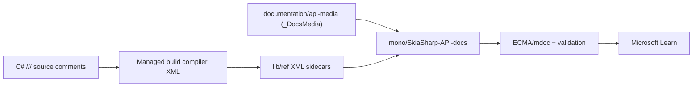

# SkiaSharp documentation architecture

SkiaSharp documentation has separate source, package, and publishing
responsibilities. This guide is the operator map; see
[writing-docs.md](writing-docs.md) for commands and
[release-notes-and-api-diffs.md](release-notes-and-api-diffs.md) for the
release-note and API-diff specification.

| Artifact | Source of truth | Owner |
|---|---|---|
| Conceptual site documentation | `documentation/docfx/guides/` | `mono/SkiaSharp` |
| Public API prose | C# `///` comments in `binding/` and `source/` | `mono/SkiaSharp` |
| Compiler XML and package sidecars | Managed build output; adjacent to `lib/<tfm>` and `ref/<tfm>` assemblies | `mono/SkiaSharp` |
| ECMA/mdoc API reference and Microsoft Learn | Package/XML/media inputs | `mono/SkiaSharp-API-docs` |
| Release notes and public API diffs | `documentation/docfx/releases/` | `mono/SkiaSharp` |

## Public API documentation flow


```mermaid
flowchart LR
  Source["C# /// source comments"] --> Build["Managed build compiler XML"]
  Build --> Package["lib/ref XML sidecars"]
  Media["documentation/api-media (_DocsMedia)"] --> External
  Package --> External["mono/SkiaSharp-API-docs"]
  External --> ECMA["ECMA/mdoc + validation"]
  ECMA --> Learn["Microsoft Learn"]
```

`///` comments are authoritative. Managed builds generate the compiler XML and
NuGet packaging intentionally copies that same file beside both the
implementation (`lib`) and reference (`ref`) assemblies. Consumers should treat
the `ref` XML as authoritative because its reference assembly defines the
consumer-visible API surface. Implementation-only XML entries are not public
API documentation.

Generated binding comments are source-controlled and preserved by
`utils/SkiaSharpGenerator`. Edit only their `///` trivia directly, then
regenerate and verify preservation; do not hand-edit generated declarations or
interop code.

## External API reference boundary

The parent repository has no `docs` submodule, mdoc generator, documentation
sync workflow, or direct XML-editing workflow. `mono/SkiaSharp-API-docs`
independently retrieves published managed packages, compiler XML, and
`_DocsMedia`, generates ECMA/mdoc, validates it, and publishes Microsoft Learn.
It currently defers Uno output; that repository owns re-enabling it. Parent
contributors author and review source comments with API changes rather than
filing a later documentation issue.

`documentation/api-media/` is versioned input for the `_DocsMedia` package.
`_DocsMedia` is nonshipping and unsigned like the other transport artifacts;
it is not a product dependency. Its matching artifact is retrieved alongside
the package family by the external consumer, which owns its use and
publication.

## Parent-owned site and release documentation

Conceptual DocFX content remains in `documentation/docfx/guides/`. Release-note
facts, prose sources, rendered release pages, and per-assembly API diffs remain
under `documentation/docfx/releases/`. The release-notes Prepare and render
entry points are:

```bash
.agents/skills/release-notes/scripts/prepare.sh [--force] [--min-version X --max-version Y]
.agents/skills/release-notes/scripts/render.sh [--min-version X --max-version Y]
```

The parent docs Docker image supports those release-note/API-diff paths only.
It intentionally has no API-reference generation dependencies.

## Validation contract

1. Build each changed managed project so compiler XML is generated.
2. Run the repository package-content test for the managed `lib`/`ref` XML
   sidecar contract.
3. Use the external repository's validation and publishing flow for ECMA/mdoc
   and Microsoft Learn. Do not duplicate or edit its generated output here.
4. Build conceptual site changes with DocFX when applicable.
