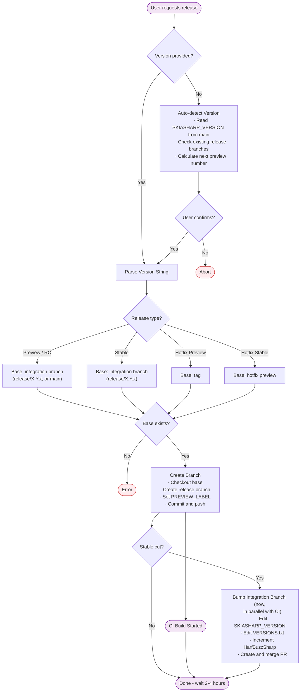
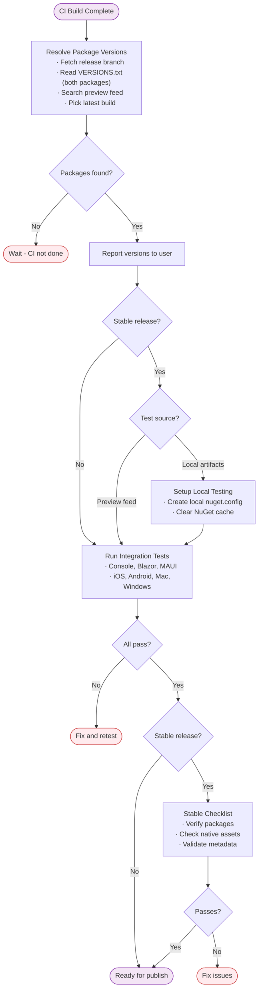
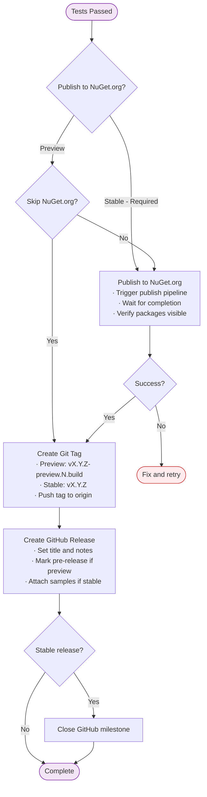

# Release Guide

How to release SkiaSharp: create branch → wait for CI → test → publish → tag.

## ⚠️ NO UNDO WARNING

**Tags and releases cannot be deleted.** Once a tag is pushed or a release is published, it's permanent. Each skill confirms before destructive operations - always review carefully before proceeding.

- Wrong tag pushed → Cannot delete, must create new release
- Wrong version published to NuGet.org → Cannot unpublish, must release new version
- Branch deleted prematurely → May lose CI artifacts

## Skills

The release process is handled by four skills in order:

| Step | Skill | Purpose | Trigger |
|------|-------|---------|---------|
| 1 | [release-branch](../../.agents/skills/release-branch/SKILL.md) | Create release branch, trigger CI | "release now", "release X.Y.Z" |
| 2 | [release-status](../../.agents/skills/release-status/SKILL.md) | Track pipeline chain progress | "check release status", "how is the build" |
| 3 | [release-testing](../../.agents/skills/release-testing/SKILL.md) | Test packages before publishing | "test the release", "continue" |
| 4 | [release-publish](../../.agents/skills/release-publish/SKILL.md) | Publish to NuGet.org, tag, finalize | "publish X.Y.Z", "finalize" |

Each skill confirms with `ask_user` before executing destructive operations.

---

## Reference Tables

### Version Patterns

| Release Type | Version Format | Branch | NuGet Pattern | Tag |
|--------------|----------------|--------|---------------|-----|
| Preview | `X.Y.Z-preview.N` | `release/X.Y.Z-preview.N` | `X.Y.Z-preview.N.{build}` | `vX.Y.Z-preview.N.{build}` |
| RC | `X.Y.Z-rc.N` | `release/X.Y.Z-rc.N` | `X.Y.Z-rc.N.{build}` | `vX.Y.Z-rc.N.{build}` |
| Stable | `X.Y.Z` | `release/X.Y.Z` | `X.Y.Z-stable.{build}` | `vX.Y.Z` |
| Hotfix Preview | `X.Y.Z.F-preview.N` | `release/X.Y.Z.F-preview.N` | `X.Y.Z.F-preview.N.{build}` | `vX.Y.Z.F-preview.N.{build}` |
| Hotfix Stable | `X.Y.Z.F` | `release/X.Y.Z.F` | `X.Y.Z.F-stable.{build}` | `vX.Y.Z.F` |

The `{build}` number is auto-assigned by CI.

### Release Type → Base Branch

Releases are cut from the line's **integration branch**: `main` for the newest
in-development line, or `release/X.Y.x` for an established/maintenance line. Each
integration branch sits at the next unreleased version with `PREVIEW_LABEL:
preview.0`, and is bumped to the next version **as soon as its stable is cut**
(immediately at branch time, not when the release publishes).

| Type | Base (integration branch) | PREVIEW_LABEL |
|------|---------------------------|---------------|
| Preview / RC | `release/X.Y.x` (or `main` if the line isn't forked yet) | `preview.N` / `rc.N` |
| Stable | `release/X.Y.x` | `stable` |
| Hotfix Preview | tag `vX.Y.Z` | `preview.N` |
| Hotfix Stable | `release/X.Y.Z.F-preview.{latest}` | `stable` |

> **Stable is cut from `release/X.Y.x`** — the integration branch that already
> produced the line's previews/rcs — not from `release/X.Y.Z-preview.{latest}`.

### HarfBuzzSharp Versioning

HarfBuzzSharp uses 4-digit versions: `X.Y.Z.N`

| Digits | Meaning |
|--------|---------|
| X.Y.Z | Native HarfBuzz version (e.g., `8.3.1`) |
| N | Incremented with each SkiaSharp release |

**Why 4 digits?** HarfBuzzSharp packages are released with SkiaSharp even when there are no HarfBuzz changes. The 4th digit keeps them in sync.

**When native HarfBuzz upgrades:** Reset to 3-digit version (e.g., `8.3.1.4` → `8.4.0`).

### Feeds

| Feed | URL | Purpose |
|------|-----|---------|
| Preview | `https://aka.ms/skiasharp-eap/index.json` | CI builds, testing (regular packages) |
| CI | `https://pkgs.dev.azure.com/xamarin/public/_packaging/SkiaSharp-CI/nuget/v3/index.json` | Internal CI artifacts (`_*` prefixed packages) |
| Stable | NuGet.org | Public releases |

> **Note:** The Preview feed contains regular NuGet packages (`SkiaSharp`, `HarfBuzzSharp`, etc.) for public testing.
> The CI feed contains internal build artifacts prefixed with `_` (`_NuGets`, `_Symbols`, `_NativeAssets`, etc.) used by the release pipeline and is not intended for public consumption.

### Pipelines

| Pipeline | Purpose |
|----------|---------|
| [Main Build](https://dev.azure.com/devdiv/DevDiv/_build?definitionId=25328) | Builds + auto-publishes to preview feed |
| [NuGet.org Publish](https://dev.azure.com/devdiv/DevDiv/_build?definitionId=25298) | Publishes to NuGet.org (manual trigger) |

---

## Workflow Diagrams

### Stage 1: Preparation (release-branch skill)



### Stage 2: Status Tracking (release-status skill)

After the branch is pushed, track the pipeline chain until packages are available:

```bash
python3 .agents/skills/release-status/scripts/pipeline-status.py release/{version}
```

The pipeline chain is: `SkiaSharp-Native` → `SkiaSharp` (signs & publishes) → `SkiaSharp-Tests`.
Packages appear on the internal feed after `SkiaSharp` (ID 10789) completes.

### Stage 3: Testing (release-testing skill)



### Stage 4: Publishing (release-publish skill)



---

## Related Documentation

- [Versioning](versioning.md) — Version numbering scheme explanation
