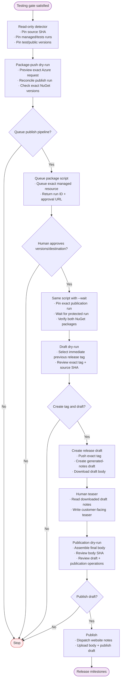
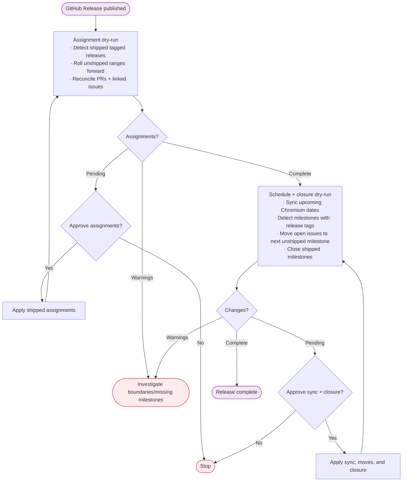

# Release Guide

How to release SkiaSharp: create branch → wait for CI → test → publish →
maintain milestones.

## Irreversible operations

**Tags and releases cannot be deleted.** Once a tag is pushed or a release is published, it's permanent. Each skill confirms before destructive operations - always review carefully before proceeding.

- Wrong tag pushed → Cannot delete, must create new release
- Wrong version published to NuGet.org → Cannot unpublish, must release new version
- Branch deleted prematurely → May lose CI artifacts

## Skills

The release process is handled by five skills in order:

| Step | Skill | Purpose | Trigger |
|------|-------|---------|---------|
| 1 | [release-branch](../../.agents/skills/release-branch/SKILL.md) | Create release branch, trigger CI | "release now", "release X.Y.Z" |
| 2 | [release-status](../../.agents/skills/release-status/SKILL.md) | Track pipeline chain progress | "check release status", "how is the build" |
| 3 | [release-testing](../../.agents/skills/release-testing/SKILL.md) | Test packages before publishing | "test the release", "continue" |
| 4 | [release-publish](../../.agents/skills/release-publish/SKILL.md) | Publish packages, create tag/draft, publish release | "publish X.Y.Z", "finalize" |
| 5 | [release-milestones](../../.agents/skills/release-milestones/SKILL.md) | Audit/sync/close milestones | "audit milestones", "sync milestone schedule" |

Each skill confirms with `ask_user` before executing destructive operations.
`done` and `pending` have the same meaning throughout; additional statuses such
as `running`, `failed`, `blocked`, `awaiting-user`, and `skipped` are
skill-specific and documented by the script that emits them.

## Reference Tables

### Version Patterns

| Release Type | Version Format | Branch | Test Package | Public Version | Tag |
|--------------|----------------|--------|--------------|----------------|-----|
| Preview | `X.Y.Z-preview.N` | `release/X.Y.Z-preview.N` | `X.Y.Z-preview.N.{build}` | `X.Y.Z-preview.N.{build}` | `vX.Y.Z-preview.N.{build}` |
| RC | `X.Y.Z-rc.N` | `release/X.Y.Z-rc.N` | `X.Y.Z-rc.N.{build}` | `X.Y.Z-rc.N.{build}` | `vX.Y.Z-rc.N.{build}` |
| Stable | `X.Y.Z` | `release/X.Y.Z` | `X.Y.Z-stable.{build}` | `X.Y.Z` | `vX.Y.Z` |
| Hotfix Preview | `X.Y.Z.F-preview.N` | `release/X.Y.Z.F-preview.N` | `X.Y.Z.F-preview.N.{build}` | `X.Y.Z.F-preview.N.{build}` | `vX.Y.Z.F-preview.N.{build}` |
| Hotfix Stable | `X.Y.Z.F` | `release/X.Y.Z.F` | `X.Y.Z.F-stable.{build}` | `X.Y.Z.F` | `vX.Y.Z.F` |

The `{build}` number is auto-assigned by CI. Release testing uses the exact test packages produced
by the selected CI build. Stable public versions drop the `-stable.{build}` suffix only when they
are published to NuGet.org.

### Release Type → Base Branch

Releases are cut from the line's **integration branch**: `main` for the newest
in-development line, or `release/X.Y.x` for an established/maintenance line. Each
integration branch sits at the next unreleased version with `PREVIEW_LABEL:
preview.0`, and is bumped to the next version **as soon as its stable is cut**
(immediately at branch time, not when the release publishes).

| Type | Base (integration branch) | PREVIEW_LABEL |
|------|---------------------------|---------------|
| Preview / RC | `release/X.Y.x` (or `main` if the line isn't forked yet) | `preview.N` / `rc.N` |
| Stable | `release/X.Y.x` | `stable` |
| Hotfix Preview | tag `vX.Y.Z` | `preview.N` |
| Hotfix Stable | `release/X.Y.Z.F-preview.{latest}` | `stable` |

> **Stable is cut from `release/X.Y.x`** — the integration branch that already
> produced the line's previews/rcs — not from `release/X.Y.Z-preview.{latest}`.

### mono/skia Counterpart Branches

Every SkiaSharp `release/{version}` branch has an **identically-named**
`release/{version}` branch in the [mono/skia](https://github.com/mono/skia) fork,
created at the exact `externals/skia` submodule commit the SkiaSharp branch
references (skia branch HEAD **==** submodule SHA). This locks the Skia source for
the release so it stays auditable, reproducible, and safe from garbage collection.

- Created by the [release-branch](../../.agents/skills/release-branch/SKILL.md) skill
  alongside the local SkiaSharp branch, validated at the pinned gitlink, then pushed
  first by the paired-branch script — for **every** cut (preview, rc, stable,
  and `release/X.Y.x` integration forks).
- `main` is the exception: it tracks the `skiasharp` integration branch, not a
  `release/*` counterpart.

### HarfBuzzSharp Versioning

HarfBuzzSharp uses 4-digit versions: `X.Y.Z.N`

| Digits | Meaning |
|--------|---------|
| X.Y.Z | Native HarfBuzz version (e.g., `8.3.1`) |
| N | Incremented with each SkiaSharp release |

**Why 4 digits?** HarfBuzzSharp packages are released with SkiaSharp even when there are no HarfBuzz changes. The 4th digit keeps them in sync.

**When native HarfBuzz upgrades:** Reset to 3-digit version (e.g., `8.3.1.4` → `8.4.0`).

### Feeds

| Feed | URL | Purpose |
|------|-----|---------|
| Preview | `https://aka.ms/skiasharp-eap/index.json` | CI builds, testing (regular packages) |
| CI | `https://pkgs.dev.azure.com/dnceng/public/_packaging/skiasharp-ci/nuget/v3/index.json` | Internal CI artifacts (`_*` prefixed packages) |
| Stable | NuGet.org | Public releases |

> **Note:** The Preview feed contains regular NuGet packages (`SkiaSharp`, `HarfBuzzSharp`, etc.) for testing, including exact `*-stable.{build}` packages before stable publication.
> The CI feed contains internal build artifacts prefixed with `_` (`_NuGets`, `_Symbols`, `_NativeAssets`, etc.) used by the release pipeline and is not intended for public consumption.

### Pipelines

| Pipeline | Purpose |
|----------|---------|
| [SkiaSharp-Native](https://dev.azure.com/devdiv/DevDiv/_build?definitionId=26493) | Builds native binaries. |
| [SkiaSharp](https://dev.azure.com/devdiv/DevDiv/_build?definitionId=10789) | Builds/signs managed packages and publishes the preview feed. |
| [SkiaSharp-Tests](https://dev.azure.com/devdiv/DevDiv/_build?definitionId=15756) | Runs the connected CI test suite. |
| [NuGet.org Publish](https://dev.azure.com/devdiv/DevDiv/_build?definitionId=25298) | Publishes to NuGet.org after protected human approval. |

---

## Workflow Diagrams

### Stage 1: Preparation (release-branch skill)


```mermaid
flowchart TB
    START([User requests release]) --> PROVIDED{Exact version supplied?}
    PROVIDED -->|Yes| EXACT[Use exact version]
    PROVIDED -->|No| DETECT

    DETECT["Read-Only Detector
    ∙ Accept only main or release/X.Y.x
    ∙ Validate integration-line version state
    ∙ Calculate exact next preview
    ∙ No execution capability"]
    DETECT --> EXACT
    EXACT --> DRYRUN

    DRYRUN["Exact-Version Executor Dry Run
    ∙ Reject integration-branch arguments
    ∙ Select and validate immutable base refs
    ∙ Check SkiaSharp + mono/skia remote state
    ∙ Plan stable post-cut bump when needed
    ∙ No checkout, commit, submodule, or remote changes"]

    DRYRUN --> VALID{Plan valid?}
    VALID -->|No| ERROR([Error])
    VALID -->|Yes| CONFIRM{User confirms complete plan?}
    CONFIRM -->|No| ABORT([Abort])
    CONFIRM -->|Yes| EXECUTE

    EXECUTE["Release Script Execute
    ∙ Initialize submodules recursively
    ∙ Create matching local release branches
    ∙ Update + commit version files
    ∙ Validate gitlink and both refs
    ∙ Push mono/skia, then SkiaSharp"]

    EXECUTE --> CI([CI Build Started])
    EXECUTE --> IS_STABLE{Stable cut?}
    IS_STABLE -->|No| DONE([Done - wait 2-4 hours])
    IS_STABLE -->|Yes| BUMP

    BUMP["Automate Integration Bump
    ∙ Create + push next-version branch
    ∙ Update SkiaSharp + HarfBuzzSharp versions
    ∙ Open complete-template PR
    ∙ Leave merge to a maintainer"]
    
    CI --> DONE
    BUMP --> DONE

    classDef error fill:#ffebee,stroke:#c62828
    classDef endpoint fill:#f3e5f5,stroke:#7b1fa2
    class ABORT,ERROR error
    class START,CI,DONE endpoint
```

### Stage 2: Status Tracking (release-status skill)

After the branch is pushed, query one connected pipeline chain for the exact
release commit:

```bash
python3 .agents/skills/release-status/scripts/pipeline-status.py release/{version}
```

The JSON report links downstream runs through `triggerInfo.pipelineId`, provides
immutable source/run metadata, and derives exact test/public package versions.
Packages appear on the internal feed after the selected `SkiaSharp` (ID 10789)
run completes. Wait for the selected `SkiaSharp-Tests` run and both exact
packages before beginning release-testing unless the user explicitly overrides
the test wait.

### Stage 3: Testing (release-testing skill)


```mermaid
flowchart TB
    START([Release status ready]) --> PLAN

    PLAN["Read-Only Matrix Planner
    ∙ Carry exact run/package metadata
    ∙ Select exact policy versions
    ∙ Select the host-specific matrix
    ∙ Generate one runner command per item"]

    PLAN --> APPROVE{User approves matrix?}
    APPROVE -->|No| STOP([Stop or customize])
    APPROVE -->|Yes| PREPARE

    PREPARE["Prepare Approved Run
    ∙ Restore pinned .NET tools
    ∙ Clear prior test output"]

    PREPARE --> TESTS
    TESTS["Run Approved Items Sequentially
    ∙ Check exact target prerequisites
    ∙ Run exact-package test command
    ∙ Always clean up"]

    TESTS --> RESULT{All approved items pass?}
    RESULT -->|No| FAIL([Release testing failed])
    RESULT -->|Yes| ARTIFACTS{Screenshots and coverage complete?}
    ARTIFACTS -->|No| FAIL
    ARTIFACTS -->|Yes| READY([Ready for publish])

    classDef error fill:#ffebee,stroke:#c62828
    classDef endpoint fill:#f3e5f5,stroke:#7b1fa2
    class STOP,FAIL error
    class START,READY endpoint
```

The release manager may explicitly override the testing gate. Record the
override and continue without searching for additional evidence.

| Mobile coverage | Exact test target |
|-----------------|-------------------|
| Android minimum / maximum | `26` / `37.1` |
| iOS minimum / maximum | `18.6` / `26.5` |

These are release-test targets, not product support minimums.

### Stage 4: Publishing (release-publish skill)


```mermaid
flowchart TB
    START([Testing gate satisfied]) --> DETECT
    DETECT["Read-only detector
    ∙ Pin source SHA
    ∙ Pin managed/tests runs
    ∙ Pin test/public versions"] --> PUSH_AUDIT
    PUSH_AUDIT["Package-push dry-run
    ∙ Preview exact Azure request
    ∙ Reconcile publish run
    ∙ Check exact NuGet versions"] --> APPROVE1{Queue publish pipeline?}
    APPROVE1 -->|No| STOP([Stop])
    APPROVE1 -->|Yes| PUSH
    PUSH["Queue package script
    ∙ Queue exact managed resource
    ∙ Return run ID + approval URL"] --> AZURE_APPROVAL{Human approves versions/destination?}
    AZURE_APPROVAL -->|No| STOP
    AZURE_APPROVAL -->|Yes| WAIT
    WAIT["Same script with --wait
    ∙ Pin exact publication run
    ∙ Wait for protected run
    ∙ Verify both NuGet packages"] --> DRAFT_AUDIT
    DRAFT_AUDIT["Draft dry-run
    ∙ Select immediate previous release tag
    ∙ Review exact tag + source SHA"] --> APPROVE2{Create tag and draft?}
    APPROVE2 -->|No| STOP
    APPROVE2 -->|Yes| DRAFT
    DRAFT["Create release draft
    ∙ Push exact tag
    ∙ Create generated-notes draft
    ∙ Download draft body"] --> TEASER
    TEASER["Human teaser
    ∙ Read downloaded draft notes
    ∙ Write customer-facing teaser"] --> PUBLICATION_AUDIT
    PUBLICATION_AUDIT["Publication dry-run
    ∙ Assemble final body
    ∙ Review body SHA
    ∙ Review draft + publication operations"] --> APPROVE3{Publish draft?}
    APPROVE3 -->|No| STOP
    APPROVE3 -->|Yes| PUBLISH
    PUBLISH["Publish
    ∙ Dispatch website notes
    ∙ Upload body + publish draft"] --> HANDOFF([Release milestones])

    classDef error fill:#ffebee,stroke:#c62828
    classDef endpoint fill:#f3e5f5,stroke:#7b1fa2
    class STOP error
    class START,HANDOFF endpoint
```

`detect-release-publish.py release/{version}` is also the recovery entry point:
it reconstructs all immutable pins and audit commands. The package publication
dry-run detects an exact existing Azure run without queueing. Execution returns
its approval URL immediately; run the emitted pinned resume command after human
approval, or add `--wait` to the approved execution command in unattended
automation. Successful Azure completion with delayed NuGet indexing remains a
resumable `wait-for-nuget` state.

### Stage 5: Release Milestones (release-milestones skill)


```mermaid
flowchart TB
    START([GitHub Release published]) --> AUDIT
    AUDIT["Assignment dry-run
    ∙ Detect shipped tagged releases
    ∙ Roll unshipped ranges forward
    ∙ Reconcile PRs + linked issues"] --> AUDIT_DECIDE{Assignments?}
    AUDIT_DECIDE -->|Warnings| BLOCKED([Investigate boundaries/missing milestones])
    AUDIT_DECIDE -->|Pending| AUDIT_APPROVE{Approve assignments?}
    AUDIT_APPROVE -->|No| STOP([Stop])
    AUDIT_APPROVE -->|Yes| AUDIT_APPLY[Apply shipped assignments]
    AUDIT_APPLY --> AUDIT
    AUDIT_DECIDE -->|Complete| SYNC
    SYNC["Schedule + closure dry-run
    ∙ Sync upcoming Chromium dates
    ∙ Detect milestones with release tags
    ∙ Move open issues to next unshipped milestone
    ∙ Close shipped milestones"] --> SYNC_DECIDE{Changes?}
    SYNC_DECIDE -->|Warnings| BLOCKED
    SYNC_DECIDE -->|Pending| SYNC_APPROVE{Approve sync + closure?}
    SYNC_APPROVE -->|No| STOP
    SYNC_APPROVE -->|Yes| SYNC_APPLY[Apply sync, moves, and closure]
    SYNC_APPLY --> SYNC
    SYNC_DECIDE -->|Complete| DONE([Release complete])

    classDef error fill:#ffebee,stroke:#c62828
    classDef endpoint fill:#f3e5f5,stroke:#7b1fa2
    class BLOCKED,STOP error
    class START,DONE endpoint
```

The same skill can run independently to synchronize upcoming milestones from
the Chromium schedule or audit shipped assignments at any time.

---

## Related Documentation

- [Versioning](versioning.md) — Version numbering scheme explanation
