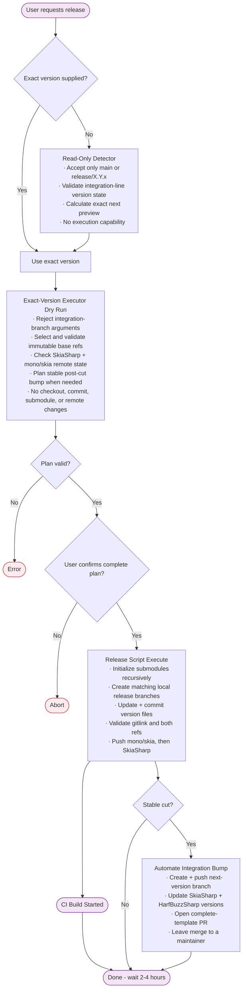
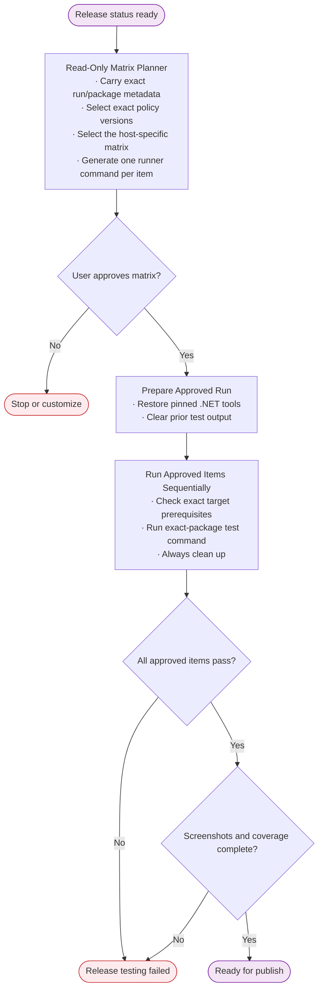
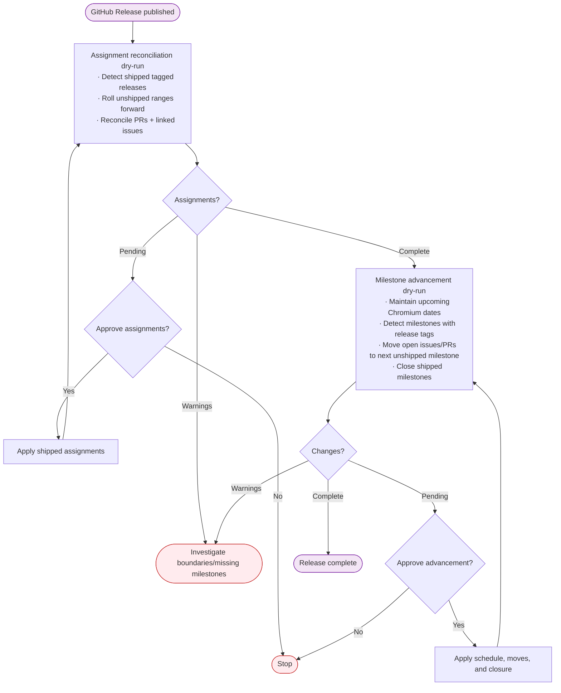

# Release Guide

How to release SkiaSharp: create branch → wait for CI → test → publish →
maintain milestones.

## Irreversible operations

**Tags and releases cannot be deleted.** Once a tag is pushed or a release is published, it's permanent. Each skill confirms before destructive operations - always review carefully before proceeding.

- Wrong tag pushed → Cannot delete, must create new release
- Wrong version published to NuGet.org → Cannot unpublish, must release new version
- Branch deleted prematurely → May lose CI artifacts

## Skills

The release process is handled by five skills in order:

| Step | Skill | Purpose | Trigger |
|------|-------|---------|---------|
| 1 | [release-branch](../../.agents/skills/release-branch/SKILL.md) | Create release branch, trigger CI | "release now", "release X.Y.Z" |
| 2 | [release-status](../../.agents/skills/release-status/SKILL.md) | Track pipeline chain progress | "check release status", "how is the build" |
| 3 | [release-testing](../../.agents/skills/release-testing/SKILL.md) | Test packages before publishing | "test the release", "continue" |
| 4 | [release-publish](../../.agents/skills/release-publish/SKILL.md) | Publish packages, create tag/draft, publish release | "publish X.Y.Z", "finalize" |
| 5 | [release-milestones](../../.agents/skills/release-milestones/SKILL.md) | Reconcile assignments and advance milestones | "reconcile milestones", "advance milestone schedule" |

Each skill confirms with `ask_user` before executing destructive operations.
`done` and `pending` have the same meaning throughout; additional statuses such
as `running`, `failed`, `blocked`, `awaiting-user`, and `skipped` are
skill-specific and documented by the script that emits them.

## Reference Tables

### Version Patterns

| Release Type | Version Format | Branch | Test Package | Public Version | Tag |
|--------------|----------------|--------|--------------|----------------|-----|
| Preview | `X.Y.Z-preview.N` | `release/X.Y.Z-preview.N` | `X.Y.Z-preview.N.{build}` | `X.Y.Z-preview.N.{build}` | `vX.Y.Z-preview.N.{build}` |
| RC | `X.Y.Z-rc.N` | `release/X.Y.Z-rc.N` | `X.Y.Z-rc.N.{build}` | `X.Y.Z-rc.N.{build}` | `vX.Y.Z-rc.N.{build}` |
| Stable | `X.Y.Z` | `release/X.Y.Z` | `X.Y.Z` | `X.Y.Z` | `vX.Y.Z` |
| Hotfix Preview | `X.Y.Z.F-preview.N` | `release/X.Y.Z.F-preview.N` | `X.Y.Z.F-preview.N.{build}` | `X.Y.Z.F-preview.N.{build}` | `vX.Y.Z.F-preview.N.{build}` |
| Hotfix Stable | `X.Y.Z.F` | `release/X.Y.Z.F` | `X.Y.Z.F` | `X.Y.Z.F` | `vX.Y.Z.F` |

`{build}` is Arcade's `short-date.revision` identity. `PREVIEW_LABEL=stable`
produces the exact public version from a real-signed `release/*` build. Arcade
registers, validates, and promotes the BAR through its configured default
channel; NuGet.org publication remains a separate protected operation.

### Release Type → Base Branch

Releases are cut from the line's **integration branch**: `main` for the newest
in-development line, or `release/X.Y.x` for an established/maintenance line. Each
integration branch sits at the next unreleased version with `PREVIEW_LABEL:
preview.0`, and is bumped to the next version **as soon as its stable is cut**
(immediately at branch time, not when the release publishes).

| Type | Base (integration branch) | PREVIEW_LABEL |
|------|---------------------------|---------------|
| Preview / RC | `release/X.Y.x` (or `main` if the line isn't forked yet) | `preview.N` / `rc.N` |
| Stable | `release/X.Y.x` | `stable` |
| Hotfix Preview | tag `vX.Y.Z` | `preview.N` |
| Hotfix Stable | `release/X.Y.Z.F-preview.{latest}` | `stable` |

> **Stable is cut from `release/X.Y.x`** — the integration branch that already
> produced the line's previews/rcs — not from `release/X.Y.Z-preview.{latest}`.

### mono/skia Counterpart Branches

Every SkiaSharp `release/{version}` branch has an **identically-named**
`release/{version}` branch in the [mono/skia](https://github.com/mono/skia) fork,
created at the exact `externals/skia` submodule commit the SkiaSharp branch
references (skia branch HEAD **==** submodule SHA). This locks the Skia source for
the release so it stays auditable, reproducible, and safe from garbage collection.

- Created by the [release-branch](../../.agents/skills/release-branch/SKILL.md) skill
  alongside the local SkiaSharp branch, validated at the pinned gitlink, then pushed
  first by the paired-branch script — for **every** cut (preview, rc, stable,
  and `release/X.Y.x` integration forks).
- `main` is the exception: it tracks the `skiasharp` integration branch, not a
  `release/*` counterpart.

### HarfBuzzSharp Versioning

HarfBuzzSharp versions are modeled as `X.Y.Z.N`. Revision zero is written in
the normalized 3-part form `X.Y.Z`.

| Digits | Meaning |
|--------|---------|
| X.Y.Z | Native HarfBuzz version (e.g., `8.3.1`) |
| N | Skia milestone bucket plus the release revision within that milestone |

For each native HarfBuzz `X.Y.Z`, the Skia milestone that first adopts it is
the base milestone. It reserves 100 revision values, and each later milestone
that continues using the same native version advances to the next bucket:

| Milestone relative to the base | HarfBuzzSharp revisions |
|--------------------------------|----------------------------|
| Base milestone | 0–99 |
| Base + 1 | 100–199 |
| Base + 2 | 200–299 |

The bucket base is
`(current Skia milestone - HarfBuzz adoption milestone) * 100`. For example,
HarfBuzz 14.2.1 was adopted by M150, so M150 uses `14.2.1` through
`14.2.1.99`, M151 uses `14.2.1.100` through `14.2.1.199`, and M152 uses
`14.2.1.200` through `14.2.1.299`. This keeps parallel Skia release lines
ordered and prevents them from publishing the same package version.

**When native HarfBuzz upgrades:** Reset `N` to zero and make the adopting
milestone the new base. For example, an M152 upgrade from `14.2.1.203` to
HarfBuzz 14.3.1 becomes `14.3.1` (`N = 0`), and M153 would start at
`14.3.1.100`. HarfBuzz upgrades are made on `main` and are not backported;
older release lines remain on their existing native HarfBuzz version and
revision buckets.

### Feeds

| Feed | URL | Purpose |
|------|-----|---------|
| Signed builds | `https://pkgs.dev.azure.com/dnceng/public/_packaging/skiasharp/nuget/v3/index.json` | Permanent target for signed packages promoted through the Maestro `SkiaSharp` channel |
| Transport | `https://pkgs.dev.azure.com/dnceng/public/_packaging/skiasharp-transport/nuget/v3/index.json` | Unsigned non-shipping `_NuGets`, `_NativeAssets*`, and dependency chunks used by local and CI builds |
| Stable | NuGet.org | Public releases |

> **Note:** One BAR records both product and transport packages. Maestro routes
> `IsShipping=true` packages to `skiasharp`, `IsShipping=false` packages to
> `skiasharp-transport`, and symbol blobs to the configured symbol targets.
> NuGet.org publication remains a separate protected operation.

### Pipelines

| Pipeline | Purpose |
|----------|---------|
| [mono-SkiaSharp](https://dev.azure.com/dnceng-public/public/_build?definitionId=345) | Public PR and branch validation. Builds native/managed outputs and publishes raw NuGets, prepared Shipping/NonShipping artifacts, and loose PDBs for direct inspection. |
| [skiasharp-package](https://dev.azure.com/dnceng/internal/_build?definitionId=1642) | Repeats the deterministic build/package work, then adds protected API Scan, real signing, BAR registration, standard validation, and Darc promotion. |
| [skiasharp-tests](https://dev.azure.com/dnceng/internal/_build?definitionId=1630) | Runs the connected test suite on Microsoft-hosted Azure Pipelines agents. |
| NuGet.org Publish | Gathers one exact BAR build and publishes it after protected human approval. |

`main` and `release/*` select real signing and BAR registration automatically.
When validating another branch manually, explicitly set `forceRealSigning`,
`registerInBar`, and `runApiScan` to `true`; a safe-default run is not release
evidence.

---

## Workflow Diagrams

### Stage 1: Preparation (release-branch skill)


```mermaid
flowchart TB
    START([User requests release]) --> PROVIDED{Exact version supplied?}
    PROVIDED -->|Yes| EXACT[Use exact version]
    PROVIDED -->|No| DETECT

    DETECT["Read-Only Detector
    ∙ Accept only main or release/X.Y.x
    ∙ Validate integration-line version state
    ∙ Calculate exact next preview
    ∙ No execution capability"]
    DETECT --> EXACT
    EXACT --> DRYRUN

    DRYRUN["Exact-Version Executor Dry Run
    ∙ Reject integration-branch arguments
    ∙ Select and validate immutable base refs
    ∙ Check SkiaSharp + mono/skia remote state
    ∙ Plan stable post-cut bump when needed
    ∙ No checkout, commit, submodule, or remote changes"]

    DRYRUN --> VALID{Plan valid?}
    VALID -->|No| ERROR([Error])
    VALID -->|Yes| CONFIRM{User confirms complete plan?}
    CONFIRM -->|No| ABORT([Abort])
    CONFIRM -->|Yes| EXECUTE

    EXECUTE["Release Script Execute
    ∙ Initialize submodules recursively
    ∙ Create matching local release branches
    ∙ Update + commit version files
    ∙ Validate gitlink and both refs
    ∙ Push mono/skia, then SkiaSharp"]

    EXECUTE --> CI([CI Build Started])
    EXECUTE --> IS_STABLE{Stable cut?}
    IS_STABLE -->|No| DONE([Done - wait 2-4 hours])
    IS_STABLE -->|Yes| BUMP

    BUMP["Automate Integration Bump
    ∙ Create + push next-version branch
    ∙ Update SkiaSharp + HarfBuzzSharp versions
    ∙ Open complete-template PR
    ∙ Leave merge to a maintainer"]
    
    CI --> DONE
    BUMP --> DONE

    classDef error fill:#ffebee,stroke:#c62828
    classDef endpoint fill:#f3e5f5,stroke:#7b1fa2
    class ABORT,ERROR error
    class START,CI,DONE endpoint
```

### Stage 2: Status Tracking (release-status skill)

After the branch is pushed, query the connected Build + Tests chain for the
exact release commit:

```bash
python3 .agents/skills/release-status/scripts/pipeline-status.py release/{version}
```

The JSON report links the combined Build run to its downstream Tests run,
provides immutable source/run metadata, and carries the exact Build, Tests, and
BAR IDs together with the signed package versions. Release testing starts only
after the connected Tests run succeeds unless the release manager records an
explicit override.

#### BAR channels and signed-package retrieval

The Build pipeline puts signed product packages, unsigned transport packages,
and symbol blobs in one BAR, validates it, then invokes standard Darc promotion.
The configured Maestro default channels route each asset class to its
destination. Darc promotion is not NuGet.org publication.

Use the BAR ID emitted by release status and gather that immutable build:

```bash
darc get-build \
  --id {bar-build} \
  --extended \
  --output-format json

darc gather-drop \
  --id {bar-build} \
  --output-dir output/darc/{bar-build} \
  --asset-filter '^(SkiaSharp|HarfBuzzSharp)(\..*)?$' \
  --no-workarounds \
  --include-released

dotnet nuget verify --all \
  output/darc/{bar-build}/shipping/packages/*.nupkg
```

Do not select release inputs by channel or latest location. Record the exact BAR
ID and use `output/darc/{bar-build}/shipping/packages` as the local NuGet source.

Release status waits until the exact BAR records the expected package locations.
Default-channel promotion authorizes publication only to the channel-configured
Azure Artifacts and symbol destinations; it does not authorize NuGet.org
publication.

The historical migration targets `release/4.150.x`, `release/4.151.x`, and
exact `release/4.152.0-rc.1`. After the `.x` backports land, release-branch cuts
exact `release/4.150.4` and `release/4.151.3` children before
status/testing/publish; RC1 can proceed directly. Release status verifies each
exact target commit has the combined Build, connected Tests, exact-version, and
fail-closed artifact-selection backport. It then blocks until that branch has
default-channel mapping and signed `skiasharp` feed routing. Main-only
production features such as Apple symbol generation are not historical
release-tooling prerequisites.

Historical BARs must also contain only one branch-versioned NonShipping
transport asset per package ID. Commit aliases may remain in the pipeline
artifact, but package downloads prefer the branch identity and release status
rejects a BAR that exposes both branch and commit versions for the same
transport ID.

Public CI validates package and pipeline artifact shape before internal release
proof. The canonical `nuget` artifact owns product and explicit symbol packages;
`nuget_special` retains unsigned branch and pipeline-only commit transport
aliases, while only branch aliases enter BAR. `PdbArtifacts` contains loose
implementation/runtime PDBs extracted from signed packages that have no
explicit symbol package, preserving package/version/TFM/RID paths and excluding
`ref/**`. Cake-native collapsed paths plus relative containment reject escaping
archive entries without `System.IO.Path`; `.empty` is valid only when no
eligible PDB exists. The expected-failure test clears global `LASTEXITCODE`
after confirming rejection so public validation exits successfully. These
public outputs come from one uncached aggregate Cake Package as `arcade_shipping`,
`arcade_nonshipping`, and `PdbArtifacts`. Internal signing consumes only
`arcade_shipping` and emits `arcade_shipping_signed`; a separate
`publish_assets` stage combines it with `arcade_nonshipping` for BAR. Release
readiness still requires exact successful internal Build, connected Tests, BAR,
default-channel, signed-feed, and protected publisher evidence.

Prepare installs the repository SDK before restoring Cake tools and validating
this contract. The top-level `nuget` target depends on
`nuget-assemble-arcade-assets`; package outputs are build-context dependent and
must not come from source-only aggregate Package caching.

### Stage 3: Testing (release-testing skill)


```mermaid
flowchart TB
    START([Release status ready]) --> PLAN

    PLAN["Read-Only Matrix Planner
    ∙ Carry exact run/package metadata
    ∙ Select exact policy versions
    ∙ Select the host-specific matrix
    ∙ Generate one runner command per item"]

    PLAN --> APPROVE{User approves matrix?}
    APPROVE -->|No| STOP([Stop or customize])
    APPROVE -->|Yes| PREPARE

    PREPARE["Prepare Approved Run
    ∙ Restore pinned .NET tools
    ∙ Clear prior test output"]

    PREPARE --> TESTS
    TESTS["Run Approved Items Sequentially
    ∙ Check exact target prerequisites
    ∙ Run exact-package test command
    ∙ Always clean up"]

    TESTS --> RESULT{All approved items pass?}
    RESULT -->|No| FAIL([Release testing failed])
    RESULT -->|Yes| ARTIFACTS{Screenshots and coverage complete?}
    ARTIFACTS -->|No| FAIL
    ARTIFACTS -->|Yes| READY([Ready for publish])

    classDef error fill:#ffebee,stroke:#c62828
    classDef endpoint fill:#f3e5f5,stroke:#7b1fa2
    class STOP,FAIL error
    class START,READY endpoint
```

The release manager may explicitly override the testing gate. Record the
override and continue without searching for additional evidence.

| Mobile coverage | Exact test target |
|-----------------|-------------------|
| Android minimum / maximum | `26` / `37.1` |
| iOS minimum / maximum | `18.6` / `26.5` |

These are release-test targets, not product support minimums.

### Stage 4: Publishing (release-publish skill)


```mermaid
flowchart TB
    START([Testing gate satisfied]) --> DETECT
    DETECT["Read-only detector
    ∙ Pin source SHA
    ∙ Pin combined Build + Tests runs
    ∙ Pin BAR build ID + package versions"] --> GATHER
    GATHER["Gather exact BAR build
    ∙ Verify repository/branch/commit and recorded locations
    ∙ Verify package versions + signatures"] --> PUSH_AUDIT
    PUSH_AUDIT["NuGet.org dry run
    ∙ Preview exact BAR ID + versions
    ∙ Confirm packages are absent"] --> APPROVE1{Queue protected publisher?}
    APPROVE1 -->|No| STOP([Stop])
    APPROVE1 -->|Yes| PUSH
    PUSH["Queue NuGet.org publisher
    ∙ Pass immutable BAR build ID
    ∙ Return run ID + approval URL"] --> AZURE_APPROVAL{Human approves versions/destination?}
    AZURE_APPROVAL -->|No| STOP
    AZURE_APPROVAL -->|Yes| WAIT
    WAIT["Protected publisher
    ∙ Gather + verify exact BAR build
    ∙ Push NuGet.org packages
    ∙ Verify indexed versions"] --> DRAFT_AUDIT
    DRAFT_AUDIT["Draft dry-run
    ∙ Select immediate previous release tag
    ∙ Review exact tag + source SHA"] --> APPROVE2{Create tag and draft?}
    APPROVE2 -->|No| STOP
    APPROVE2 -->|Yes| DRAFT
    DRAFT["Create release draft
    ∙ Push exact tag
    ∙ Create generated-notes draft
    ∙ Download draft body"] --> TEASER
    TEASER["Human teaser
    ∙ Read downloaded draft notes
    ∙ Write customer-facing teaser"] --> PUBLICATION_AUDIT
    PUBLICATION_AUDIT["Publication dry-run
    ∙ Assemble final body
    ∙ Review body SHA
    ∙ Review draft + publication operations"] --> APPROVE3{Publish draft?}
    APPROVE3 -->|No| STOP
    APPROVE3 -->|Yes| PUBLISH
    PUBLISH["Publish
    ∙ Dispatch website notes
    ∙ Upload body + publish draft"] --> HANDOFF([Release milestones])

    classDef error fill:#ffebee,stroke:#c62828
    classDef endpoint fill:#f3e5f5,stroke:#7b1fa2
    class STOP error
    class START,HANDOFF endpoint
```

The release-publish detector is also the recovery entry point: it reconstructs
the immutable source, pipeline, BAR, package, and test pins. The protected
publisher accepts the BAR build ID rather than a mutable branch or latest-build
selector. Successful publication with delayed NuGet indexing remains a
resumable `wait-for-nuget` state.

### Stage 5: Release Milestones (release-milestones skill)


```mermaid
flowchart TB
    START([GitHub Release published]) --> RECONCILE
    RECONCILE["Assignment reconciliation dry-run
    ∙ Detect shipped tagged releases
    ∙ Roll unshipped ranges forward
    ∙ Reconcile PRs + linked issues"] --> RECONCILE_DECIDE{Assignments?}
    RECONCILE_DECIDE -->|Warnings| BLOCKED([Investigate boundaries/missing milestones])
    RECONCILE_DECIDE -->|Pending| RECONCILE_APPROVE{Approve assignments?}
    RECONCILE_APPROVE -->|No| STOP([Stop])
    RECONCILE_APPROVE -->|Yes| RECONCILE_APPLY[Apply shipped assignments]
    RECONCILE_APPLY --> RECONCILE
    RECONCILE_DECIDE -->|Complete| ADVANCE
    ADVANCE["Milestone advancement dry-run
    ∙ Maintain upcoming Chromium dates
    ∙ Detect milestones with release tags
    ∙ Move open issues/PRs to next unshipped milestone
    ∙ Close shipped milestones"] --> ADVANCE_DECIDE{Changes?}
    ADVANCE_DECIDE -->|Warnings| BLOCKED
    ADVANCE_DECIDE -->|Pending| ADVANCE_APPROVE{Approve advancement?}
    ADVANCE_APPROVE -->|No| STOP
    ADVANCE_APPROVE -->|Yes| ADVANCE_APPLY[Apply schedule, moves, and closure]
    ADVANCE_APPLY --> ADVANCE
    ADVANCE_DECIDE -->|Complete| DONE([Release complete])

    classDef error fill:#ffebee,stroke:#c62828
    classDef endpoint fill:#f3e5f5,stroke:#7b1fa2
    class BLOCKED,STOP error
    class START,DONE endpoint
```

The same skill can run independently to advance upcoming milestones from the
Chromium schedule or reconcile shipped assignments at any time.

---

## Related Documentation

- [Versioning](versioning.md) — Version numbering scheme explanation
