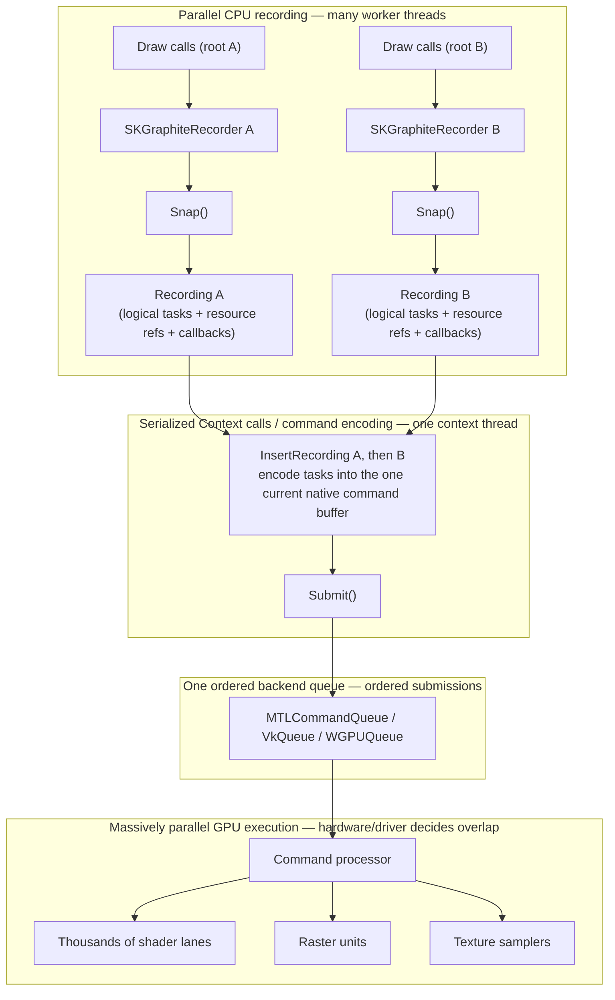
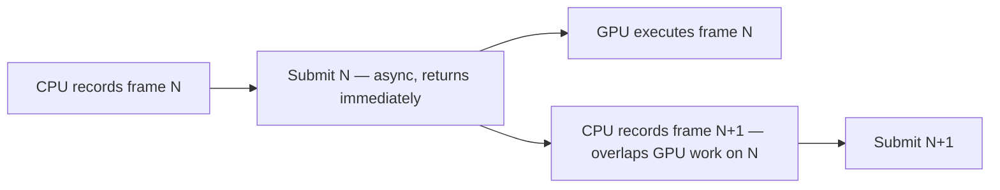

# Graphite GPU surfaces

*Graphite* is Skia's newer GPU backend, built on modern explicit graphics APIs. You create a context, record drawing into a surface, submit that recording to the GPU, and read the result back yourself. None of the SkiaSharp [view controls](../views/index.md) drive Graphite yet, so you drive it directly today — either fully offscreen, or by wrapping an onscreen render target or texture yourself, the same way you can with Ganesh.

Both backends **defer** GPU work rather than executing it as you draw — neither is immediate-mode. The difference is *where* that deferred work lives. [Ganesh](../ganesh/index.md) accumulates it inside a stateful, context-centric [`GRContext`](xref:SkiaSharp.GRContext) and drains it when you call `Flush`/`Submit` (and it may flush internally on its own when it needs to). Graphite instead splits the pipeline into independent producer objects: a **recorder** records drawing and hands you a self-contained **recording**, which you later transfer to one **context** thread to be encoded and submitted. That split is deliberate — it maps cleanly onto modern explicit APIs (Vulkan, Metal, and WebGPU) and lets an application record drawing on several CPU threads in parallel, then funnel the recordings through one shared context.

Graphite differs from [Ganesh](../ganesh/index.md) in two important ways:

- **Drawing is recorded, then submitted separately.** You draw onto a surface's canvas as usual, but instead of flushing a context you *snap* a **recording** from a **recorder** and *insert* that recording into the context, then *submit* it.
- **Reading pixels back is asynchronous.** Graphite surfaces do not support the synchronous `SKSurface.ReadPixels` you use with raster and Ganesh surfaces. You request a readback and drive it to completion. This is the single most important thing to get right — see [Reading pixels back](#reading-pixels-back).

Graphite supports three backends: **Vulkan**, **Metal**, and **Dawn** (WebGPU).

**Threading model:** `SKGraphiteRecorder` and `SKGraphiteContext` are single-owner objects — never call into one from two threads at once — but they are *not* permanently pinned to the thread that created them. Separate recorders may run concurrently on different CPU workers, provided each recorder (and the surfaces made from it) is touched by one worker at a time and handed off with proper synchronization. Every `SKGraphiteContext` operation — `InsertRecording`, `Submit`, `CheckAsyncWorkCompletion` — must be serialized onto one designated context/submission thread.

## What parallel recording actually means

Graphite's split between recording and submission is what makes it worth the extra plumbing — but it is easy to misread. The parallelism is on the **CPU**: many threads can build recordings at once. Submission stays **serial**: one context encodes those recordings, in order, into one command buffer and hands them to **one** backend queue. That is not a bottleneck that makes Graphite pointless — encoding is cheap CPU work, and the GPU itself is where the massive parallelism happens.



Read the zones from top to bottom:

- **Parallel CPU recording.** Each worker owns a recorder, issues draw calls, and calls `Snap()` to get an immutable recording. Recorders never touch each other, so this scales across cores.
- **Serialized Context calls / command encoding.** `InsertRecording` walks each recording's tasks and encodes them into the context's single current native command buffer; `Submit` closes and submits it. These calls run one at a time on the context thread. No GPU work has executed yet.
- **Ordered submissions.** The command buffer goes to one backend queue (`MTLCommandQueue`, `VkQueue`, or `WGPUQueue`). Submissions execute in the order you made them.
- **Massively parallel GPU execution.** The GPU's command processor feeds thousands of shader lanes, raster units, and samplers. *This* is where a single draw is parallelized across pixels and vertices.

Two things people get wrong: **one queue is not one GPU thread** — a single queue already drives the whole GPU's parallel hardware — and **using several recorders does not create several GPU queues** or guarantee that their work overlaps on the GPU. Recorders buy you parallel *recording*; the driver and hardware decide any parallel *execution*.

### Cross-frame pipelining

Because `Submit` is asynchronous and returns without waiting for the GPU, the CPU does not sit idle while a frame renders. While the GPU executes frame N, your workers can already be recording frame N+1:



Keep the ordered-draw caveat in mind: this overlaps *CPU recording of the next frame* with *GPU execution of the current one*. It does not reorder or parallelize the ordered draws within a frame — the hardware and driver decide whatever internal overlap is safe.

### A compositor-style example

A UI framework's compositor is the classic fit for parallel recording. (This describes a *pattern* you could build; the stock SkiaSharp view controls and stock Uno controls do **not** render through Graphite today.)

1. **Invalidation identifies independent dirty raster roots** — self-contained subtrees such as scrolling tiles, separate windows, popups, a chart, or a heavy custom control that changed this frame.
2. **Worker threads record roots in parallel** — one recorder per worker turns each dirty root into a recording, while unchanged roots keep their cached GPU content.
3. **The context thread inserts recordings in dependency order** — parents after the children they composite, back-to-front where blending requires it — then submits once.
4. **The compositor assembles and presents** — it combines the freshly recorded roots with the cached ones and presents the frame.

This pays off only when the roots are genuinely independent and each is substantial. Watch for:

- **Partitioning overhead** — splitting the scene, allocating recorders, and synchronizing handoff all cost CPU; too fine a split loses more than it gains.
- **Dependencies** — a root that reads another's output cannot be recorded in isolation; encode order still has to respect it.
- **Shared caches** — text/glyph atlases and image caches are shared state; coordinate access rather than racing on them.
- **Tiny jobs** — recording a trivial root on its own worker is usually slower than just recording it inline.

## Backend platform support

Which Graphite backend you use is determined by the platform:

| Backend | Platforms |
| --- | --- |
| [**Metal**](metal.md) | macOS, iOS (including the iOS Simulator on Apple Silicon, with one caveat), Mac Catalyst, tvOS |
| [**Vulkan**](vulkan.md) | Linux, Android, Windows |
| [**Dawn**](dawn.md) (WebGPU) | WebAssembly / browser only |

A few consequences worth calling out:

- **Apple platforms use Metal, not Vulkan.** The native Skia build for Apple is not compiled with Vulkan, so on macOS/iOS/Mac Catalyst/tvOS the only Graphite backend is Metal.
- **On Windows, Graphite means Vulkan.** There is **no Direct3D Graphite backend** in SkiaSharp — a D3D path would only exist as Graphite→Dawn→D3D12, which is not exposed. If you need D3D specifically, use [Ganesh with Direct3D](../ganesh/direct3d.md).
- **Dawn is browser-only.** It is the WebAssembly path and cannot submit synchronously; see [Graphite with Dawn](dawn.md).

## Checking a backend is available

A given build of SkiaSharp may not include every Graphite backend. Before creating a context, you can check whether a backend is compiled in with `SKGraphiteContext.IsBackendAvailable`:

```csharp
if (SKGraphiteContext.IsBackendAvailable(SKGraphiteBackend.Metal))
{
    // The Metal factory is compiled in. Validate the device before creating a context.
}
```

The check does not validate native devices, queues, or required capabilities. Most factory failures return `null`, but the current Metal backend terminates the process if its `MTLDevice` reports none of the GPU families Skia supports. Follow each backend page's preflight requirements before calling its factory.

## Choose and create a backend

Create the context from the native device objects owned by your host:

- [Vulkan](vulkan.md) — raw Vulkan handles on Linux, Android, or Windows, including the render-target usage flags and release ordering required for wrapped images.
- [Metal](metal.md) — an `MTLDevice` and `MTLCommandQueue` on Apple platforms, including iOS Simulator caveats.
- [Dawn](dawn.md) — WebGPU handles in a browser/WebAssembly host, including its asynchronous submission constraint.

Each backend page returns the same `SKGraphiteContext`. Return here after context creation for the shared recorder, surface, submission, readback, texture, image-provider, and resource-management flow. Every factory also has an overload that takes [`SKGraphiteContextOptions`](#context-options).

## The render loop

Once you have a context, the Graphite drawing loop is: create a **recorder**, create a surface from it, draw, **snap** a recording, **insert** it, and **submit**.

```csharp
var info = new SKImageInfo(512, 512, SKColorType.Rgba8888, SKAlphaType.Premul);

using var recorder = context.CreateRecorder();
using var surface = SKSurface.Create(recorder, info);
using var paint = new SKPaint { Color = SKColors.CornflowerBlue };

// draw exactly as you would on any other surface
surface.Canvas.Clear(SKColors.White);
surface.Canvas.DrawCircle(256, 256, 200, paint);

// capture everything recorded so far
using var recording = recorder.Snap();

// hand the recording to the context and submit it to the GPU
context.InsertRecording(recording);
context.Submit(new SKGraphiteSubmitInfo { Sync = true });
```

A few things to note:

- `CreateRecorder` returns an `SKGraphiteRecorder`. A recorder is a reusable unit of work capture; you create the surface from it, not from the context directly. If you draw raster (CPU-backed) `SKImage`s, create the recorder with an image provider instead — see [Drawing CPU images](#drawing-cpu-images-the-image-provider).
- `Snap` produces an `SKGraphiteRecording` — an immutable package of prepared Graphite *tasks*, the resource references they need, and completion callbacks. It is **not** a native command buffer: no Metal, Vulkan, or WebGPU commands have been encoded yet, and no GPU work has run. Snapping resets the recorder so it can record the next frame. It can return **`null`** if the recording could not be built, for example if the driver could not compile a pipeline for something you drew; see [Pipeline compilation](#pipeline-compilation).
- `InsertRecording` walks the recording's tasks and encodes them into the context's current native command buffer, on the context thread. This is CPU work — it still does not execute anything on the GPU. It returns an [`SKGraphiteInsertStatus`](#status-and-enums) that production code can inspect when it needs to recover from submission problems.
- `Submit(new SKGraphiteSubmitInfo { Sync = true })` sends that command buffer to the backend queue — this is where the GPU actually starts working — and, with `Sync = true`, waits for it to finish. It returns `false` if submission failed.

## Reading pixels back

> [!IMPORTANT]
> Graphite surfaces do **not** support the synchronous [`SKSurface.ReadPixels`](xref:SkiaSharp.SKSurface.ReadPixels*) used with [raster](../raster/index.md) and [Ganesh](../ganesh/index.md) surfaces — it returns `false`. To get pixels off a Graphite surface you must use the **asynchronous** readback path. This is the number-one thing to get right when porting existing code.

Call `RequestReadPixels` with the surface, the destination `SKImageInfo`, the source rectangle, and a callback. Then drive the request to completion by submitting and repeatedly calling `CheckAsyncWorkCompletion` until the callback fires. This helper is for **native hosts** only — it submits with `Sync = true`, which a browser/WebGPU host cannot do because it must yield to the event loop (see [Graphite with Dawn](dawn.md)). It bounds the pump, checks the `Submit` result, and handles a failed read:

```csharp
static byte[] ReadPixelsFromGraphite(
    SKGraphiteContext context,
    SKSurface surface,
    SKImageInfo dstInfo,
    int maxPumps = 10_000)
{
    byte[] pixels = null;
    var done = false;

    context.RequestReadPixels(
        surface,
        dstInfo,
        new SKRectI(0, 0, dstInfo.Width, dstInfo.Height),
        result =>
        {
            done = true;
            // The read can fail: the result is null when Graphite could not satisfy it.
            if (result is null)
                return;
            // ToArray copies the plane into a tightly-packed byte[] that outlives the
            // callback, stripping any per-row transfer padding for you.
            pixels = result.ToArray();
        });

    // Flush the queued readback. Submit reports failure by returning false.
    if (!context.Submit(new SKGraphiteSubmitInfo { Sync = true }))
        throw new InvalidOperationException("Graphite Submit failed during read-back.");

    // Bounded pump so a callback that never fires can't spin forever.
    for (var pump = 0; !done && pump < maxPumps; pump++)
        context.CheckAsyncWorkCompletion();

    if (!done)
        throw new TimeoutException("Graphite read-back did not complete within the pump budget.");
    if (pixels is null)
        throw new InvalidOperationException("Graphite read-back failed.");

    return pixels;
}

var dstInfo = new SKImageInfo(info.Width, info.Height, SKColorType.Rgba8888, SKAlphaType.Premul);
var pixels = ReadPixelsFromGraphite(context, surface, dstInfo);
```

The helper drives the callback to completion within a bounded budget so the sequence is easy to see. In a production renderer, pump completion from the host's render or event loop and apply the timeout or cancellation policy appropriate for the application. Browser hosts cannot use `Sync = true` and must never block the event loop; submit without syncing and pump `CheckAsyncWorkCompletion` from the loop instead — see [Graphite with Dawn](dawn.md).

The callback receives an [`SKImageReadPixelsResult`](#status-and-enums) — the backend-neutral async-read result type shared by the [`SKImage`](xref:SkiaSharp.SKImage), [`SKSurface`](xref:SkiaSharp.SKSurface), and `SKGraphiteContext` read paths. SkiaSharp disposes it automatically when the callback returns, so copy what you need out before returning; using its accessors afterwards throws `ObjectDisposedException`. Keep the context and surface undisposed until the callback completes.

It offers a few ways to extract pixels:

- `ToArray(planeIndex = 0)` — a tightly-packed `byte[]` copy (padding stripped), as above.
- `ToBitmap()` / `ToImage()` — an owned [`SKBitmap`](xref:SkiaSharp.SKBitmap) or [`SKImage`](xref:SkiaSharp.SKImage) for single-plane (interleaved) results.
- `CopyPlaneTo(planeIndex, destination)` — copies one plane into a `Span<byte>` you own, stripping row padding.
- `GetPlaneData(planeIndex)` / `GetPlaneRowBytes(planeIndex)` — the raw `ReadOnlySpan<byte>` and its stride, if you want to handle padding yourself.

A shorter `RequestReadPixels` overload uses default rescaling; a longer overload lets you pass an [`SKImageRescaleGamma`](#status-and-enums) and [`SKImageRescaleMode`](#status-and-enums) when you want the read to also rescale the image. The default is `(SKImageRescaleGamma.Src, SKImageRescaleMode.Nearest)`.

## Wrapping an external GPU texture

Instead of letting Skia allocate the surface's texture, you can render into a GPU texture your own code created. Build an `SKGraphiteBackendTexture` as shown on the [Vulkan](vulkan.md#wrap-and-release-vulkan-images), [Metal](metal.md#wrap-metal-textures), or [Dawn](dawn.md#wrap-dawn-textures) page, then create a surface that wraps it:

```csharp
using var surface = SKSurface.Create(
    recorder, backendTexture, SKColorType.Rgba8888);

surface.Canvas.Clear(SKColors.White);
// ... draw, then Snap / InsertRecording / Submit as above ...
```

### Releasing a wrapped texture

When Skia is done with a wrapped backend texture it can notify you through the parameterless `SKGraphiteReleaseDelegate` accepted by the wrap overloads. The callback means Skia no longer needs the texture; it does not automatically delete a texture allocated through `CreateBackendTexture`.

The callback fires after the wrapping surface or image is disposed and pending GPU work has drained. Disposing the wrapper alone is not enough. Delete a Skia-allocated backend texture only after the callback fires, and release an externally allocated texture through the API that created it. The [Vulkan page](vulkan.md#release-a-wrapped-texture) contains the complete wrapper-dispose, GPU-drain, callback, delete, and failure sequence.

`SKImage.FromTexture` has the same release-callback overload and fires after image disposal and GPU drain.

## Using textures as images

You can also move between GPU textures and [`SKImage`](xref:SkiaSharp.SKImage) objects on a recorder:

- [`SKImage.FromTexture`](xref:SkiaSharp.SKImage.FromTexture*) wraps a backend texture as a sampling image you can draw onto a surface:

  ```csharp
  using var image = SKImage.FromTexture(
      recorder, backendTexture, SKColorType.Rgba8888, SKAlphaType.Premul);
  ```

  A longer overload also takes a color space and a parameterless `SKGraphiteReleaseDelegate` that fires once when Skia releases the wrapped texture.

- [`ToTextureImage`](xref:SkiaSharp.SKImage.ToTextureImage*) uploads an existing image (for example, one decoded on the CPU) into a GPU-backed image on the recorder:

  ```csharp
  using var gpuImage = cpuImage.ToTextureImage(recorder);
  ```

## Drawing CPU images: the image provider

> [!IMPORTANT]
> Unlike Ganesh, Graphite does **not** automatically upload a non-Graphite `SKImage` to the GPU. If you draw a raster/CPU-backed `SKImage` — for example one you decoded with `SKImage.FromEncodedData` — onto a Graphite surface **without an image provider, the draw is silently dropped**: nothing appears and no error is raised.

There are two ways to handle this. You can upload each image yourself with [`ToTextureImage`](#using-textures-as-images) and draw the GPU-backed result. Or you can give the recorder an *image provider* callback that uploads CPU images on demand when ordinary `DrawImage` calls need them.

Pass the callback to the `CreateRecorder` overload that accepts one. SkiaSharp ships a ready-made `SKGraphiteImageCache` whose `FindOrCreate` method implements the callback (uploading via `ToTextureImage`) and caches the results — an LRU cache (capped at 256 entries, keyed on the image's unique id and mipmap flag) so repeated draws of the same image don't re-upload every frame:

```csharp
static SKGraphiteRecorder CreateRecorderWithImageCache(SKGraphiteContext context)
{
    var imageCache = new SKGraphiteImageCache();
    return context.CreateRecorder(
        recorderBudgetBytes: -1,                   // -1 = use Skia's default budget
        findOrCreate: imageCache.FindOrCreate,     // uploads + caches CPU images on demand
        findOrCreateDispose: imageCache.Dispose);  // released with the recorder
}

using var recorder = CreateRecorderWithImageCache(context);

using var surface = SKSurface.Create(recorder, info);
surface.Canvas.DrawImage(cpuImage, 0, 0);      // now uploaded through the provider
```

The callback has the signature `SKImage SKGraphiteFindOrCreateImageDelegate(SKGraphiteRecorder recorder, SKImage image, bool mipmapped)`, and returning `null` drops that image's draw. `SKGraphiteImageCache` is `IDisposable`; pass its `Dispose` as `findOrCreateDispose` so its cached GPU images are released while the recorder is still alive. Provide your own delegate if you want custom upload or caching behavior; otherwise `SKGraphiteImageCache` is the simplest default.

## Context options

The `Create*` factories accept an optional `SKGraphiteContextOptions`. The most commonly useful field is `InternalMultisampleCount` (the internal MSAA sample count), which must be `0` (use Skia's default) or one of `1`, `2`, `4`, `8`, or `16`; other values are rejected. Other options include a GPU byte budget (`GpuBudgetInBytes`) and driver-workaround toggles.

```csharp
var options = new SKGraphiteContextOptions
{
    InternalMultisampleCount = 4,
    GpuBudgetInBytes = -1, // preserve Skia's default 256 MB resource budget
};
using var context = SKGraphiteContext.CreateMetal(backendContext, options);
```

The factory overloads that **don't** take options use Skia's defaults, including its default GPU resource budget (256 MB). If you build an `SKGraphiteContextOptions` yourself and want that same default budget, set `GpuBudgetInBytes = -1` (the "use Skia's default" sentinel). A literal `0` creates a zero-byte resource cache.

## Managing resources

An `SKGraphiteContext` exposes a few properties and methods for inspecting and managing GPU resources:

- `Backend`, `IsDeviceLost`, `MaxTextureSize`, and `SupportsProtectedContent` report the state of the underlying device.
- `MaxBudgetedBytes` gets or sets the GPU memory budget (defaulting to Skia's 256 MB); `CurrentBudgetedBytes` reports current usage.
- `FreeGpuResources()` releases cached GPU resources; `PerformDeferredCleanup(TimeSpan)` purges resources unused for longer than the given duration.

Dispose recordings, surfaces, recorders, and the context when you are done. The context manages its cached GPU resources. Backend textures created with `CreateBackendTexture` remain caller-owned and must be deleted after their wrappers and pending GPU work are gone, as shown in [Releasing a wrapped texture](#releasing-a-wrapped-texture).

## Pipeline compilation

Graphite renders by building a GPU **pipeline** (a compiled shader program) for each distinct combination of draw operation, paint effects, blend mode, and target surface format. Each pipeline is compiled the **first time** that combination is drawn, and then cached on the context for reuse.

Two practical consequences follow:

- **The first frame that uses a new combination can be slower**, because the pipeline is compiled on demand (during `Snap`/`InsertRecording`). Subsequent frames can reuse the cached pipeline and avoid that first-use compilation cost.
- **If the driver cannot compile the pipeline, `recorder.Snap()` returns `null`** for that frame. This is exactly the [iOS Simulator gradient limitation](metal.md#simulator-caveats) — the simulator's Metal compiler rejects the pipeline Graphite emits for gradient shaders. Always null-check `Snap()`.

Skia itself supports *pipeline precompilation* — warming the pipeline cache before the first frame so there is no first-use hitch — but that is not yet surfaced in SkiaSharp. The first use of a new draw/paint combination therefore pays a one-time compilation cost.

## Status and enums

Graphite uses a handful of enums and one shared result type:

- `SKGraphiteBackend` — `Dawn`, `Metal`, `Vulkan`, or `Unknown`.
- `SKGraphiteInsertStatus` — the result of `InsertRecording`; `Success` plus failure reasons such as `InvalidRecording`, `AddCommandsFailed`, and `OutOfOrderRecording`.
- `SKImageRescaleGamma` — `Src` or `Linear`, for the optional readback rescale. Backend-neutral (shared with the Ganesh async-read path), not Graphite-specific.
- `SKImageRescaleMode` — `Nearest`, `Linear`, `RepeatedLinear`, or `RepeatedCubic`, for the optional readback rescale. Also backend-neutral.
- `SKImageReadPixelsResult` — the backend-neutral result handed to the `RequestReadPixels` callback (see [Reading pixels back](#reading-pixels-back)). `IDisposable` and valid only for the duration of the callback.

## Related links

- [SkiaSharp APIs](xref:SkiaSharp)
- [Surface overview](../index.md)
- [Ganesh GPU surfaces](../ganesh/index.md)
- [Migrate from Ganesh to Graphite](migrate-from-ganesh.md)
- [Skia GPU documentation (skia.org)](https://skia.org/docs/user/api/skcanvas_creation/)
