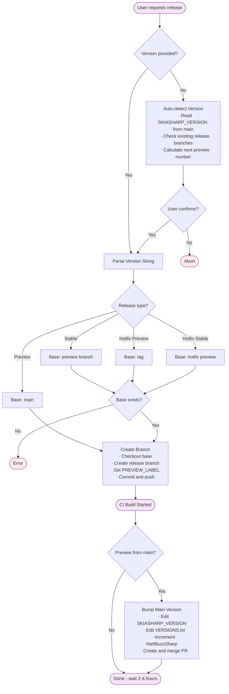
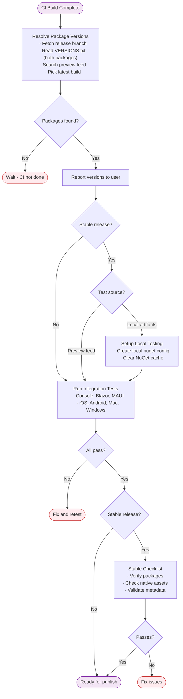
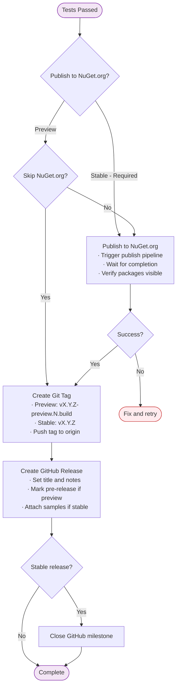

# Release Guide

How to release SkiaSharp: create branch → wait for CI → test → publish → tag.

## ⚠️ NO UNDO WARNING

**Tags and releases cannot be deleted.** Once a tag is pushed or a release is published, it's permanent. Each skill confirms before destructive operations - always review carefully before proceeding.

- Wrong tag pushed → Cannot delete, must create new release
- Wrong version published to NuGet.org → Cannot unpublish, must release new version
- Branch deleted prematurely → May lose CI artifacts

## Skills

The release process is handled by three skills in order:

| Step | Skill | Purpose | Trigger |
|------|-------|---------|---------|
| 1 | [release-branch](../.github/skills/release-branch/SKILL.md) | Create release branch, trigger CI | "release now", "release X.Y.Z" |
| 2 | [release-testing](../.github/skills/release-testing/SKILL.md) | Test packages before publishing | "test the release", "continue" |
| 3 | [release-publish](../.github/skills/release-publish/SKILL.md) | Publish to NuGet.org, tag, finalize | "publish X.Y.Z", "finalize" |

Each skill confirms with `ask_user` before executing destructive operations.

---

## Reference Tables

### Version Patterns

| Release Type | Version Format | Branch | NuGet Pattern | Tag |
|--------------|----------------|--------|---------------|-----|
| Preview | `X.Y.Z-preview.N` | `release/X.Y.Z-preview.N` | `X.Y.Z-preview.N.{build}` | `vX.Y.Z-preview.N.{build}` |
| Stable | `X.Y.Z` | `release/X.Y.Z` | `X.Y.Z-stable.{build}` | `vX.Y.Z` |
| Hotfix Preview | `X.Y.Z.F-preview.N` | `release/X.Y.Z.F-preview.N` | `X.Y.Z.F-preview.N.{build}` | `vX.Y.Z.F-preview.N.{build}` |
| Hotfix Stable | `X.Y.Z.F` | `release/X.Y.Z.F` | `X.Y.Z.F-stable.{build}` | `vX.Y.Z.F` |

The `{build}` number is auto-assigned by CI.

### Release Type → Base Branch

| Type | Base | PREVIEW_LABEL |
|------|------|---------------|
| Preview | `main` | `preview.N` |
| Stable | `release/X.Y.Z-preview.{latest}` | `stable` |
| Hotfix Preview | tag `vX.Y.Z` | `preview.N` |
| Hotfix Stable | `release/X.Y.Z.F-preview.{latest}` | `stable` |

### HarfBuzzSharp Versioning

HarfBuzzSharp uses 4-digit versions: `X.Y.Z.N`

| Digits | Meaning |
|--------|---------|
| X.Y.Z | Native HarfBuzz version (e.g., `8.3.1`) |
| N | Incremented with each SkiaSharp release |

**Why 4 digits?** HarfBuzzSharp packages are released with SkiaSharp even when there are no HarfBuzz changes. The 4th digit keeps them in sync.

**When native HarfBuzz upgrades:** Reset to 3-digit version (e.g., `8.3.1.4` → `8.4.0`).

### Feeds

| Feed | URL | Purpose |
|------|-----|---------|
| Preview | `https://aka.ms/skiasharp-eap/index.json` | CI builds, testing |
| Stable | NuGet.org | Public releases |

### Pipelines

| Pipeline | Purpose |
|----------|---------|
| [Main Build](https://dev.azure.com/devdiv/DevDiv/_build?definitionId=27373) | Builds + auto-publishes to preview feed |
| [NuGet.org Publish](https://dev.azure.com/devdiv/DevDiv/_build?definitionId=25298) | Publishes to NuGet.org (manual trigger) |

---

## Workflow Diagrams

### Stage 1: Preparation (release-branch skill)

### Stage 2: Testing (release-testing skill)

### Stage 3: Publishing (release-publish skill)

---

## Related Documentation

- [Versioning](versioning.md) — Version numbering scheme explanation
