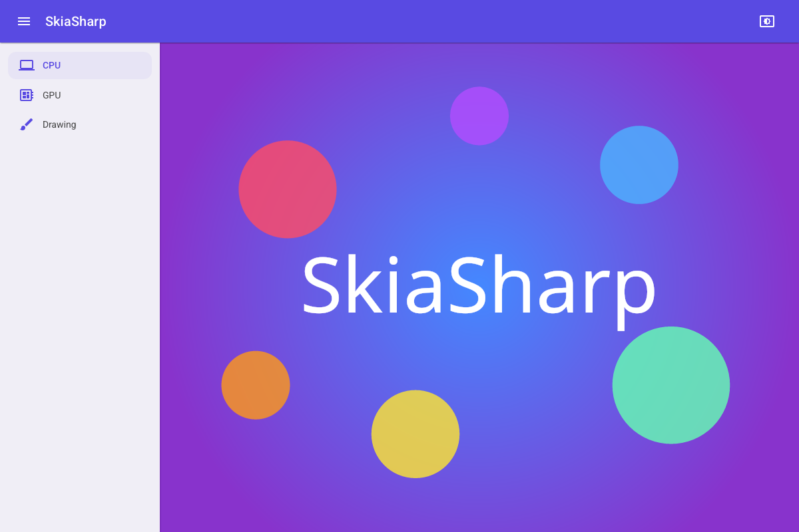
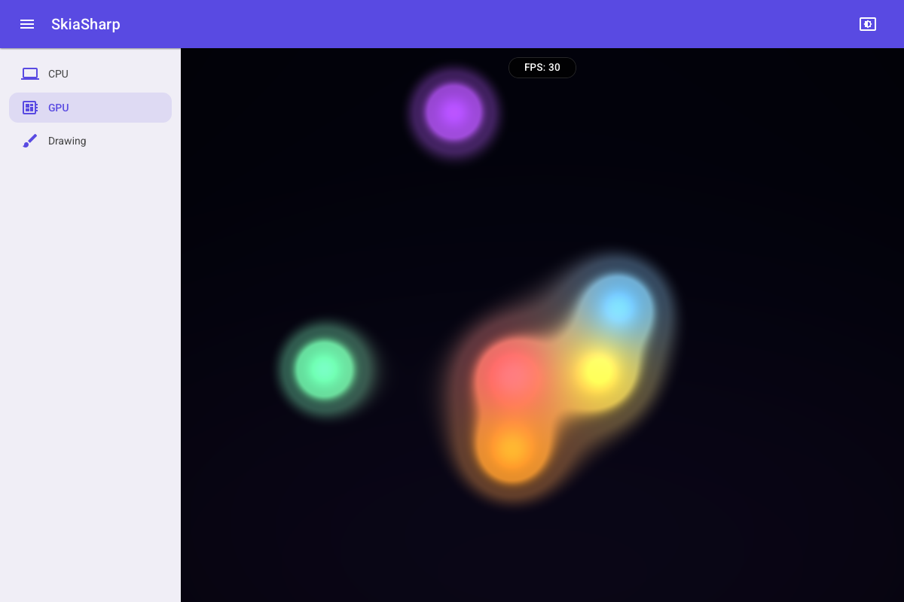
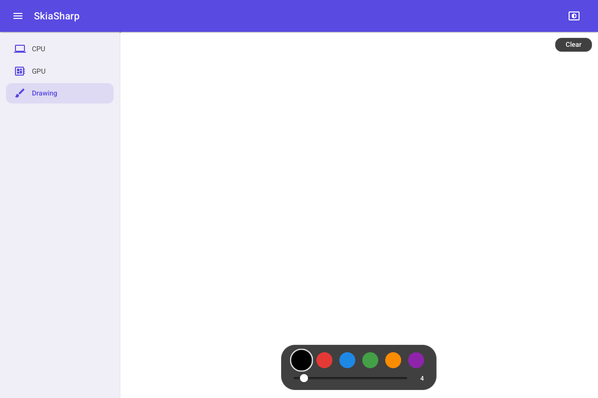
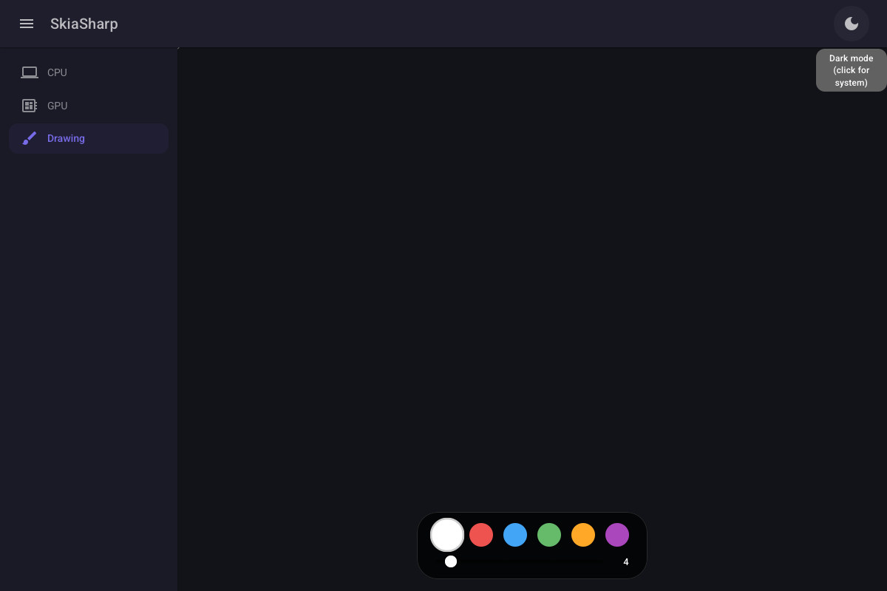

# SkiaSharp Blazor WebAssembly Sample

Demonstrates SkiaSharp running in the browser via WebAssembly with MudBlazor navigation, three-mode theming (light, dark, system), and responsive layout.

## Sample Pages

This sample shows how to integrate SkiaSharp views into a Blazor WebAssembly app using Razor components. The views are placed declaratively in `.razor` files alongside standard HTML and Blazor components, with a responsive MudBlazor sidebar for navigation.

### CPU

A static scene rendered on the CPU — a radial gradient background overlaid with semi-transparent colored circles and centered "SkiaSharp" text.

**Features:**

- **`SKCanvasView`** — Software-rendered canvas that draws each frame on the CPU via the HTML `<canvas>` element.
- **`SKShader`** — Radial gradient background created with `SKShader.CreateRadialGradient`.
- **`SKCanvas.DrawCircle`** — Semi-transparent colored circles composited over the gradient.
- **`SKCanvas.DrawText`** — Centered "SkiaSharp" text rendered with measured alignment.
- **`SKTypeface`** — Custom font loaded from an embedded resource via `SKTypeface.FromStream`.

### GPU

A real-time animated shader running at full frame rate on the GPU via WebGL, with pointer interaction that adds a white-hot blob to the metaball field.

**Features:**

- **`SKGLView`** — Hardware-accelerated canvas backed by WebGL, rendered into an HTML `<canvas>` element.
- **`SKRuntimeEffect`** — SkSL metaball "lava lamp" shader compiled at runtime with `SKRuntimeEffect.BuildShader`.
- **`EnableRenderLoop`** — Continuous animation driven by the browser's `requestAnimationFrame`.
- **Pointer interaction** — Mouse/touch position is passed as a shader uniform, adding a white-hot blob to the metaball field.

### Drawing

A freehand drawing canvas with a color palette, brush size slider, and clear button. Strokes persist across color and size changes.

**Features:**

- **`SKCanvasView`** — Software-rendered canvas invalidated on demand after each stroke or clear.
- **`SKPath`** — Freehand strokes captured as paths with `MoveTo` and `LineTo` from pointer events.
- **Pointer events** — Blazor `@onpointerdown`, `@onpointermove`, `@onpointerup` for cross-device input.
- **Color palette** — Six selectable colors with dark/light mode variants.
- **Brush size** — Adjustable stroke width via a MudBlazor slider.

## Screenshots

| CPU | GPU | Drawing |
|---|---|---|
|  |  |  |
| | |  |
