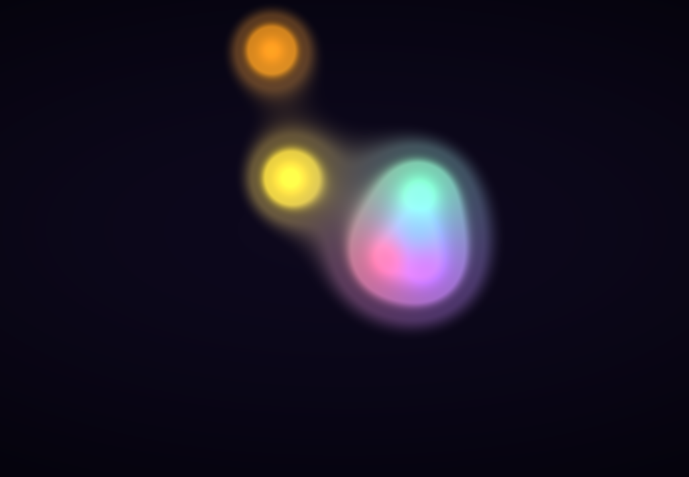
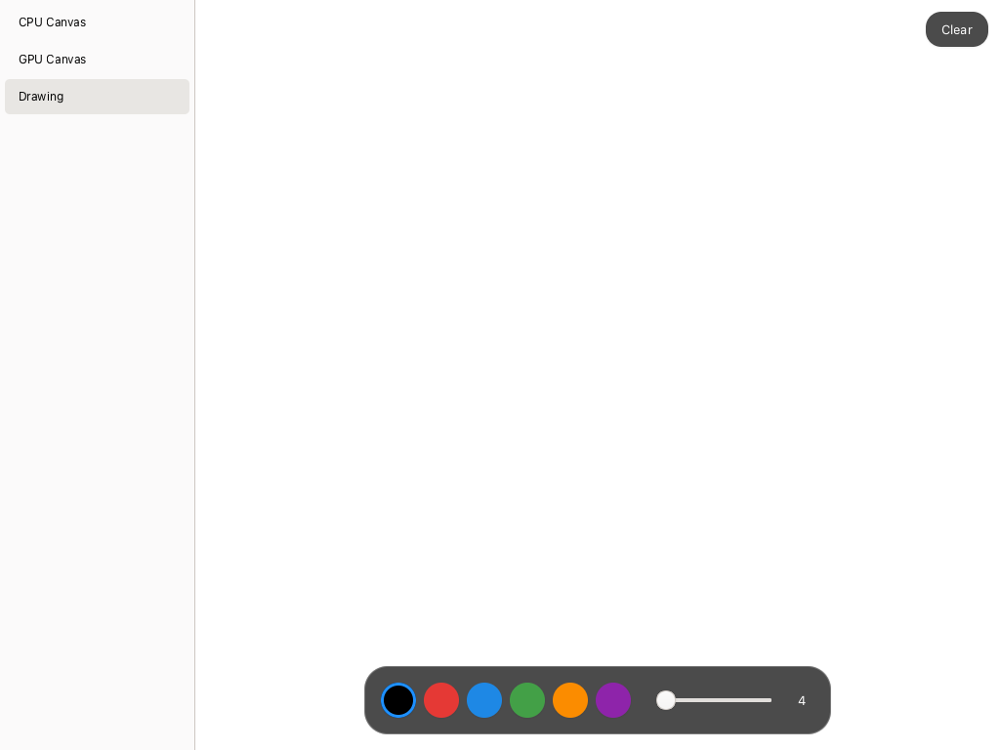

# SkiaSharp GTK 4 Sample

Demonstrates SkiaSharp running in a GTK 4 desktop app with tab-based navigation and UI Builder layout support.

## Sample Pages

This sample shows how to integrate SkiaSharp views into a GTK 4 app. The UI structure is defined in `.ui` files (editable in GNOME Builder or Cambalache), with `SKDrawingArea` and `SKGLView` widgets injected into the layout containers.

### CPU

A static scene rendered on the CPU — a radial gradient background overlaid with semi-transparent colored circles and centered "SkiaSharp" text.

**Features:**

- **`SKDrawingArea`** — Software-rendered canvas backed by a `Gtk.DrawingArea`, the standard GTK 4 drawing surface.
- **Pixel scaling** — By default, paint coordinates and `CanvasSize` use physical display pixels; set `IgnorePixelScaling` to draw in GTK logical pixels instead. `RawInfo` always describes the backing surface.
- **`SKShader`** — Radial gradient background created with `SKShader.CreateRadialGradient`.
- **`SKCanvas.DrawCircle`** — Semi-transparent colored circles composited over the gradient.
- **`SKCanvas.DrawText`** — Centered "SkiaSharp" text rendered with measured alignment.
- **`SKTypeface`** — Custom font loaded via `SKTypeface.FromStream`.

### GPU

An animated, interactive SkSL metaball shader rendered on a real OpenGL-backed SkiaSharp surface.

**Features:**

- **`SKGLView`** — Hardware-accelerated canvas backed by `Gtk.GLArea`; no CPU canvas fallback. Uses desktop OpenGL on Linux/macOS and desktop OpenGL or GTK's EGL/ANGLE OpenGL ES context on Windows.
- **`SKRuntimeEffect`** — Shader compiled once and updated with time, resolution, and mouse-position uniforms each frame.
- **Render loop** — GTK frame-clock-driven animation with an FPS pill made from a native `Gtk.Box` and `Gtk.Label`, paused whenever the tab is hidden.
- **Pointer input** — Press and drag to add a bright blob to the scene.

### Drawing

A freehand drawing canvas with a color palette, brush size label, and clear button. Strokes persist across color and size changes.

**Features:**

- **`SKDrawingArea`** — Software-rendered canvas invalidated on demand after each stroke or clear.
- **Drawing canvas** — A fixed white background and standard color palette; light/dark mode support is deferred.
- **`SKPath`** — Freehand strokes captured as paths with `MoveTo` and `LineTo` from GTK gesture events.
- **`GestureDrag`** — GTK 4 drag gesture for tracking press, move, and release.
- **`EventControllerScroll`** — Scroll wheel to adjust brush size.
- **Color palette** — Six selectable colors with a blue ring around the selected swatch.
- **Native toolbox** — GTK buttons, scale, labels and boxes, with the same palette, dimensions and narrow-window arrangement as the MAUI sample. No custom UI controls.

## Requirements

- [.NET 10 SDK](https://dotnet.microsoft.com/download) or later
- GTK 4 development libraries:
  - **macOS:** `brew install gtk4`
  - **Ubuntu/Debian:** `sudo apt-get install libgtk-4-dev`
  - **Fedora:** `sudo dnf install gtk4-devel`
  - **Windows:** Install a GTK4 runtime using [MSYS2 or gvsbuild](https://www.gtk.org/docs/installations/windows/) and put its `bin` directory on `PATH`. For MSYS2 UCRT64, install `mingw-w64-ucrt-x86_64-gtk4` and use `C:\msys64\ucrt64\bin`.
- A Linux, macOS or Windows GTK display and a working GL driver for the GPU page. Windows can use EGL/ANGLE when the GTK runtime provides it.
- GTK's libepoxy dispatcher must be present alongside GTK (`libepoxy.so.0`, `libepoxy.0.dylib`, or `libepoxy-0.dll`/`epoxy-0.dll`). It is a separate required dependency installed automatically by the GTK packages above, not bundled in the managed NuGet packages. Manually bundled GTK runtimes must include it.

`Gtk.GLArea` does not expose its framebuffer binding, stencil bit count or sample count as properties; GTK's own render example queries the framebuffer using `glGetIntegerv`. `SKGLView` queries the stencil attachment size directly, since the legacy `GL_STENCIL_BITS` integer query is not valid in desktop core profiles. It resolves these queries and Skia's GL entry points through libepoxy, the same current-context dispatcher GTK uses. This avoids loading an unrelated GL implementation when GTK selects EGL/ANGLE instead of WGL or GLX.

GTK 4 can use Vulkan to composite its own scene graph, but it does not expose a Vulkan drawing widget analogous to `Gtk.GLArea`. The GPU page uses OpenGL/OpenGL ES; a future Vulkan-backed SkiaSharp view would need application-owned Vulkan resources and a GTK-compatible texture import/synchronization path.

## Running the Sample

Build and run (Linux):

```bash
dotnet run --project SkiaSharpSample/SkiaSharpSample.csproj
```

On macOS, include Homebrew's native library directory so GirCore can load GTK and Graphene:

```bash
DYLD_LIBRARY_PATH="$(brew --prefix)/lib" dotnet run --project SkiaSharpSample/SkiaSharpSample.csproj
```

The sample does not detect, synchronize or override light/dark appearance. Native controls use GTK's default styling; the Drawing canvas and palette are fixed. Theme-aware sample rendering can be added separately later.

GTK's native sidebar, widget styling and input controllers remain platform-specific. Input positions are always GTK logical coordinates, independently of `IgnorePixelScaling`; the Drawing page converts them to the physical canvas coordinates, like the other desktop samples. It retains the desktop samples' mouse brush preview. The toolbox wraps at 600 pixels of available page width rather than including the navigation sidebar.

To start on a different page, change `DefaultPage` in `MainWindow.cs`:

```csharp
public static SamplePage DefaultPage { get; set; } = SamplePage.Drawing;
```

Available pages: `Cpu` (default), `Gpu`, `Drawing`

## Screenshots

| CPU | GPU | Drawing |
|---|---|---|
|  |  |  |
