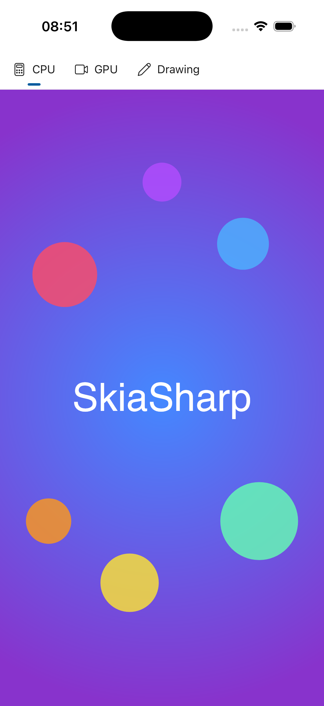
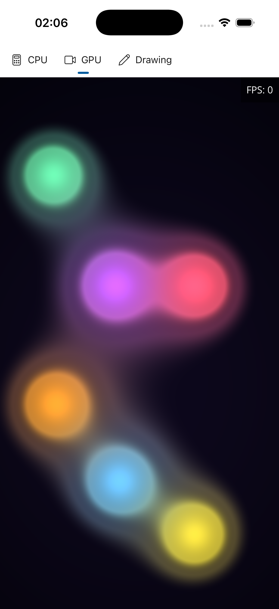
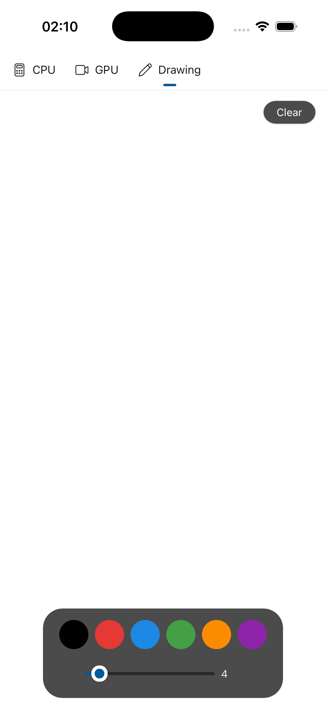

# SkiaSharp Uno Platform Sample (Native Renderer)

Demonstrates SkiaSharp views in an Uno Platform app using the **native rendering** path. This sample uses `SKXamlCanvas` for CPU-rendered content and `SKSwapChainPanel` for hardware-accelerated GPU rendering via the platform's native graphics backend.

> **See also:** The [UnoPlatformSkia](../UnoPlatformSkia/) sample demonstrates the **Skia rendering** path using `SKCanvasElement` for GPU rendering, which is the primary rendering path in Uno 6.x.

## Rendering Approach

| Control | Rendering | Use Case |
|---------|-----------|----------|
| `SKXamlCanvas` | Software (CPU) | Static or on-demand content — works everywhere |
| `SKSwapChainPanel` | DirectX/OpenGL/WebGL (GPU) | Continuous animation — hardware-accelerated on WinUI, native mobile, and WASM |

### Supported Platforms

`SKSwapChainPanel` works on platforms with native GPU access:
- **Windows** (WinUI) — DirectX swap chain
- **iOS / Android** — Native OpenGL ES / Metal
- **WebAssembly** — WebGL canvas

> **Note:** `SKSwapChainPanel` is **not supported** on Skia desktop targets (`net10.0-desktop`) — it throws `NotSupportedException`. Use the [UnoPlatformSkia](../UnoPlatformSkia/) sample with `SKCanvasElement` instead.

## Sample Pages

This sample shows how to integrate SkiaSharp views into an Uno Platform app using XAML. The `SKXamlCanvas` and `SKSwapChainPanel` controls are placed declaratively in `.xaml` files alongside standard Uno controls, targeting multiple platforms (Windows, WebAssembly, iOS, Android, Desktop) from a single codebase.

Navigation uses a `NavigationView` with `PaneDisplayMode="Top"` for a clean tab bar that works well on both mobile and desktop.

### CPU

A static scene rendered on the CPU — a radial gradient background overlaid with semi-transparent colored circles and centered "SkiaSharp" text.

**Features:**

- **`SKXamlCanvas`** — Software-rendered canvas that integrates into XAML layout on all Uno target platforms.
- **`SKShader`** — Radial gradient background created with `SKShader.CreateRadialGradient`.
- **`SKCanvas.DrawCircle`** — Semi-transparent colored circles composited over the gradient.
- **`SKCanvas.DrawText`** — Centered "SkiaSharp" text rendered with measured alignment.

### GPU

A real-time animated shader running at full frame rate on the GPU, with pointer interaction that adds a white-hot blob to the metaball field.

**Features:**

- **`SKSwapChainPanel`** — Hardware-accelerated canvas using the platform GPU backend.
- **`SKRuntimeEffect`** — SkSL metaball "lava lamp" shader compiled at runtime with `SKRuntimeEffect.BuildShader`.
- **Render loop** — Continuous animation with `EnableRenderLoop="True"` and an FPS counter overlay.
- **Pointer interaction** — Pointer position is passed as a shader uniform.

### Drawing

A freehand drawing canvas with a color palette, brush size slider, and clear button.

**Features:**

- **`SKXamlCanvas`** — Software-rendered canvas invalidated on demand after each stroke or clear.
- **`SKPath`** — Freehand strokes captured as paths with `MoveTo` and `LineTo` from pointer events.
- **Pointer events** — `PointerPressed`, `PointerMoved`, `PointerReleased` for cross-device input.
- **`PointerWheelChanged`** — Scroll wheel to adjust brush size (desktop).
- **Color palette** — Six selectable colors with dark/light mode variants and selection highlight.
- **Responsive layout** — Toolbox adapts between vertical and horizontal orientation based on window width.

## Screenshots

| CPU | GPU | Drawing |
|---|---|---|
|  |  |  |

## Requirements

- [.NET 10 SDK](https://dotnet.microsoft.com/download) or later
- Uno Platform workload: `dotnet workload install uno-platform`
- Platform-specific workloads for target platforms (e.g., `android`, `ios`, `wasm-tools`)

## Running the Sample

Build and run the Windows target:

```bash
dotnet run -f net10.0-windows10.0.19041.0
```

Or target a specific platform:

```bash
dotnet build -f net10.0-browserwasm     # WebAssembly
dotnet build -f net10.0-android         # Android
dotnet build -f net10.0-ios             # iOS
```
