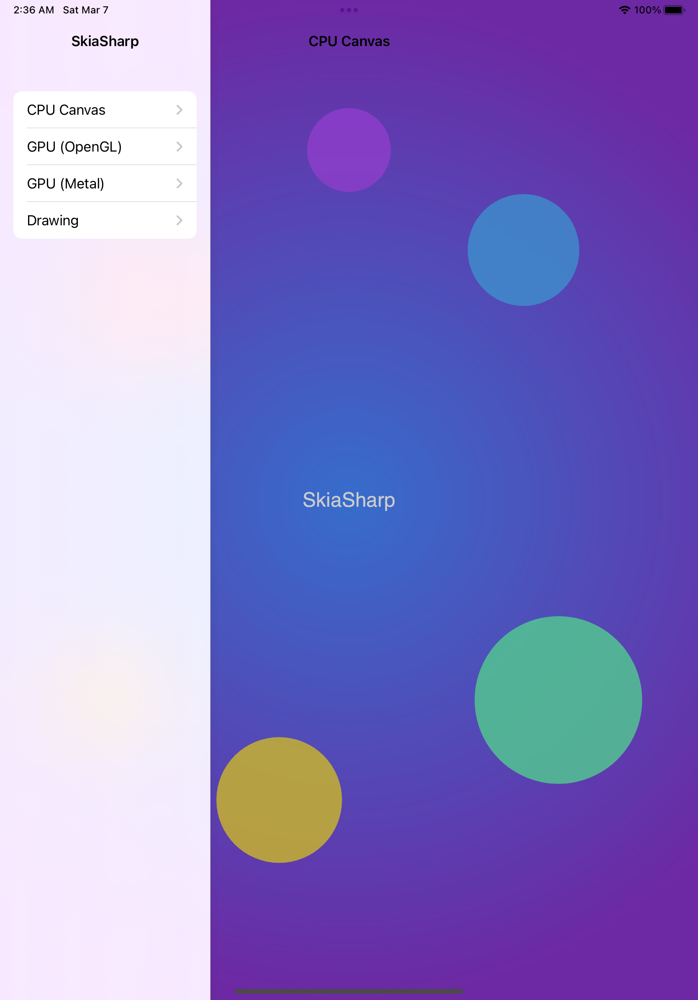
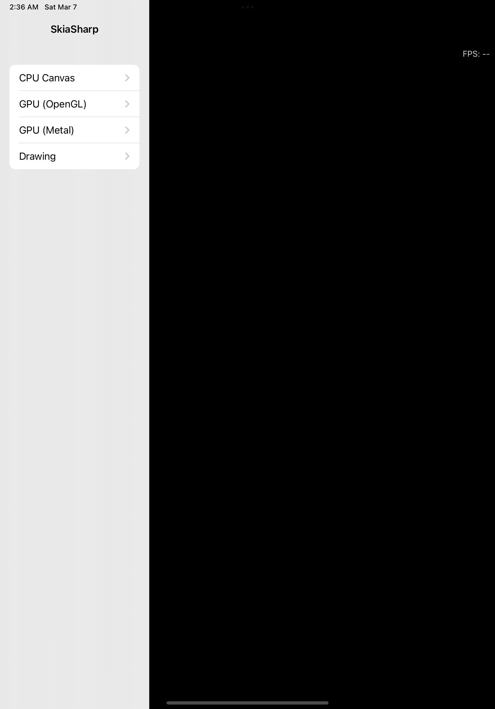
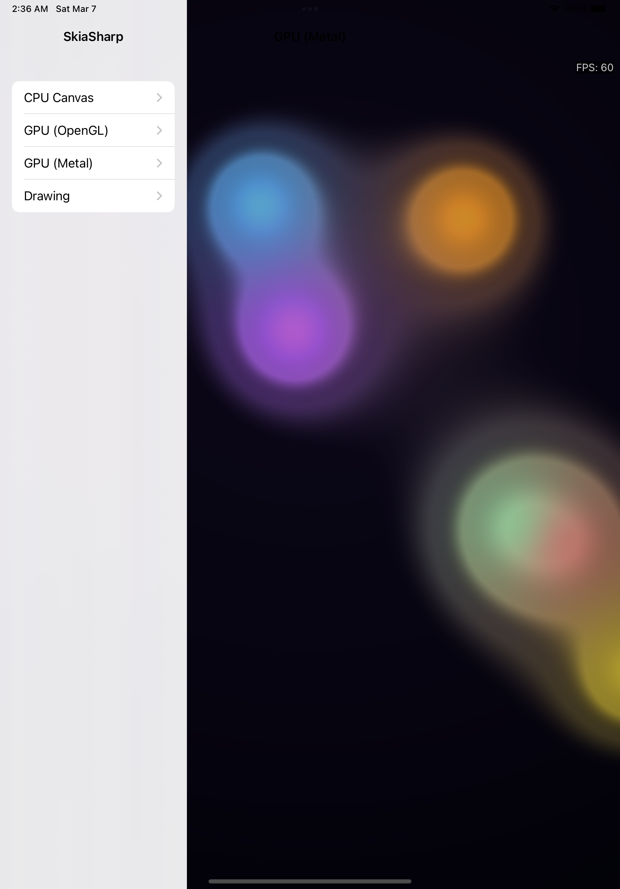
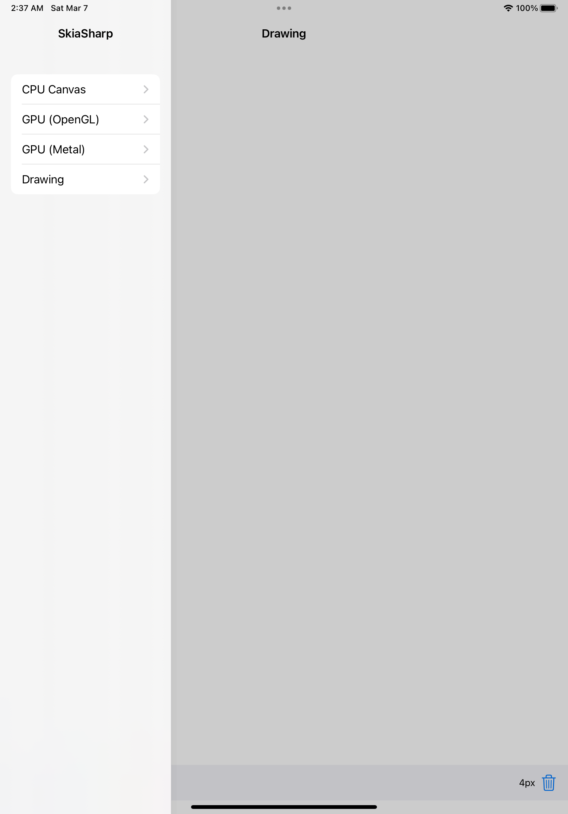

# SkiaSharp iOS Sample

Demonstrates all SkiaSharp iOS view types with a `UISplitViewController` sidebar, system dark/light mode support, and touch interaction.

## Sample Pages

This sample shows how to integrate SkiaSharp views into an iOS app using storyboards and `UIViewController` subclasses. Each view type can be placed in a storyboard scene and configured in Interface Builder. Navigation uses the modern `UISplitViewController` sidebar pattern.

### CPU

A static scene rendered on the CPU — a radial gradient background overlaid with semi-transparent colored circles and centered "SkiaSharp" text.

**Features:**

- **`SKCanvasView`** — Software-rendered canvas backed by a `UIView`, ideal for static or infrequently updated content.
- **`SKShader`** — Radial gradient background created with `SKShader.CreateRadialGradient`.
- **`SKCanvas.DrawCircle`** — Semi-transparent colored circles composited over the gradient.
- **`SKCanvas.DrawText`** — Centered "SkiaSharp" text rendered with measured alignment.
- **`SKTypeface`** — Custom font loaded from the app bundle via `SKTypeface.FromStream`.

### GPU (OpenGL)

A real-time animated shader running at full frame rate on the GPU via OpenGL ES, with touch interaction that adds a white-hot blob to the metaball field.

**Features:**

- **`SKGLView`** — Hardware-accelerated canvas backed by GLKit's `GLKView`, using OpenGL ES for rendering.
- **`SKRuntimeEffect`** — SkSL metaball "lava lamp" shader compiled at runtime with `SKRuntimeEffect.BuildShader`.
- **Render loop** — Continuous animation with an FPS counter overlay.
- **Touch interaction** — Touch position is passed as a shader uniform via `UITouch` events.

### GPU (Metal)

A real-time animated shader running at full frame rate on the GPU via Apple's Metal framework, with touch interaction.

**Features:**

- **`SKMetalView`** — Hardware-accelerated canvas backed by Metal, Apple's modern low-level GPU API.
- **`SKRuntimeEffect`** — SkSL metaball "lava lamp" shader compiled at runtime with `SKRuntimeEffect.BuildShader`.
- **Render loop** — Continuous animation with an FPS counter overlay.
- **Touch interaction** — Touch position is passed as a shader uniform via `UITouch` events.

### Drawing

A freehand drawing canvas with a color palette, brush size control via pinch gesture, and a clear button.

**Features:**

- **`SKCanvasView`** — Software-rendered canvas invalidated on demand after each stroke or clear.
- **`SKPath`** — Freehand strokes captured as paths with `MoveTo` and `LineTo` from touch events.
- **`UITouch`** — Touch tracking for press, move, and release across the canvas.
- **`UIPinchGestureRecognizer`** — Pinch gesture to adjust brush size.
- **Color palette** — Six selectable colors with dark/light mode variants.

## Running the Sample

Build and deploy to a simulator or device:

```bash
dotnet build -f net8.0-ios
```

To start on a different page, change `DefaultPage` in `AppDelegate.cs`:

```csharp
public static SamplePage DefaultPage { get; set; } = SamplePage.GpuMetal;
```

Available pages: `Cpu` (default), `GpuGL`, `GpuMetal`, `Drawing`

## Screenshots

| CPU | GPU (OpenGL) | GPU (Metal) | Drawing |
|---|---|---|---|
|  |  |  |  |
