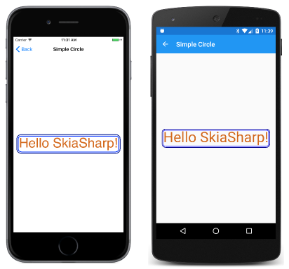

# SkiaSharp and Xamarin.Forms

The SkiaSharpFormsDemos program demonstrates the use of SkiaSharp in a Xamarin.Forms application.

For more information about this sample, see [Using SkiaSharp in Xamarin.Forms](https://docs.microsoft.com/en-us/xamarin/xamarin-forms/user-interface/graphics/skiasharp/).

