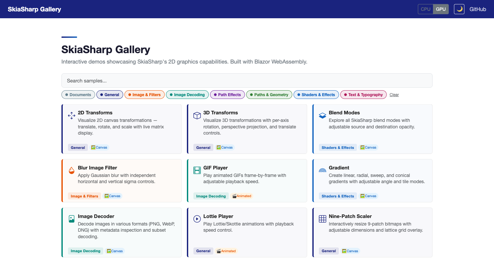
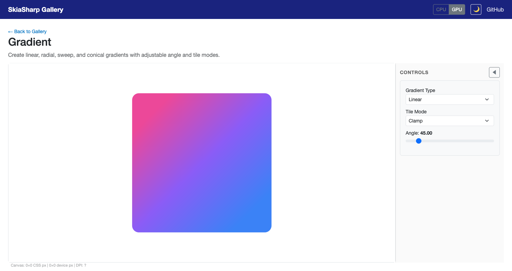
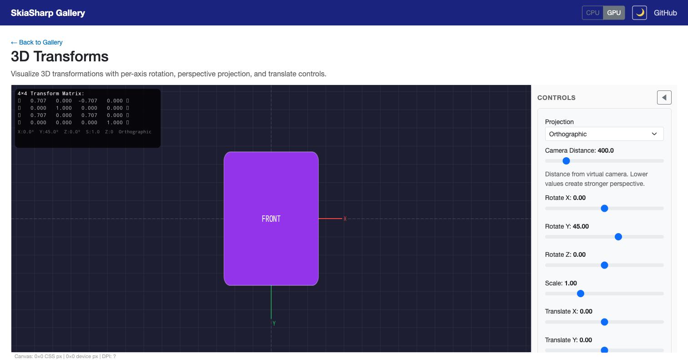
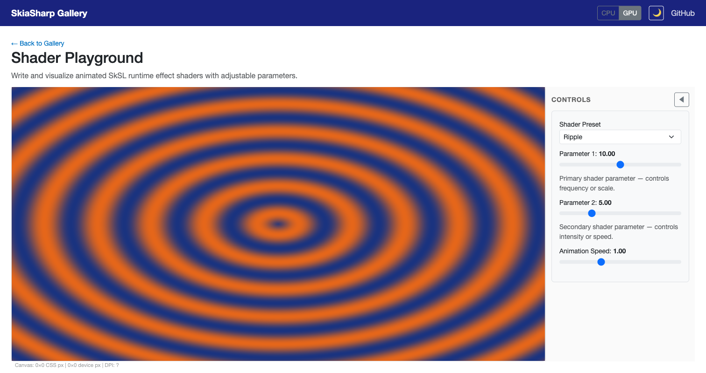
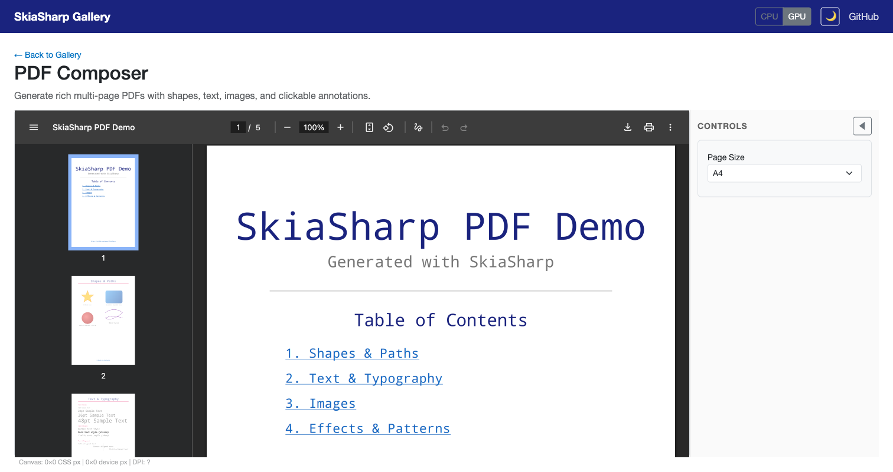

# SkiaSharp Gallery

An interactive sample gallery showcasing SkiaSharp's 2D graphics capabilities, built with **Blazor WebAssembly**.



## Features

- **21 interactive demos** covering gradients, transforms, shaders, text, paths, image filters, and more
- **Live controls** — sliders, pickers, toggles, and composable effect groups
- **CPU & GPU rendering** toggle (WebGL or software rasterizer)
- **Dark mode** with full theme support
- **Category filtering** and search
- **PDF generation** with embedded viewer
- **SkSL shader playground** with 5 animated presets
- **3D transforms** using native `SKMatrix44` 4×4 pipeline

## Screenshots

| Gradient Sample | 3D Transforms |
|---|---|
|  |  |

| Shader Playground | PDF Composer |
|---|---|
|  |  |

## Running

```bash
# 1. Bootstrap native binaries (one-time)
dotnet cake --target=externals-download

# 2. Run the Blazor WASM app
cd samples/Gallery/Blazor
dotnet run
```

Then open http://localhost:5002 in your browser.

## Sample List

### Canvas Samples (19)

| Sample | Category | Description |
|--------|----------|-------------|
| 2D Transforms | General | Translate, rotate, and scale with live matrix display |
| 3D Transforms | General | Per-axis rotation, perspective projection, 4×4 matrix overlay |
| Blend Modes | Shaders & Effects | All SkiaSharp blend modes with adjustable opacity |
| Blur Image Filter | Image & Filters | Gaussian blur with independent sigma controls |
| GIF Player | Image Decoding | Animated GIF playback with speed control |
| Gradient | Shaders & Effects | Linear, radial, sweep, and conical gradients |
| Image Decoder | Image Decoding | PNG, WebP, DNG decoding with metadata inspection |
| Lottie Player | General | Skottie animation playback |
| Nine-Patch Scaler | General | Interactive 9-patch bitmap resizing |
| Noise Generator | Shaders & Effects | Procedural Perlin noise textures |
| Path Builder | Paths & Geometry | Star, Bézier, and spiral paths with bounds |
| Path Effects Lab | Path Effects | Dash, discrete, corner, and composed effects |
| Photo Lab | Image & Filters | Composable effect stack (color, blur, morphology, magnifier) |
| Shader Playground | Shaders & Effects | Live SkSL runtime effect editor with 5 presets |
| Text Lab | Text & Typography | Font selection, alignment, size, and metric visualization |
| Text on Path | Text & Typography | Text along circle, wave, and heart paths |
| Vector Art | Paths & Geometry | Complex Bézier artwork with color themes |
| Vertex Mesh | General | Triangle meshes with wireframe overlay |
| World Text | Text & Typography | Multi-script rendering with HarfBuzz shaping |

### Document Samples (2)

| Sample | Description |
|--------|-------------|
| PDF Composer | Multi-page PDF with shapes, text, images, and clickable annotations |
| Create XPS | XPS document generation (Windows only) |

## Architecture

```
samples/Gallery/
├── Shared/                          # Platform-agnostic .NET class library
│   ├── SampleBase.cs                # Root: title, description, controls, lifecycle
│   ├── CanvasSampleBase.cs          # Drawing, animation, refresh
│   ├── DocumentSampleBase.cs        # Document generation (PDF/XPS)
│   ├── Controls/SampleControl.cs    # Slider, Toggle, Picker, Group records
│   ├── Services/SampleService.cs    # DI sample discovery
│   └── Samples/                     # All 21 sample implementations
├── Blazor/                          # Blazor WebAssembly host
│   ├── Pages/Home.razor             # Card grid with search & filter chips
│   ├── Pages/SamplePage.razor       # Canvas + sidebar controls + PDF viewer
│   ├── Components/                  # ControlPanel, SampleCard
│   └── Layout/MainLayout.razor      # Header bar, GPU toggle, dark mode
└── screenshots/                     # README screenshots
```

### Base Class Hierarchy

```
SampleBase                   ← metadata, controls, lifecycle
├── CanvasSampleBase         ← drawing (OnDrawSample), animation, refresh
└── DocumentSampleBase       ← document generation (OnGenerateDocument)
```

## Adding a New Sample

1. Create a class in `Shared/Samples/` extending `CanvasSampleBase` or `DocumentSampleBase`
2. Override `Title`, `Description`, `Category`
3. Define `Controls` and `OnControlChanged` for interactivity
4. Implement `OnDrawSample` (canvas) or `OnGenerateDocument` (document)
5. The sample auto-discovers via reflection — no registration needed
