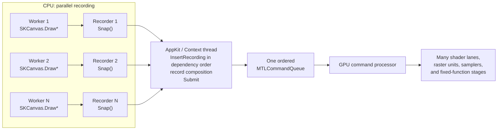

# Graphite Performance Lab

This macOS app demonstrates the problem Graphite was designed to solve: reducing work on an
application's critical UI/GPU submission thread by recording independent work on worker
threads.

It renders the same animated tile workload into real, onscreen `MTKView` drawables:

1. **Ganesh / Metal** prepares every tile serially on the UI thread, composites the
   resulting images into the current drawable, submits the Metal work, and presents it.
2. **Graphite / Metal** gives each tile to a dedicated worker-owned
   `SKGraphiteRecorder`. The UI thread inserts those recordings, composites the tile images
   into the current drawable, and presents it. It keeps presenting the last complete tile set
   while workers asynchronously prepare the next one rather than blocking on a per-frame join.

## Execution model

Graphite's multiple Recorders parallelize **CPU preparation**, not GPU queues. Each worker
thread owns a Recorder and its surfaces. `Snap()` packages prepared Graphite tasks and
resource references into a Recording; it does not produce a native Metal command buffer.
The AppKit thread serially inserts completed Recordings, records the final composition,
submits one ordered Metal command stream, and presents the drawable.



One ordered queue does not mean one GPU thread. Queue ordering preserves dependencies while
the GPU executes individual draws across many hardware lanes. Multiple Recorders also do
not create multiple queues or promise independent GPU execution. The important overlap is:

```text
CPU workers: record content update N + 1
AppKit:      compose and present update N
GPU:         execute submitted update N
```

This is why the sample reports **presented frames** separately from **content updates**.
Graphite can keep the window responsive and re-present the latest completed content while
an expensive update is still being prepared, but presentation rate is not animation
throughput.

The controls let you change:

- **Workload** — an Uno-style UI dashboard (the default), vector shapes, a batched sprite
  atlas, or text/glyph-cache pressure. Each dashboard tile represents an independently
  invalidated visual root containing cards, charts, lists, text, and many paint operations.
- **Tiles / workers** — identical tile count for both backends; Graphite records one tile
  per worker while Ganesh remains serial.
- **Items per tile** — scales scene complexity from 100 to 8,000 operations.
- **Target frame rate** and animation.
- **View mode** — isolated A/B alternates the active backend every four seconds while
  preserving both last-presented images; live side-by-side is an explicitly contended visual
  mode; either backend can also run alone.

Each panel separately reports presented FPS and content updates per second, plus total CPU
callback time, tile-preparation/worker-recording time, and UI-thread busy time. Graphite can continue
presenting the last completed tile set at 120 Hz while workers produce new content more
slowly, so presented FPS alone is not treated as animation throughput. Graphite's worker
recording time can exceed one display interval without freezing the UI because command
preparation and presentation are decoupled.
Because both `MTKView` callbacks run through AppKit's UI thread, live side-by-side throughput
is capped by the slower callback. Use isolated A/B or a single-backend mode for numbers.
Isolated A/B pauses and drains the outgoing backend before resetting and starting the next
measurement interval, so worker jobs and GPU submissions do not leak across intervals.

This mirrors Chromium's tile-raster motivation for Graphite. Graphite is not intended to
make every existing Ganesh scene immediately faster; it also targets predictable pipeline
compilation and a maintainable backend for modern GPU APIs.

For the broader API lifecycle and an architecture diagram grounded in upstream Skia
internals, see [PR #4566](https://github.com/mono/SkiaSharp/pull/4566).

## Run

From the repository root:

```bash
./eng/common/dotnet.sh run \
  --project samples/Graphite/Metal/SkiaSharpSample/SkiaSharpSample.csproj \
  -c Release \
  -p:TargetFramework=net10.0-macos \
  -p:TargetFrameworks=net10.0-macos \
  -p:RuntimeIdentifier=osx-arm64
```

Use `osx-x64` instead on an Intel Mac. A single RID is required because the repository's
downloaded `libSkiaSharp.dylib` is already universal.

Capture the app window without granting the terminal screen-recording permission:

```bash
./eng/common/dotnet.sh run \
  --project samples/Graphite/Metal/SkiaSharpSample/SkiaSharpSample.csproj \
  -c Release \
  -p:TargetFramework=net10.0-macos \
  -p:TargetFrameworks=net10.0-macos \
  -p:RuntimeIdentifier=osx-arm64 -- \
  --screenshot "$PWD/output/graphite-performance-lab.png"
```

The best worker count depends on the CPU and workload. Too many small partitions can lose to
`Recorder.Snap` and `Context.InsertRecording` overhead, and text can contend on the shared
glyph atlas.

See [Introducing Skia Graphite: Chrome's rasterization backend for the
future](https://blog.google/chromium/introducing-skia-graphite-chromes/) for the
architecture and production motivation.
