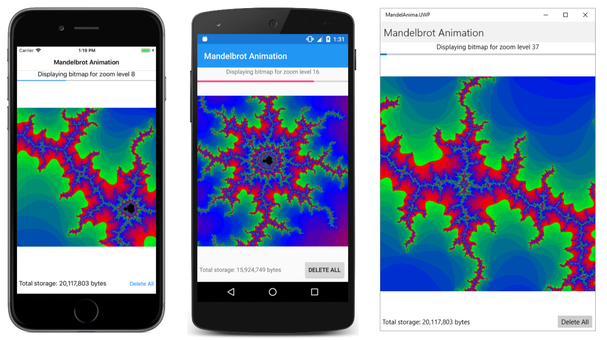

# Mandelbrot Animation

This program demonstrates bitmap animation using SkiaSharp. Running the program requires some patience because it first needs to create up to 50 bitmaps of various zoom levels of the famous Mandelbrot Set. After that's finished, however, the program animates those bitmaps to simulate a continuous zoom.

As the program is creating the 50 bitmaps, it stores them in application local storage as PNG files. This allows the program to access those PNG files the next time that you run the program, so you don't have to wait for them to be created. However, these 50 bitmaps occupy over 20 megabytes of storage on your device.

For background on the Mandelbrot Set and the algorithms used in this program see Chapter 20 of [_Creating Mobile Apps with Xamarin Forms_](https://xamarin.azureedge.net/developer/xamarin-forms-book/XamarinFormsBook-Ch20-Apr2016.pdf) starting on page 666.

This program is described in the article [**Animating SkiaSharp bitmaps: Bitmap animation**](https://docs.microsoft.com/xamarin/xamarin-forms/user-interface/graphics/skiasharp/bitmaps/animating#bitmap-animation). The **MainPage.xaml.cs** file begins with several constants that you can change:

- The `COUNT` constant indicates the number of bitmaps in the animation. It is initially set to 10, but you can set it to any value up to 50. Setting it to values beyond 50 adds very little, however, because at that zoom level the algorithm runs into problems caused by the resolution of double-precision floating point numbers, as discussed on page 684 of the book.

- The `BITMAP_SIZE` constant indicates the square size of the bitmap. It is set to 1000 to create bitmaps of 1000-by-1000 pixels.

- The `center` field indicates the `Complex` point that the program zooms in on. There are three possible values in the program, which are the same as the final three screenshots on page 684 of the book, but you can set it to any `Complex` point you want. Watch out! Most points are not very interesting. You might want to experiement with [MandelbrotXF](https://github.com/xamarin/xamarin-forms-book-samples/tree/master/Chapter20/MandelbrotXF) to find a point with interesting visuals.

The bitmaps that **Mandelbrot Animation** saves in local application storage incorporate the `center` value in their filenames. This means that if you run **Mandelbrot Animation** with one `Complex` point, and then change `center` and run it again with another `Complex` point, the application's local storage will contain bitmaps for both points. A `Label` at the lower-left corner of the program displays the total storage space of all the bitmaps created by the program.

At any time while the program is running, you can click the *Delete All* button in the lower-right corner of the program to delete all the bitmaps. You can even do this as the program is animating the bitmaps, because at that point, all the bitmaps have been loaded into memory. Uninstalling the program from the device also clears the application's local storage.

When you first run the program, the `Label` at the top of the program shows which bitmap is being created. The `ProgressBar` indicates the progress of the Mandelbrot algorithm. Each successive bitmap is another level of zoom: It displays 1/2 of the width and height of a square of the complex plane as the previous bitmap. Once the program has all the bitmaps created and loaded into memory, the `Label` and `ProgressBar` show the zoom level of the bitmap being displayed, and the degree to which that bitmap is zoomed.

For some devices, the animation runs smoother if the program is not being run under control of Visual Studio's debugger.

