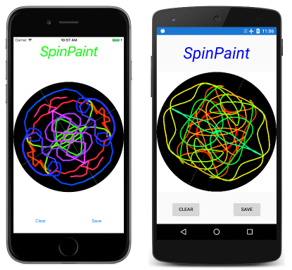

# SpinPaintShared

This is the Shared Project version of [SpinPaint](https://developer.xamarin.com/samples/xamarin-forms/SkiaSharpForms/SpinPaint/).

SpinPaint is a Xamarin.Forms application that runs on iOS, Android, and Universal Windows Platform devices.

The program simulates a revolving disk that you can paint on by touching and moving your fingers.
SpinPaint responds to touch by painting a line under your finger, but it also duplicates that line in three mirror images in the other three quadrants of the disk.
The current color of the line is indicated by the color of the title of the program above the disk. At the bottom are buttons to clear the image to start over, or to save the image as a bitmap in the device's shared photo library.

SpinPaint demonstrates the use of SkiaSharp in a Xamarin.Forms application. For more information about SkiaSharp see [Using SkiaSharp in Xamarin.Forms](https://docs.microsoft.com/xamarin/xamarin-forms/user-interface/graphics/skiasharp/). The program also uses a touch-tracking effect discussed in the article [Invoking Events from Effects](https://docs.microsoft.com/xamarin/xamarin-forms/app-fundamentals/effects/touch-tracking).

