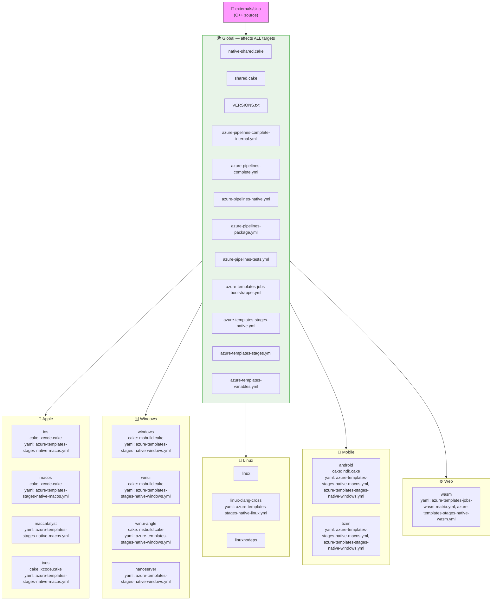

# Build Dependency Graph

> Auto-generated by `scripts/generate-native-dep-graph.py`.
> Regenerate: `python3 scripts/generate-native-dep-graph.py`
> Explore interactively: paste the mermaid block into [mermaid.live](https://mermaid.live)

